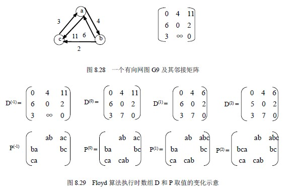

# 8.6 最短路径—每一对顶点之间的最短路径

解决这个问题的一个办法是：每次以一个顶点为源点，重复招待迪杰斯特拉算法次。这样，便可求得每一结顶点的最短路径。总的执行时间为 O(n3)。

这里要介绍由弗洛伊德(Floyd)提出的另一个算法。这个算法的时间复杂度也是 O(n3),但形式上简单些。

弗洛伊德算法仍从图的带权邻接矩阵 cost 出发，其基本思想是：

假设求从顶点 vi 到 vj 的最短路径。如果从 vi 到 vi 有弧，则从 vi 到 vj 存在一条长度为 edges[i][j]的路径，该路径不一定是最短路径，尚需进行 n 次试探。首先考虑路径（vi, v0,vj）是否存在（即判别弧（vi, v0）和(v0, vj)是否存在）。如果存在，则比较（vi, vj）和（vi,v0, vj）的路径长度取长度较短者为从 vi 到 vj 的中间顶点的序号不大于 0 的最短路径。假如在路径上再增加一个顶点 v1，也就是说，如果（vi, …, v1）和（v1, …, vj）分别是当前找到的中间顶点的序号不大于 0 的最短路径，那么（vi, …, v1, … , vj） 就有可能是从 vi 到 vj 的中间顶点的序号不大于 1 的最短路径。将它和已经得到的从 vi 到 vj 中间顶点序号不大于 0 的最短路径相比较，从中选出中间顶点的序号不大于 1 的最短路径之后，再增加一个顶点 v2，继续进行试探。依次类推。在一般情况下，若（vi, …, vk）和（vk, …, vj）

分别是从 vi 到 vk 和从 vk 到 vj 的中间顶点的序号不大于 k-1 的最短路径，则将（vi, …,vk, …, vj）和已经得到的从 vi 到 vj 且中间顶点序号不大于 k-1 的最短路径相比较，其长度较短者便是从 vi 到 vj 的中间顶点的序号不大于 k 的最短路径。这样，在经过 n 次比较后，最后求得的必是从 vi 到 vj 的最短路径。

按此方法，可以同时求得各对顶点间的最短路径。

现定义一个 n 阶方阵序列。

D(-1)，D(0)，D(1)，…，D(k)，D(n-1)其中 D(-1)[i][j]=edges[i][j]

D( k)[i][j]=Min{D( k-1)[i][j], D( k-1)[i][k]+D( k-1)[k][j]} 0≦k≦n-1

从上述计算公式可见，D(1)[i][j]是从 vi 到 vj 的中间顶点的序号不大于 1 的最短路径的长度；D( k)[i][j] 是从 vi 到 vj 的中间顶点的个数不大于 k 的最短路径的长度；D( n-1)[i][j] 就是从 vi 到 vj 的最短路径的长度。

由此得到求任意两顶点间的最短路径的算法 8.18。

void ShortestPath_2 (Mgraph G, PathMatrix *P[],DistancMatrix *D)

{/*用 Floyd 算法求有向网 G 中各对顶点 v 和 w 之间的最短路径 P[v][w]及其带权长度 D[v][w]。*/

/*若 P[v][w][u]为 TRUE，则 u 是从 v 到 w 当前求得的最短路径上的顶点。*/

for(v=0;v<G.vexnum;++v) /*各对顶点之间初始已知路径及距离*/

for(w=0;w<G,vexnum;++w)

{ D[v][w]=G.arcs[v][w];

for(u=0;u<G,vexnum;++u) P[v][w][u]=FALSE;

if (D[v][w]<INFINITY) /*从 v 到 w 有直接路径*/

{ P[v][w][v]=TRUE;

}

}

for(u=0; u<G.vexnum; ++u)

for(v=0; v<G.vexnum; ++v)

for(w=0;w<G.vexnum;++w)

if (D[v][u]+D[u][w]<D[v][w]) /*从 v 经 u 到 w 的一条路径更短*/

{D[v][w]=D[v][u]+D[u][w];

for(i=0;i<G.vexnum;++i)

P[v][w][i]=P[v][u][i]||P[u][w][i];

}

}/* ShortestPath_2*/

算法 8.18

图 8.28 给出了一个简单的有向网及其邻接矩阵。图 8.29 给出了用 Floyd 算法求该有向网中每对顶点之间的最短路径过程中，数组 D 和数组 P 的变化情况。

