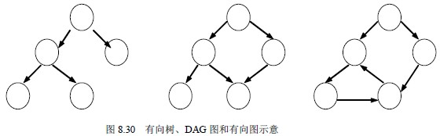
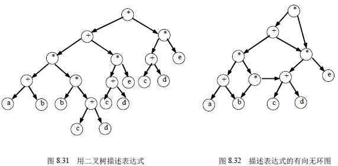

# 8.7 有向无环图及其应用—有向无环图的概念

一个无环的有向图称做有向无环图（directed acycline praph）。简称 DAG 图。DAG 图是一类较有向树更一般的特殊有向图，图 8.30 给出了有向树、DAG 图和有向图的例子。

有向无环图是描述含有公共子式的表达式的有效工具。例如下述表达式：

((a+b)*(b*(c+d)+(c+d)*e)*((c+d)*e)可以用第六章讨论的二叉树来表示，如图 8.31 所示。仔细观察该表达式，可发现有一些相同的子表达式，如(c+d)和(c+d)*e 等，在二叉树中，它们也重复出现。若利用有向无环图，则可实现对相同子式的共享，从而节省存储空间。例如图 8.32 所示为表示同一表达式的有向无环图。

检查一个有向图是否存在环要比无向图复杂。对于无向图来说，若深度优先遍历过程中遇到回边（即指向已访问过的顶点的边），则必定存在环；而对于有向图来说，这条回边有可能是指向深度优先生成森林中另一棵生成树上顶点的弧。但是，如果从有向图上某个顶点 v 出发的遍历，在 dfs(v)结束之前出现一条从顶点 u 到顶点 v 的回边，由于 u 在生成树上是 v 的子孙，则有向图必定存在包含顶点 v 和 u 的环。

有向无环图是描述一项工程或系统的进行过程的有效工具。除最简单的情况之外，几乎所有的工程（project）都可分为若干个称作活动（activity）的子工程，而这些子工程之间，通常受着一定条件的约束，如其中某些子工程的开始必须在另一些子工程完成之后。

对整个工程和系统，人们关心的是两个方面的问题：一是工程能否顺利进行：二是估算整个工程完成所必须的最短时间。以下两小节将详细介绍这样两个问题是如何通过对有向图进行拓扑排序和关键路径操作来解决的。