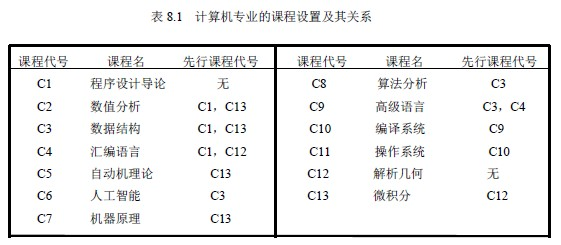
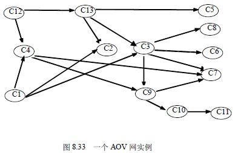
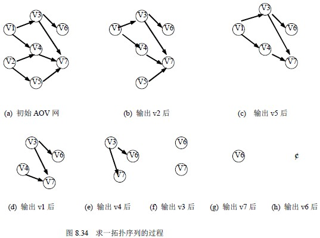
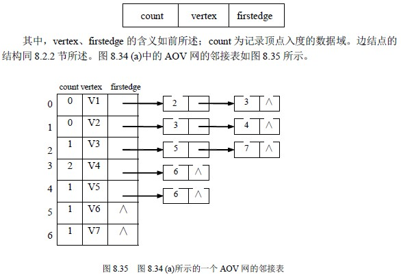

# 8.7 有向无环图及其应用—AOV 网与拓扑排序

## 1．AOV 网(Activity on vertex network)

所有的工程或者某种流程可以分为若干个小的工程或阶段，这些小的工程或阶段就称为活动。若以图中的顶点来表示活动，有向边表示活动之间的优先关系，则这样活动在顶点上的有向图称为 AOV 网。在 AOV 网中，若从顶点 i 到顶点 j 之间存在一条有向路径，称顶点 i 是顶点 j 的前驱，或者称顶点 j 是顶点 i 的后继。若<i,j>是图中的弧，则称顶点 i 是顶点 j 的直接前驱，顶点 j 是顶点 i 的直接后驱。

AOV 网中的弧表示了活动之间存在的制约关系。例如，计算机专业的学生必须完成一系列规定的基础课和专业课才能毕业。学生按照怎样的顺序来学习这些课程呢？这个问题可以被看成是一个大的工程，其活动就是学习每一门课程。这些课程的名称与相应代号如表 8.1 所示。

表中，C1、C12 是独立于其它课程的基础课，而有的课却需要有先行课程，比如，学完程序设计导论和数值分析后才能学数据结构……，先行条件规定了课程之间的优先关系。这种优先关系可以用图 8.33 所示的有向图来表示。其中，顶点表示课程，有向边表示前提条件。若课程 i 为课程 j 的先行课，则必然存在有向边〈i,j〉。在安排学习顺序时，必须保证在学习某门课之前，已经学习了其先行课程。

类似的 AOV 网的例子还有很多，比如大家熟悉的计算机程序，任何一个可执行程序也可以划分为若干个程序段（或若干语句），由这些程序段组成的流程图也是一个 AOV 网。

## 2．拓扑排序

首先复习一下离散数学中的偏序集合与全序集合两个概念。

若集合 A 中的二元关系 R 是自反的、非对称的和传递的，则 R 是 A 上的偏序关系。集合 A 与关系 R 一起称为一个偏序集合。

若 R 是集合 A 上的一个偏序关系，如果对每个 a、b∈A 必有 aRb 或 bRa ，则 R 是 A 上的全序关系。集合 A 与关系 R 一起称为一个全序集合。

偏序关系经常出现在我们的日常生活中。例如，若把 A 看成一项大的工程必须完成的一批活动，则 aRb 意味着活动 a 必须在活动 b 之前完成。比如，对于前面提到的计算机专业的学生必修的基础课与专业课，由于课程之间的先后依赖关系，某些课程必须在其它课程以前讲授，这里的 aRb 就意味着课程 a 必须在课程 b 之前学完。

AOV 网所代表的一项工程中活动的集合显然是一个偏序集合。为了保证该项工程得以顺利完成，必须保证 AOV 网中不出现回路；否则，意味着某项活动应以自身作为能否开展的先决条件，这是荒谬的。测试 AOV 网是否具有回路（即是否是一个有向无环图）的方法，就是在 AOV 网的偏序集合下构造一个线性序列，该线性序列具有以下性质：

1、在 AOV 网中，若顶点 i 优先于顶点 j ，则在线性序列中顶点 i 仍然优先于顶点 j；

2、对于网中原来没有优先关系的顶点与顶点，如图 8.33 中的 C1 与 C13，在线性序列中也建立一个先后关系，或者顶点 i 优先于顶点 j ，或者顶点 j 优先于 i。

满足这样性质的线性序列称为拓扑有序序列。构造拓扑序列的过程称为拓扑排序。也可以说拓扑排序就是由某个集合上的一个偏序得到该集合上的一个全序的操作。

若某个 AOV 网中所有顶点都在它的拓扑序列中，则说明该 AOV 网不会存在回路，这时的拓扑序列集合是 AOV 网中所有活动的一个全序集合。以图 8.21 中的 AOV 网例，可以得到不止一个拓扑序列，C1、C12、C4、C13、C5、C2、C3、C9、C7、C10、C11、C6、C8 就是其中之一。显然，对于任何一项工程中各个活动的安排，必须按拓扑有序序列中的顺序进行才是可行的。

## 3．拓扑排序算法

对 AOV 网进行拓扑排序的方法和步骤是：

1、从 AOV 网中选择一个没有前驱的顶点（该顶点的入度为 0）并且输出它；

2、从网中删去该顶点，并且删去从该顶点发出的全部有向边；

3、重复上述两步，直到剩余的网中不再存在没有前驱的顶点为止。

这样操作的结果有两种：一种是网中全部顶点都被输出，这说明网中不存在有向回路；另一种就是网中顶点未被全部输出，剩余的顶点均不前驱顶点，这说明网中存在有向回路。

图 8.34 给出了在一个 AOV 网上实施上述步骤的例子。

这样得到一个拓扑序列：v2,v5,v1,v4,v3,v7,v6。

为了实现上述算法，对 AOV 网采用邻接表存储方式，并且邻接表中顶点结点中增加一个记录顶点入度的数据域，即顶点结构设为：

顶点表结点结构的描述改为：

typedef struct vnode{ /*顶点表结点*/

int count /*存放顶点入度*/

VertexType vertex; /*顶点域*/

EdgeNode * firstedge; /*边表头指针*/

}VertexNode;

当然也可以不增设入度域，而另外设一个一维数组来存放每一个结点的入度。算法中可设置了一个堆栈，凡是网中入度为 0 的顶点都将其入栈。为此，拓扑排序的算法步骤为：

1、将没有前驱的顶点（count 域为 0）压入栈；

2、从栈中退出栈顶元素输出，并把该顶点引出的所有有向边删去，即把它的各个邻接顶点的入度减 1；

3、将新的入度为 0 的顶点再入堆栈；

4、重复②～④，直到栈为空为止。此时或者是已经输出全部顶点，或者剩下的顶点中没有入度为 0 的顶点。

下面给出用 C 语言描述的拓扑排序算法的实现。

从上面的步骤可以看出，栈在这里的作用只是起到一个保存当前入度为零点的顶点，并使之处理有序。这种有序可以是后进先出，也可以是先进先出，故此也可用队列来辅助实现。在下面给出用 C 语言描述的拓扑排序的算法实现中，我们采用栈来存放当前未处理过的入度为零点的结点，但并不需要额外增设栈的空间，而是设一个栈顶位置的指针将当前所有未处理过的入度为零的结点连接起来，形成一个链式栈。

void Topo_Sort (AlGraph *G)

{/*对以带入度的邻接链表为存储结构的图 G，输出其一种拓扑序列*/

int top = -1； /* 栈顶指针初始化*/

for (i=0；i<n；i++) /* 依次将入度为 0 的顶点压入链式栈*/

{ if ( G->adjlist[i]. Count = = 0)

{ G->adjlist[i].count = top；

top = i；

}

}

for (i=0;i<n;i++)

{ if (t0p= -1)

{printf(“The network has a cycle”);

return;

}

j=top;

top=G->adjlist[top].count; /* 从栈中退出一个顶点并输出*/

printf(“% c”,G->adjlist[j].vertex);

ptr=G->adjlist[j].firstedge;

while (ptr!=null)

{ k=ptr->adjvex;

G->adjlist[k].count--; /*当前输出顶点邻接点的入度减 1*/

if(G->adjlist[k].count= =0) /*新的入度为 0 的顶点进栈*/

{G->adjlist[k].count =top;

top=k;

}

ptr=ptr->next; /*找到下一个邻接点*/

}

}

}

算法 8.19

对一个具有 n 个顶点、e 条边的网来说，整个算法的时间复杂度为 O（e+n）。下面结合图 8.34 (a)给出的 AOV 网以及图 8.35 所示的邻接表，观察算法的执行情况。

图 8.36 给出了邻接表的顶点结点的变化情况。其中，图 8.36 (a)示出了算法开始时堆栈的初始状态；图 8.36（b）～（h）给出了每输出一个顶点后堆栈的状态。