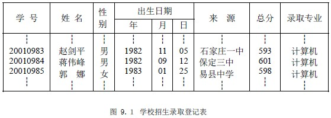

# 9.1 查找的基本概念与术语

在英汉字典中查找某个英文单词的中文解释；在新华字典中查找某个汉字的读音、含义；在对数表、平方根表中查找某个数的对数、平方根；邮递员送信件要按收件人的地址确定位置等等。可以说查找是为了得到某个信息而常常进行的工作。

计算机、计算机网络使信息查询更快捷、方便、准确。要从计算机、计算机网络中查找特定的信息，就需要在计算机中存储包含该特定信息的表。如要从计算机中查找英文单词的中文解释，就需要存储类似英汉字典这样的信息表，以及对该表进行的查找操作。本章将讨论的问题即是“信息的存储和查找”。

查找是许多程序中最消耗时间的一部分。因而，一个好的查找方法会大大提高运行速度。另外，由于计算机的特性，象对数、平方根等是通过函数求解，无需存储相应的信息表。

以学校招生录取登记表为例，来讨论计算机中表的概念。

### 1.数据项(也称项或字段)

项是具有独立含义的标识单位，是数据不可分割的最小单位。如表中“学号”、“姓名”、“年”等。项有名和值之分，项名是一个项的标识，用变量定义，而项值是它的一个可能取值，表中“20010983”是项“学号”的一个取值。项具有一定的类型，依项的取值类型而定。

### 2.组合项

由若干项、组合项构成，表中“出生日期”就是组合项，它由“年”、“月”、“日”三项组成。

### 3.数据元素（记录）

数据元素是由若干项、组合项构成的数据单位，是在某一问题中作为整体进行考虑和处理的基本单位。数据元素有型和值之分，表中项名的集合，也即表头部分就是数据元素的类型；而一个学生对应的一行数据就是一个数据元素的值，表中全体学生即为数据元素的集合。

### 4.关键码

关键码是数据元素（记录）中某个项或组合项的值，用它可以标识一个数据元素（记录）。能唯一确定一个数据元素（记录）的关键码，称为主关键码；而不能唯一确定一个数据元素（记录）的关键码，称为次关键码。表中“学号”即可看成主关键码，“姓名”则应视为次关键码，因可能有同名同姓的学生。

### 5.查找表

是由具有同一类型（属性）的数据元素（记录）组成的集合。分为静态查找表和动态查找表两类。

静态查找表：仅对查找表进行查找操作，而不能改变的表；

动态查找表：对查找表除进行查找操作外，可能还要进行向表中插入数据元素，或删除表中数据元素的表。

### 6.查找

按给定的某个值 kx，在查找表中查找关键码为给定值 kx 的数据元素（记录）。关键码是主关键码时：由于主关键码唯一，所以查找结果也是唯一的，一旦找到，查找成功，结束查找过程，并给出找到的数据元素（记录）的信息，或指示该数据元素（记录）的位置。要是整个表检测完，还没有找到，则查找失败，此时，查找结果应给出一个“空”记录或“空”指针。

关键码是次关键码时：需要查遍表中所有数据元素（记录），或在可以肯定查找失败时，才能结束查找过程。

### 7.数据元素类型说明

在手工绘制表格时，总是根据有多少数据项，每个数据项应留多大宽度来确定表的结构，即表头的定义。然后，再根据需要的行数，画出表来。在计算机中存储的表与手工绘制的类似，需要定义表的结构，并根据表的大小为表分配存储单元。以图 9.１为例，用 C 语言的结构类型描述之。

/* 出生日期类型定义*/

typedef struct {

char year[5]； /* 年：用字符型表示，宽度为 4 个字符*/

char month[3]； /* 月：字符型，宽度为 2 */

char date[3]； /* 日：字符型，宽度为 2 */

}BirthDate；

/* 数据元素类型定义*/

typedef struct {

char number[7]； /* 学号：字符型，宽度为 6 */

char name[9]； /* 姓名：字符型，宽度为 8 */

char sex[3]； /* 性别：字符型，宽度为 2 */

BirthDate birthdate； /* 出生日期：构造类型，由该类型的宽度确定*/

char comefrom[21]； /* 来源：字符型，宽度为 20 */

int results； /* 成绩：整型，宽度由“程序设计 C 语言工具软件”决定*/

} ElemType；

以上定义的数据元素类型，相当于手工绘制的表头。要存储学生的信息，还需要分配一定的存储单元，即给出表长度。可以用数组分配，即顺序存储结构；也可以用链式存储结构实现动态分配。

/* 顺序分配 1000 个存储单元用来存放最多 1000 个学生的信息*/

ElemType elem[1000]；

本章以后讨论中，涉及的关键码类型和数据元素类型统一说明如下：

typedef struct {

KeyType key； /* 关键码字段，可以是整型、字符串型、构造类型等*/

…… /* 其它字段*/

} ElemType；