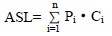
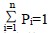
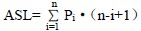
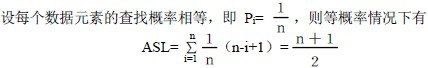

# 9.2 静态查找表—顺序查找

顺序查找又称线性查找，是最基本的查找方法之一。其查找方法为：从表的一端开始，向另一端逐个按给定值 kx 与关键码进行比较，若找到，查找成功，并给出数据元素在表中的位置；若整个表检测完，仍未找到与 kx 相同的关键码，则查找失败，给出失败信息。

**【算法 9.1】**以顺序存储为例，数据元素从下标为 1 的数组单元开始存放，0 号单元留空。

int s_search(S_TBL tbl，KeyType kx)

{ /*在表 tbl 中查找关键码为 kx 的数据元素，若找到返回该元素在数组中的下标，否则返回 0 */

tbl.elem[0].key = kx；/* 存放监测，这样在从后向前查找失败时，不必判表是否检测完， */

/* 从而达到算法统一*/

for( i = tbl.length ; tbl.elem[i].key < > kx ；i-- )； /* 从标尾端向前找*/

return i；

}

**【性能分析】**

分析查找算法的效率，通常用平均查找长度 ASL 来衡量。

定义：在查找成功时，平均查找长度 ASL 是指为确定数据元素在表中的位置所进行的关键码比较次数的期望值。

对一个含 n 个数据元素的表，查找成功时

其中：Pi 为表中第 i 个数据元素的查找概率，

Ci 为表中第 i 个数据元素的关键码与给定值 kx 相等时，按算法定位时关键码的比较次数。显然，不同的查找方法，Ci 可以不同。

就上述算法而言，对于 n 个数据元素的表，给定值 kx 与表中第 i 个元素关键码相等，即定位第 i 个记录时，需进行 n-i+1 次关键码比较，即 Ci=n-i+1。则查找成功时，顺序查找的平均查找长度为：

查找不成功时，关键码的比较次数总是 n+1 次。

算法中的基本工作就是关键码的比较，因此，查找长度的量级就是查找算法的时间复杂度，其为 O(n)。

许多情况下，查找表中数据元素的查找概率是不相等的。为了提高查找效率，查找表需依据查找概率越高，比较次数越少；查找概率越低，比较次数就较多的原则来存储数据元素。

顺序查找缺点是当 n 很大时，平均查找长度较大，效率低；优点是对表中数据元素的存储没有要求。另外，对于线性链表，只能进行顺序查找。