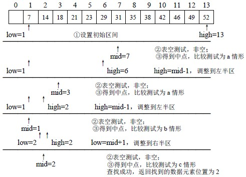
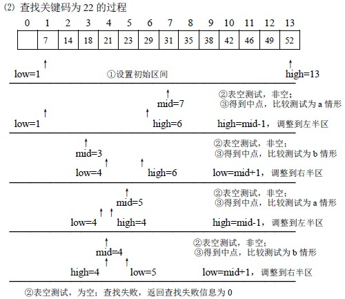
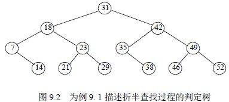
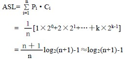

# 9.2 静态查找表—有序表的折半查找

有序表即是表中数据元素按关键码升序或降序排列。

折半查找的思想为：在有序表中，取中间元素作为比较对象，若给定值与中间元素的关键码相等，则查找成功；若给定值小于中间元素的关键码，则在中间元素的左半区继续查找；若给定值大于中间元素的关键码，则在中间元素的右半区继续查找。不断重复上述查找过程，直到查找成功，或所查找的区域无数据元素，查找失败。

**【步骤】**

① low=1；high=length； // 设置初始区间

② 当 low>high 时，返回查找失败信息// 表空，查找失败

③ low≤high，mid=(low+high)/2; // 取中点

      a. 若 kx<tbl.elem[mid].key，high=mid-1；转② // 查找在左半区进行

      b. 若 kx>tbl.elem[mid].key，low=mid+1；转② // 查找在右半区进行

      c. 若 kx=tbl.elem[mid].key，返回数据元素在表中位置// 查找成功

**【例 9.１】**有序表按关键码排列如下：

7，14，18，21，23，29，31，35，38，42，46，49，52 在表中查找关键码为 14 和 22 的数据元素。

⑴ 查找关键码为 14 的过程

**【算法 9.2】**

int Binary_Search(S_TBL tbl，KEY kx)

{ /* 在表 tbl 中查找关键码为 kx 的数据元素，若找到返回该元素在表中的位置，否则，返回 0 */

int mid，flag=0；

low=1；high=length； /* ①设置初始区间*/

while(low<=high) /* ②表空测试*/

{ /* 非空，进行比较测试*/

mid=(low+high)/2； /* ③得到中点*/

if(kx<tbl.elem[mid].key) high=mid-1； /* 调整到左半区*/

else if(kx>tbl.elem[mid].key) low=mid+1； /* 调整到右半区*/

else { flag=mid；break；} /* 查找成功，元素位置设置到 flag 中*/

}

return flag;

}

**【性能分析】**

从折半查找过程看，以表的中点为比较对象，并以中点将表分割为两个子表，对定位到的子表继续这种操作。所以，对表中每个数据元素的查找过程，可用二叉树来描述，称这个描述查找过程的二叉树为判定树。

可以看到，查找表中任一元素的过程，即是判定树中从根到该元素结点路径上各结点关键码的比较次数，也即该元素结点在树中的层次数。对于 n 个结点的判定树，树高为 k，则有 2k-1 -1<n≤2k-1，即 k-1<log2(n+1)≤k，所以 k= 。因此，折半查找在查找成功时，所进行的关键码比较次数至多为。

接下来讨论折半查找的平均查找长度。为便于讨论，以树高为 k 的满二叉树(n=2k-1)为例。假设表中每个元素的查找是等概率的，即 Pi= ，则树的第 i 层有 2i-1 个结点，因此，折半查找的平均查找长度为：

所以，折半查找的时间效率为 O(log2n)。