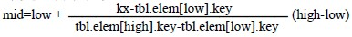
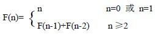

# 9.2 静态查找表—有序表的插值查找和斐波那契查找

### 一.插值查找

插值查找通过下列公式

求取中点，其中 low 和 high 分别为表的两个端点下标，kx 为给定值。

若 kx<tbl.elem[mid].key，则 high=mid-1，继续左半区查找；

若 kx>tbl.elem[mid].key，则 low=mid+1，继续右半区查找；

若 kx=tbl.elem[mid].key，查找成功。

插值查找是平均性能最好的查找方法，但只适合于关键码均匀分布的表，其时间效率依然是 O(log2n)。

### 二.斐波那契查找

斐波那契查找通过斐波那契数列对有序表进行分割，查找区间的两个端点和中点都与斐波那契数有关。斐波那契数列定义如下：

设 n 个数据元素的有序表，且 n 正好是某个斐波那契数-1，即 n=F(k)-1 时，可用此查找方法。

斐波那契查找分割的思想为：对于表长为 F(i)-1 的有序表，以相对 low 偏移量 F(i-1)-1 取中点，即 mid=low+F(i-1)-1，对表进行分割，则左子表表长为 F(i-1)-1，右子表表长为 F(i)-1-[F(i-1)-1]-1=F(i-2)-1。可见，两个子表表长也都是某个斐波那契数-1，因而，可以对子表继续分割。

【算法 9.3】

① low=1；high=F(k)-1； // 设置初始区间

F=F(k)-1；f=F(k-1)-1； // F 为表长，f 为取中点的相对偏移量

② 当 low>high 时，返回查找失败信息// 表空，查找失败

③ low≤high，mid=low+f; // 取中点

a. 若 kx<tbl.elem[mid].key，则

     p=f；f=F-f-1； // 计算取中点的相对偏移量

     F=p； // 调整表长 F

     high=mid-1；转② // 查找在左半区进行

b. 若 kx>tbl.elem[mid].key，则

    F=F-f-1； // 调整表长 F

    f=f-F-1； // 计算取中点的相对偏移量

    low=mid+1；转② // 查找在右半区进行

c. 若 kx=tbl.elem[mid].key，返回数据元素在表中位置// 查找成功

当 n 很大时，该查找方法称为黄金分割法，其平均性能比折半查找好，但其时间效率仍为 O(log2n)，而且，在最坏情况下比折半查找差，优点是计算中点仅作加、减运算。