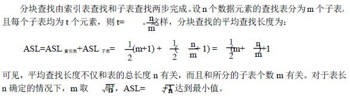

# 9.2 静态查找表—分块查找

分块查找又称索引顺序查找，是对顺序查找的一种改进。分块查找要求将查找表分成 若干个子表，并对子表建立索引表，查找表的每一个子表由索引表中的索引项确定。索引 项包括两个字段：关键码字段(存放对应子表中的最大关键码值) ；指针字段(存放指向对 应子表的指针) ，并且要求索引项按关键码字段有序。查找时，先用给定值 kx 在索引表中 检测索引项，以确定所要进行的查找在查找表中的查找分块(由于索引项按关键码字段有序，可用顺序查找或折半查找) ，然后，再对该分块进行顺序查找。

**【例 9.2】**关键码集合为：

88，43，14，31，78，8，62，49，35，71，22，83，18，52 按关键码值 31，62，88 分为三块建立的查找表及其索引表如下：**【性能分析】**