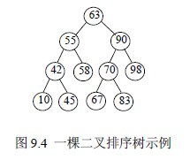
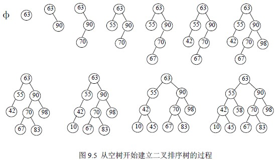
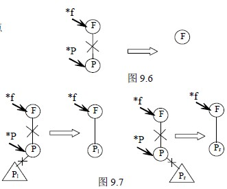
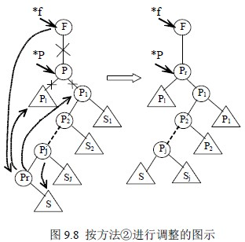
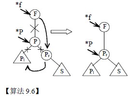

# 9.3.1 动态查找表—二叉排序树

## 一.二叉排序树定义

二叉排序树（Binary Sort Tree）或者是一棵空树；或者是具有下列性质的二叉树：

1.  若左子树不空，则左子树上所有结点的值均小于根结点的值；若右子树不空，则右子树上所有结点的值均大于根结点的值。
2.  左右子树也都是二叉排序树。

由图 9.4 可以看出，对二叉排序树进行中序遍历，便可得到一个按关键码有序的序列，因此，一个无序序列，可通过构一棵二叉排序树而成为有序序列。

## 二.二叉排序树查找过程

从其定义可见，二叉排序树的查找过程为：

1.  若查找树为空，查找失败。
2.  查找树非空，将给定值 kx 与查找树的根结点关键码比较。
3.  若相等，查找成功，结束查找过程，否则，

    a．当给 kx 小于根结点关键码，查找将在以左子女为根的子树上继续进行，转①

    b．当给 kx 大于根结点关键码，查找将在以右子女为根的子树上继续进行，转①

以二叉链表作为二叉排序树的存储结构，则查找过程算法程序描述如下：

typedef struct NODE

{ ElemType elem; /*数据元素字段*/

struct NODE *lc,*rc; /*左、右指针字段*/

}NodeType; /*二叉树结点类型*/

【算法 9.4】

int SearchElem(NodeType *t,NodeType **p,NodeType **q,KeyType kx)

{ /*在二叉排序树 t 上查找关键码为 kx 的元素，若找到，返回 1，且 q 指向该结点，p 指向其父结点；*/

/*否则，返回 0，且 p 指向查找失败的最后一个结点*/int flag=0; *q=t;while(*q) /*从根结点开始

查找*/{ if(kx>(*q)->elem.key) /*kx 大于当前结点*q 的元素关键码*/

{ *p=*q; *q=(*q)->rc; } /*将当前结点*q 的右子女置为新根*/

else

{ if(kx<(*q)->elem.key) /*kx 小于当前结点*q 的元素关键码*/

{ *p=*q; *q=(*q)->lc;} /*将当前结点*q 的左子女置为新根*/

else {flag=1;break;} /*查找成功，返回*/

}

}/*while*/

return flag;

}

## 三.二叉排序树插入操作和构造一棵二叉排序树

先讨论向二叉排序树中插入一个结点的过程：设待插入结点的关键码为 kx，为将其插入，先要在二叉排序树中进行查找，若查找成功，按二叉排序树定义，待插入结点已存在，不用插入；查找不成功时，则插入之。因此，新插入结点一定是作为叶子结点添加上去的。

构造一棵二叉排序树则是逐个插入结点的过程。

【例 9.3】记录的关键码序列为：63，90，70，55，67，42，98，83，10，45，58，则构造一棵二叉排序树的过程如下：

【算法 9.5】

int InsertNode (NodeType **t,KeyType kx)

{ /*在二叉排序树*t 上插入关键码为 kx 的结点*/

NodeType *p=*t,*q,*s; int flag=0;

if(!SearchElem(*t,&p,&q,kx)); /*在*t 为根的子树上查找*/

{ s=(NodeType *))malloc(sizeof(NodeType)); /*申请结点，并赋值*/

s->elem.key=kx;s->lc=NULL;s->rc=NULL;

flag=1; /*设置插入成功标志*/

if(!p) t=s; /*向空树中插入时*/

else

{ if(kx>p->elem.key) p->rc=s; /*插入结点为 p 的右子女*/

else p->lc=s; /*插入结点为 p 的左子女*/

}

}

return flag;

}

## 四.二叉排序树删除操作

从二叉排序树中删除一个结点之后，使其仍能保持二叉排序树的特性即可。设待删结点为*p（p 为指向待删结点的指针），其双亲结点为*f，以下分三种情况进行讨论。

1.  *p 结点为叶结点，由于删去叶结点后不影响整棵树的特性，所以，只需将被删结点的双亲结点相应指针域改为空指针。如图 9.6。
2.  *p 结点只有右子树 pr 或只有左子树 pl，此时，只需将 pr 或 pl 替换*f 结点的*p 子树即可。如图 9.7。
3.  *p 结点既有左子树 Pl 又有右子树 Pr，可按中序遍历保持有序进行调整。

设删除*p 结点前，中序遍历序列为：

1.  P 为 F 的左子女时有：…，Pl 子树，P，Pj ，S 子树，Pk，Sk 子树，…，P2，S2 子树，P1，S1 子树，F，…
2.  P 为 F 的右子女时有：…，F，Pl 子树，P，Pj ，S 子树，Pk，Sk 子树，…，P2，S2 子树，P1，S1 子树，…

则删除*p 结点后，中序遍历序列应为：

1.  P 为 F 的左子女时有：…，Pl 子树，Pj ，S 子树，Pk，Sk 子树，…，P2，S2 子树，P1，S1 子树，F，…
2.  P 为 F 的右子女时有：…，F，Pl 子树，Pj ，S 子树，Pk，Sk 子树，…，P2，S2 子树，P1，S1 子树，…

有两种调整方法：

1.  直接令 pl 为*f 相应的子树，以 pr 为 pl 中序遍历的最后一个结点 pk 的右子树；
2.  令*p 结点的直接前驱 Pr 或直接后继（对 Pl 子树中序遍历的最后一个结点 Pk）替换*p 结点，再按⒉的方法删去 Pr 或 Pk。图 9.8 所示的就是以*p 结点的直接前驱 Pr 替换*p。

【算法 9.6】

int DeleteNode(NodeType **t,KeyType kx)

{ NodeType *p=*t,*q,*s,**f;

int flag=0;

if(SearchElem(*t,&p,&q,kx));

{ flag=1; /*查找成功，置删除成功标志*/

if(p= =q) f=&(*t); /*待删结点为根结点时*/

else /*待删结点非根结点时*/

{ f=&(p->lc); if(kx>p->elem.key) f=&(p->rc);

} /*f 指向待删结点的父结点的相应指针域*/

if(!q->rc) *f=q->lc; /*若待删结点无右子树，以左子树替换待删结点*/

else

{ if(!q->lc) *f=q->rc; /*若待删结点无左子树，以右子树替换待删结点*/

else /*既有左子树又有右子树*/

{ p=q->rc;s=p;

while(p->lc) {s=p;p=p->lc;}/*在右子树上搜索待删结点的前驱 p*/

*f=p;p->lc=q->lc; /*替换待删结点 q，重接左子树*/

if(s!=p)

{ s->lc=p->rc; /*待删结点的右子女有左子树时，还要重接右子树*/

p->rc=q->rc;

}

}

}

free(q);

}

return flag;

}

对给定序列建立二叉排序树，若左右子树均匀分布，则其查找过程类似于有序表的折半查找。但若给定序列原本有序，则建立的二叉排序树就蜕化为单链表，其查找效率同顺序查找一样。因此，对均匀的二叉排序树进行插入或删除结点后，应对其调整，使其依然保持均匀。