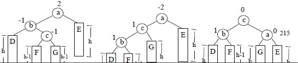

# 9.3.1 动态查找表—平衡二叉树(AVL 树)

平衡二叉树或者是一棵空树，或者是具有下列性质的二叉排序树：它的左子树和右子树都是平衡二叉树，且左子树和右子树高度之差的绝对值不超过 1。

图 9.9 给出了两棵二叉排序树，每个结点旁边所注数字是以该结点为根的树中，左子树与右子树高度之差，这个数字称为结点的平衡因子。由平衡二叉树定义，所有结点的平衡因子只能取-1，0，1 三个值之一。若二叉排序树中存在这样的结点，其平衡因子的绝对值大于 1，这棵树就不是平衡二叉树。如图 9.9 （a）所示的二叉排序树。

在平衡二叉树上插入或删除结点后，可能使树失去平衡，因此，需要对失去平衡的树进行平衡化调整。设 a 结点为失去平衡的最小子树根结点，对该子树进行平衡化调整归纳起来有以下四种情况：

### 一. 左单旋转

如图 9.10 的图(a)为插入前的子树。其中，B 为结点 a 的左子树，D、E 分别为结点 c 的左右子树，B、D、E 三棵子树的高均为 h。图(a)所示的子树是平衡二叉树。在图(a)所示的树上插入结点 x，如图(b)所示。结点 x 插入在结点 c 的右子树 E 上，导致结点 a 的平衡因子绝对值大于 1，以结点 a 为根的子树失去平衡。

【调整策略】

调整后的子树除了各结点的平衡因子绝对值不超过 1，还必须是二叉排序树。由于结点 c 的左子树 D 可作为结点 a 的右子树，将结点 a 为根的子树调整为左子树是 B，右子树是 D，再将结点 a 为根的子树调整为结点 c 的左子树，结点 c 为新的根结点，如图(c)。

【平衡化调整操作判定】

沿插入路径检查三个点 a、c、E，若它们处于“\”直线上的同一个方向，则要作左单

旋转，即以结点 c 为轴逆时针旋转。

### 二. 右单旋转

右单旋转与左单旋转类似，沿插入路径检查三个点 a、c、E，若它们处于“/”直线上的同一个方向，则要作右单旋转，即以结点 c 为轴顺时针旋转，如图 9.11 所示。

### 三. 先左后右双向旋转

如图 9.12 为插入前的子树，根结点 a 的左子树比右子树高度高 1，待插入结点 x 将插入到结点 b 的右子树上，并使结点 b 的右子树高度增 1，从而使结点 a 的平衡因子的绝对值大于 1，导致结点 a 为根的子树平衡被破坏，如图 9.13(a)、9.14(d)所示。

沿插入路径检查三个点 a、b、c，若它们呈“<”字形，需要进行先左后右双向旋转：

1.  首先，对结点 b 为根的子树，以结点 c 为轴，向左逆时针旋转，结点 c 成为该子树的新根，如图(b、e)；
2.  由于旋转后，待插入结点 x 相当于插入到结点 b 为根的子树上，这样 a、c、b 三点处于“/”直线上的同一个方向，则要作右单旋转，即以结点 c 为轴顺时针旋转，如图(c、f)。

### 四. 先右后左双向旋转先右后左双向旋转和先左后右双向旋转对称，请读者自行补充整理。

在平衡的二叉排序树 T 上插入一个关键码为 kx 的新元素，递归算法可描述如下：

1.  若 T 为空树，则插入一个数据元素为 kx 的新结点作为 T 的根结点，树的深度增 1；
2.  若 kx 和 T 的根结点关键码相等，则不进行插入；
3.  若 kx 小于 T 的根结点关键码，而且在 T 的左子树中不存在与 kx 有相同关键码的结点， 则将新元素插入在 T 的左子树上，并且当插入之后的左子树深度增加 1 时，分别就下列情况进行处理：

    ① T 的根结点平衡因子为-1(右子树的深度大于左子树的深度)，则将根结点的平衡因子更改为 0，T 的深度不变；

    ② T 的根结点平衡因子为 0(左、右子树的深度相等)，则将根结点的平衡因子更改为 1，T 的深度增加 1；

    ③ T 的根结点平衡因子为 1(左子树的深度大于右子树的深度)，则若 T 的左子树根结点的平衡因子为 1，需进行单向右旋平衡处理，并且在右旋处理之后，将根结点和其右子树根结点的平衡因子更改为 0，树的深度不变；若 T 的左子树根结点平衡因子为-1，需进行先左后右双向旋转平衡处理，并且在旋转处理之后，修改根结点和其左、右子树根结点的平衡因子，树的深度不变。

4.  若 kx 大于 T 的根结点关键码，而且在 T 的右子树中不存在与 kx 有相同关键码的结点，则将新元素插入在 T 的右子树上，并且当插入之后的右子树深度增加 1 时，分别就不同情况处理之。其处理操作和(3.) 中所述相对称，读者可自行补充整理。

【算法 9.7】

typedef struct NODE{

ElemType elem; /*数据元素*/

int bf; /*平衡因子*/

struct NODE *lc,*rc; /*左右子女指针*/

}NodeType; /*结点类型*/

void R_Rotate(NodeType **p)

{ /*对以*p 指向的结点为根的子树，作右单旋转处理，处理之后，*p 指向的结点为子树的新根*/

lp=(*p)->lc; /*lp 指向*p 左子树根结点*/

(*p)->lc=lp->rc; /*lp 的右子树挂接*p 的左子树*/

lp->rc=*p; *p=lp; /* *p 指向新的根结点*/

}

void L_Rotate(NodeType **p)

{ /*对以*p 指向的结点为根的子树，作左单旋转处理，处理之后，*p 指向的结点为子树的新根*/

lp=(*p)->rc; /*lp 指向*p 右子树根结点*/

(*p)->rc=lp->lc; /*lp 的左子树挂接*p 的右子树*/

lp->lc=*p; *p=lp; /* *p 指向新的根结点*/

}

#define LH 1 /* 左高*/

#define EH 0 /* 等高*/

#define RH 1 /* 右高*/

void LeftBalance((NodeType **p)

{ /*对以*p 指向的结点为根的子树，作左平衡旋转处理，处理之后，*p 指向的结点为子树的新根*/

lp=(*p)->lc; /*lp 指向*p 左子树根结点*/

switch((*p)->bf) /*检查*p 平衡度，并作相应处理*/

{case LH: /*新结点插在*p 左子女的左子树上，需作单右旋转处理*/

(*p)->bf=lp->bf=EH;R_Rotate(p);break;

case EH: /*原本左、右子树等高，因左子树增高使树增高*/

(*p)->bf=LH; *paller=TRUE;break;

case RH: /*新结点插在*p 左子女的右子树上，需作先左后右双旋处理*/

rd=lp->rc; /*rd 指向*p 左子女的右子树根结点*/

switch(rd->bf) /*修正*p 及其左子女的平衡因子*/

{ case LH:(*p)->bf=RH;lp->bf=EH;break;

case EH:(*p)->bf=lp->bf=EH;break;

case RH:(*p)->bf=EH;lp->bf=LH;break;

}/*switch(rd->bf)*/

rd->bf=EH; L_Rotate(&((*p)->lc)); /*对*p 的左子树作左旋转处理*/

R_Rotate(p); /*对*t 作右旋转处理*/

}/*switch((*p)->bf)*/

}/*LeftBalance*/

int InsertAVL(NodeType **t,ElemType e,Boolean *taller)

{ /*若在平衡的二叉排序树 t 中不存在和 e 有相同关键码的结点，则插入一个数据元素为 e 的*/

/*新结点，并反回 1，否则反回 0。若因插入而使二叉排序树失去平衡，则作平衡旋转处理，*/

/*布尔型变量 taller 反映 t 长高与否*/

if(!(*t)) /*插入新结点，树“长高”，置 taller 为 TURE*/

{ *t=(NodeType *)malloc(sizeof(NodeType)); (*T)->elem=e;

(*t)->lc=(*t)->rc=NULL;(*t)->bf=EH;*taller=TRUE;

}/*if*/

else

{ if(e.key==(*t)->elem.key) /*树中存在和 e 有相同关键码的结点，不插入*/

{ taller=FALSE; return 0;}

if(e.key<(*t)->elem.key)

{ /*应继续在*t 的左子树上进行*/

if(!InsertAVL(&((*t)->lc)),e,&taller)) return 0; /*未插入*/

if(*taller) /*已插入到(*t)的左子树中，且左子树增高*/

switch((*t)->bf) /*检查*t 平衡度*/

{case LH: /*原本左子树高，需作左平衡处理*/

LeftBalance(t);*taller=FALSE;break;

case EH: /*原本左、右子树等高，因左子树增高使树增高*/

(*t)->bf=LH; *taller=TRUE;break;

case RH: /*原本右子树高，使左、右子树等高*/

(*t)->bf=EH; *taller=FALSE;break;

}

}/*if*/

else /*应继续在*t 的右子树上进行*/

{ if(!InsertAVL(&((*t)->rc)),e,&taller)) return 0; /*未插入*/

if(*taller) /*已插入到(*t)的左子树中，且左子树增高*/

switch((*t)->bf) /*检查*t 平衡度*/

{case LH: /*原本左子树高，使左、右子树等高*/

(*t)->bf=EH; *taller=FALSE;break;

case EH: /*原本左、右子树等高，因右子树增高使树增高*/

(*t)->bf=RH; *taller=TRUE;break;

case RH: /*原本右子树高，需作右平衡处理*/

RightBalance(t); *taller=FALSE;break;

}

}/*else*/

}/*else*/

return 1;

}/*InsertAVL*/

【平衡树的查找分析】

在平衡树上进行查找的过程和二叉排序树相同，因此，在查找过程中和给定值进行比较的关键码个数不超过树的深度。那么，含有 n 个关键码的平衡树的最大深度是多少呢？

为解答这个问题，我们先分析深度为 h 的平衡树所具有的最少结点数。假设以 Nh 表示深度为 h 的平衡树中含有的最少结点数。显然，N0=0，N1=1，N2=2，并且 Nh=Nh-1+Nh-2+1。这个关系和斐波那契序列极为相似。利用归纳法容易证明：当 h≥0 间复杂度为 O(logn)。

上述对二叉排序树和二叉平衡树的查找性能的讨论都是在等概率的提前下进行的。