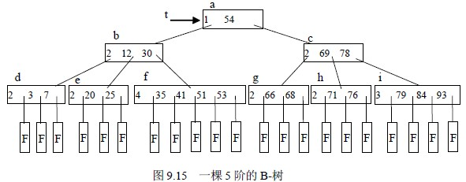
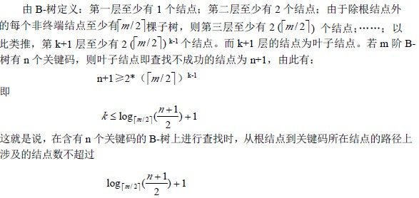
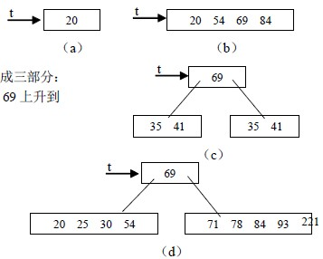
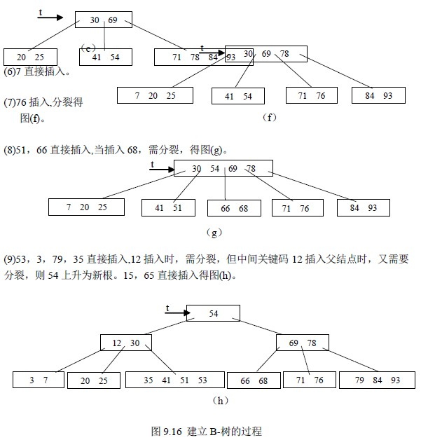
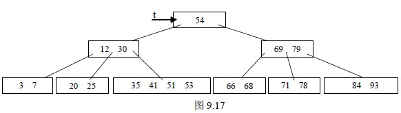
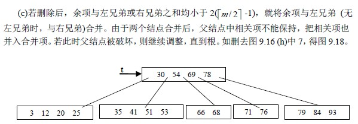
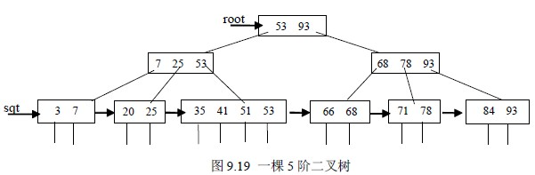
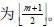

# 9.3.1 动态查找表—B-树和 B+树

## 一.B-树及其查找

B-树是一种平衡的多路查找树，它在文件系统中很有用。

定义：一棵 m 阶的 B-树，或者为空树，或为满足下列特性的 m 叉树：

⑴树中每个结点至多有 m 棵子树；

⑵若根结点不是叶子结点，则至少有两棵子树；

⑶除根结点之外的所有非终端结点至少有⎡m/2⎤ 棵子树；

⑷所有的非终端结点中包含以下信息数据：（n，A0，K1，A1，K2，…，Kn，An）

其中：Ki（i=1,2,…,n）为关键码，且 Ki<Ki+1，Ai 为指向子树根结点的指针(i=0,1,…,n)，且指针 Ai-1 所指子树中所有结点的关键码均小于 Ki (i=1,2,…,n)，An 所指子树中所有结点的关键码均大于 Kn， ⎡m/2⎤ −1≤n≤m −1 ，n 为关键码的个数。

⑸所有的叶子结点都出现在同一层次上，并且不带信息（可以看作是外部结点或查找失败的结点，实际上这些结点不存在，指向这些结点的指针为空）。

【例 9.4】如图 9.15 所示为一棵 5 阶的 B-树，其深度为 4。

B-树的查找类似二叉排序树的查找，所不同的是 B-树每个结点上是多关键码的有序表，在到达某个结点时，先在有序表中查找，若找到，则查找成功；否则，到按照对应的指针信息指向的子树中去查找，当到达叶子结点时，则说明树中没有对应的关键码，查找时，而约等于φ 其中φ )，则约等于φ / 5 1。反之，含有 n 个结点的平衡树的最大深度为 log 5 φ( (n+1))-2。因此，在平衡树上进行查找的时失败。即在 B-树上的查找过程是一个顺指针查找结点和在结点中查找关键码交叉进行的过程。比如，在图 9.12 中查找关键码为 93 的元素。首先，从 t 指向的根结点（a）开始，结点（a）中只有一个关键码，且 93 大于它，因此，按（a）结点指针域 A1 到结点（c）去查找，结点（c）由两个关键码，而 93 也都大于它们，应按（c）结点指针域 A2 到结点（i）去查找，在结点（i）中顺序比较关键码，找到关键码 K3。

【算法 9.8】

#define m 5 /*B 树的阶，暂设为 5*/

typedef struct NODE{

int keynum; /* 结点中关键码的个数，即结点的大小*/

struct NODE *parent; /*指向双亲结点*/ KeyTypekey[m+1]; /*关键码向量，0 号单元未用*/ struct NODE *ptr[m+1]; /*子树指针向量*/ record *recptr[m+1]; /*记录指针向量*/

}NodeType; /*B 树结点类型*/

typedef struct{

NodeType *pt; /*指向找到的结点*/

int i; /*在结点中的关键码序号，结点序号区间[1…m]*/

int tag; /* 1:查找成功，0:查找失败*/

}Result; /*B 树的查找结果类型*/

Result SearchBTree(NodeType *t,KeyType kx)

{ /*在 m 阶 B 树 t 上查找关键码 kx，反回(pt,i,tag)。若查找成功，则特征值 tag=1，*/

/*指针 pt 所指结点中第 i 个关键码等于 kx；否则，特征值 tag=0,等于 kx 的关键码记录*/

/*应插入在指针 pt 所指结点中第 i 个和第 i+1 个关键码之间*/

p=t;q=NULL;found=FALSE;i=0; /*初始化，p 指向待查结点，q 指向 p 的双亲*/

while(p&&!found)

{ n=p->keynum;i=Search(p,kx); /*在 p-->key[1…keynum]中查找*/

if(i>0&&p->key[i]= =kx) found=TRUE; /*找到*/

else {q=p;p=p->ptr[i];}

}

if(found) return (p,i,1); /*查找成功*/

else return (q,i,0); /*查找不成功，反回 kx 的插入位置信息*/

}

【查找分析】

B-树的查找是由两个基本操作交叉进行的过程，即

⑴在 B-树上找结点； ⑵在结点中找关键码。

由于，通常 B-树是存储在外存上的，操作⑴就是通过指针在磁盘相对定位，将结点信

息读入内存，之后，再对结点中的关键码有序表进行顺序查找或折半查找。因为，在磁盘

上读取结点信息比在内存中进行关键码查找耗时多，所以，在磁盘上读取结点信息的次数，

221

即 B-树的层次树是决定 B-树查找效率的首要因素。

那么，对含有 n 个关键码的 m 阶 B-树，最坏情况下达到多深呢？可按二叉平衡树进

行类似分析。首先，讨论 m 阶 B-数各层上的最少结点数。

二.B-树的插入和删除

1.插入

在 B-树上插入关键码与在二叉排序树上插入结点不同，关键码的插入不是在叶结点上

进行的，而是在最底层的某个非终端结点中添加一个关键码，若该结点上关键码个数不超

过 m-1 个，则可直接插入到该结点上；否则，该结点上关键码个数至少达到 m 个，因而使

该结点的子树超过了 m 棵，这与 B-树定义不符。所以要进行调整，即结点的“分裂”。方

法为：关键码加入结点后，将结点中的关键码分成三部分，使得前后两部分关键码个数

个结点将其插入到父结点中。若插入父结点而使父结点中关键码个数超过 m-1，则父结点

继续分裂，直到插入某个父结点，其关键码个数小于 m。可见，B-树是从底向上生长的。

【例 9.5】就下列关键码序，建立 5 阶 B-树，如图 9.16。20，54，69，84，71，30，78，25，

93，41，7，76，51，66，68，53，3，79，35，12，15，65

(1)向空树中插入 20，得图(a)。

(2)插入 54，69，84，得图(b)。

(3)插入 71，索引项达到 5，要分裂成三部分：

{20，54}，{69}和{71，84},并将 69 上升到

该结点的父结点中，如图(c)。

(4)插入 30,78,25,93 得图(d)。

(5)插 41 又分裂得图(e)。

【算法 9.9】

int InserBTree(NodeType **t,KeyType kx,NodeType *q,int i){ /* 在 m 阶 B 树*t 上结点*q 的

key[i],key[i+1]之间插入关键码 kx*/ /*若引起结点过大，则沿双亲链进行必要的结点分裂调整，使*t

仍为 m 阶 B 树*/

x=kx;ap=NULL;finished=FALSE;

while(q&&!finished)

{ Insert(q,i,x,ap); /*将 x 和 ap 分别插入到 q->key[i+1]和 q->ptr[i+1]*/

if(q->keynum<m) finished=TRUE; /*插入完成*/

else

{ /*分裂结点*p*/

s=m/2;split(q,ap);x=q->key[s];

/*将 q->key[s+1…m],q->ptr[s…m]和 q->recptr[s+1…m]移入新结点*ap*/

q=q->parent;

if(q) i=Search(q,kx); /*在双亲结点*q 中查找 kx 的插入位置*/

}/*else*/

}/*while*/

if(!finished) /*(*t)是空树或根结点已分裂为*q*和 ap*/

NewRoot(t,q,x,ap); /*生成含信息(t,x,ap)的新的根结点*t,原*t 和 ap 为子树指针*/

}

2\. 删除

分两种情况：

(1)删除最底层结点中关键码

a)若结点中关键码个数大于⎡m / 2⎤ -1，直接删去。

b)否则除余项与左兄弟(无左兄弟，则找左兄弟)项数之和大于等于 2( -1) 就与它

们父结点中的有关项一起重新分配。如删去图 9.16 (h)中的 76 得图 9.17

(2)删除为非底层结点中关键码

若所删除关键码非底层结点中的 Ki，则可以指针 Ai 所指子树中的最小关键码 X 替代

Ki，然后，再删除关键码 X，直到这个 X 在最底层结点上，即转为(1)的情形。

删除程序，请读者自己完成。

三. B+树

B+树是应文件系统所需而产生的一种 B-树的变形树。一棵 m 阶的 B+树和 m 阶的 B-

树的差异在于：

⑴有 n 棵子树的结点中含有 n 个关键码；

⑵所有的叶子结点中包含了全部关键码的信息，及指向含有这些关键码记录的指针，且

叶子结点本身依关键码的大小自小而大的顺序链接。

⑶所有的非终端结点可以看成是索引部分，结点中仅含有其子树根结点中最大（或最小）

关键码。

例如图 9.16 所示为一棵五阶的 B+树，通常在 B+树上有两个头指针，一个指向根结

点，另一个指向关键码最小的叶子结点。因此，可以对 B+树进行两种查找运算：一种是

从最小关键码起顺序查找，另一种是根结点开始，进行随机查找。

在 B+树上进行随机查找、插入和删除的过程基本上与 B-树类似。只是在查找时，若

非终端结点上的关键码等于给定值，并不终止，而是继续向下直到叶子结点。因此，在 B+

树，不管查找成功与否，每次查找都是走了一条从根到叶子结点的路径。B+树查找的分析

类似于 B-树。B+树的插入仅在叶子结点上进行，当结点中的关键码个数大于 m 时要

分裂成两个结点，他们所含关键码的个数均并且，他们的双亲结点中应同时包含这两个结点中的最大关键码。B+树的删除也仅在叶子结点进行，当叶子结点中的最大关

键码被删除时，其在非终端结点中的值可以作为一个“分界关键码”存在。若因删除

⎡m / 2⎤

图 9.18

而使结点中关键码的个数少于时，其和兄弟结点的合并过程亦和 B-树类似。