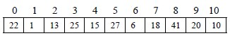

# 9.4 哈希表查找(杂凑法)—哈希表与哈希方法

以上讨论的查找方法，由于数据元素的存储位置与关键码之间不存在确定的关系，因此，查找时，需要进行一系列对关键码的查找比较，即“查找算法”是建立在比较的基础上的，查找效率由比较一次缩小的查找范围决定。理想的情况是依据关键码直接得到其对应的数据元素位置，即要求关键码与数据元素间存在一一对应关系，通过这个关系，能很快地由关键码得到对应的数据元素位置。

【例 9.6】11 个元素的关键码分别为 18，27，1，20，22，6，10，13，41，15，25。选取关键码与元素位置间的函数为 f(key)=key mod 11

1\. 通过这个函数对 11 个元素建立查找表如下：

2\. 查找时，对给定值 kx 依然通过这个函数计算出地址，再将 kx 与该地址单元中元素的关键码比较，若相等，查找成功。

**哈希表与哈希方法：**选取某个函数，依该函数按关键码计算元素的存储位置，并按此存放；查找时，由同一个函数对给定值 kx 计算地址，将 kx 与地址单元中元素关键码进行比，确定查找是否成功，这就是哈希方法(杂凑法)；哈希方法中使用的转换函数称为哈希函数(杂凑函数)；按这个思想构造的表称为哈希表(杂凑表)。

对于 n 个数据元素的集合，总能找到关键码与存放地址一一对应的函数。若最大关键为 m，可以分配 m 个数据元素存放单元，选取函数 f(key)=key 即可，但这样会造成存储空间的很大浪费，甚至不可能分配这么大的存储空间。通常关键码的集合比哈希地址集合大得多，因而经过哈希函数变换后，可能将不同的关键码映射到同一个哈希地址上，这种现象称为冲突(Collision)，映射到同一哈希地址上的关键码称为同义词。可以说，冲突不可能避免，只能尽可能减少。所以，哈希方法需要解决以下两个问题：

1.  构造好的哈希函数

    （1）所选函数尽可能简单，以便提高转换速度。

    （2）所选函数对关键码计算出的地址，应在哈希地址集中大致均匀分布，以减少空间浪费。

2.  制定解决冲突的方案。