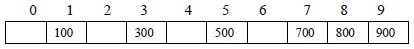
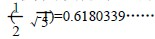
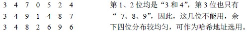
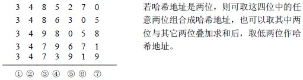
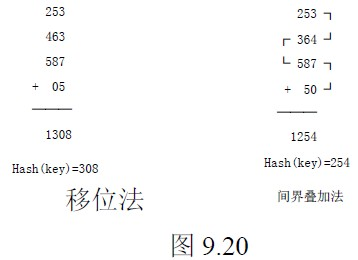

# 9.4 哈希表查找(杂凑法)—常用的哈希函数

## 一. 直接定址法

Hash(key)=a·key+b (a、b 为常数)

即取关键码的某个线性函数值为哈希地址，这类函数是一一对应函数，不会产生冲突，但要求地址集合与关键码集合大小相同，因此，对于较大的关键码集合不适用。

【例 9.7】关键码集合为{100，300，500，700，800，900}，选取哈希函数为 Hash(key)=key/100，则存放如下：

## 二. 除留余数法

Hash(key)=key mod p (p 是一个整数)

即取关键码除以 p 的余数作为哈希地址。使用除留余数法，选取合适的 p 很重要，若哈希表表长为 m，则要求 p≤m，且接近 m 或等于 m。p 一般选取质数，也可以是不包含小于 20 质因子的合数。

## 三. 乘余取整法

Hash(key)= ⎣B*(A*key mod 1)⎦ (A、B 均为常数，且 0<A<1，B 为整数)以关键码 key 乘以 A，取其小数部分(A*key mod 1 就是取 A*key 的小数部分)，之后再用整数 B 乘以这个值，取结果的整数部分作为哈希地址。

该方法 B 取什么值并不关键，但 A 的选择却很重要，最佳的选择依赖于关键码集合的特征。一般取 A=较为理想。

## 四. 数字分析法

设关键码集合中，每个关键码均由 m 位组成，每位上可能有 r 种不同的符号。

【例 9.8】若关键码是 4 位十进制数，则每位上可能有十个不同的数符 0～9，所以 r=10。

【例 9.9】若关键码是仅由英文字母组成的字符串，不考虑大小写，则每位上可能有 26 种不同的字母，所以 r=26。

数字分析法根据 r 种不同的符号，在各位上的分布情况，选取某几位，组合成哈希地址。所选的位应是各种符号在该位上出现的频率大致相同。

【例 9.10】有一组关键码如下：

## 五. 平方取中法

对关键码平方后，按哈希表大小，取中间的若干位作为哈希地址。

## 六. 折叠法(Folding)

此方法将关键码自左到右分成位数相等的几部分，最后一部分位数可以短些，然后将这几部分叠加求和，并按哈希表表长，取后几位作为哈希地址。这种方法称为折叠法。

有两种叠加方法：

1.  移位法── 将各部分的最后一位对齐相加。
2.  间界叠加法── 从一端向另一端沿各部分分界来回折叠后，最后一位对齐相加。

【例 9.11】关键码为 key=05326248725，设哈希表长为三位数，则可对关键码每三位一部分来分割。

关键码分割为如下四组： 253 463 587 05

用上述方法计算哈希地址对于位数很多的关键码，且每一位上符号分布较均匀时，可采用此方法求得哈希地址。

