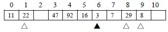
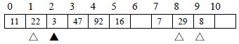
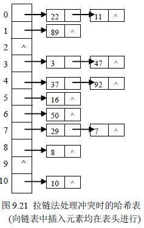

# 9.4 哈希表查找(杂凑法)—处理冲突的方法

## 一. 开放定址法

所谓开放定址法，即是由关键码得到的哈希地址一旦产生了冲突，也就是说，该地址已经存放了数据元素，就去寻找下一个空的哈希地址，只要哈希表足够大，空的哈希地址总能找到，并将数据元素存入。

找空哈希地址方法很多，下面介绍三种：

**1\. 线性探测法**

Hi=(Hash(key)+di) mod m ( 1≤i < m )

其中：

Hash(key)为哈希函数

m 为哈希表长度

di 为增量序列 1，2，……，m-1，且 di=i

【例 9.12】关键码集为{47，7，29，11，16，92，22，8，3}，哈希表表长为 11，Hash(key)=key mod 11，用线性探测法处理冲突，建表如下：

47、7、11、16、92 均是由哈希函数得到的没有冲突的哈希地址而直接存入的；Hash(29)=7，哈希地址上冲突，需寻找下一个空的哈希地址：

由 H1=(Hash(29)+1) mod 11=8，哈希地址 8 为空，将 29 存入。另外，22、8 同样在哈希地址上有冲突，也是由 H1 找到空的哈希地址的；

而 Hash(3)=3，哈希地址上冲突，由

H1=(Hash(3)+1) mod 11=4 仍然冲突；

H2=(Hash(3)+2) mod 11=5 仍然冲突；

H3=(Hash(3)+3) mod 11=6 找到空的哈希地址，存入。

线性探测法可能使第 i 个哈希地址的同义词存入第 i+1 个哈希地址，这样本应存入第 i+1 个哈希地址的元素变成了第 i+2 个哈希地址的同义词，……，因此，可能出现很多元素在相邻的哈希地址上“堆积”起来，大大降低了查找效率。为此，可采用二次探测法，或双哈希函数探测法，以改善“堆积”问题。

**2\. 二次探测法**

Hi=(Hash(key)±di) mod m

其中：

Hash(key)为哈希函数

m 为哈希表长度，m 要求是某个 4k+3 的质数(k 是整数)

di 为增量序列 12，-12，22，-22，……，q2，-q2 且 q≤1/2 (m-1)

仍以上例用二次探测法处理冲突，建表如下：

对关键码寻找空的哈希地址只有 3 这个关键码与上例不同，

Hash(3)=3，哈希地址上冲突，由

H1=(Hash(3)+12) mod 11=4 仍然冲突；

H2=(Hash(3)-12) mod 11=2 找到空的哈希地址，存入。

**3\. 双哈希函数探测法**

Hi=(Hash(key)+i*ReHash(key)) mod m (i=1，2，……，m-1)

其中：

Hash(key)，ReHash(key)是两个哈希函数，

m 为哈希表长度

双哈希函数探测法，先用第一个函数 Hash(key)对关键码计算哈希地址，一旦产生地址冲突，再用第二个函数 ReHash(key)确定移动的步长因子，最后，通过步长因子序列由探测函数寻找空的哈希地址。

比如，Hash(key)=a 时产生地址冲突，就计算 ReHash(key)=b，则探测的地址序列为

H1=(a+b) mod m，H2=(a+2b) mod m，……，Hm-1=(a+(m-1)b) mod m

## 二. 拉链法

设哈希函数得到的哈希地址域在区间[0，m-1]上，以每个哈希地址作为一个指针，指向一个链，即分配指针数组 ElemType *eptr[m]；建立 m 个空链表，由哈希函数对关键码转换后，映射到同一哈希地址 i 的同义词均加入到*eptr[i]指向的链表中。

【例 9.l3】关键码序列为 47,7,29,11,16,92,22,8,3,50,37,89,94,21，哈希函数为 Hash(key)=key mod 11

用拉链法处理冲突，建表如图 9.21。

## 三. 建立一个公共溢出区

设哈希函数产生的哈希地址集为[0，m-1]，则分配两个表：

一个基本表 ElemType base_tbl[m]；每个单元只能存放一个元素；

一个溢出表 ElemType over_tbl[k]；只要关键码对应的哈希地址在基本表上产生冲突，则所有这样的元素一律存入该表中。查找时，对给定值 kx 通过哈希函数计算出哈希地址 i，先与基本表的 base_tbl[i]单元比较，若相等，查找成功；否则，再到溢出表中进行查找。