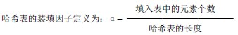
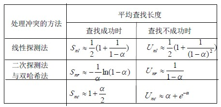

# 9.4 哈希表查找(杂凑法)—哈希表的查找分析

哈希表的查找过程基本上和造表过程相同。一些关键码可通过哈希函数转换的地址直接找到，另一些关键码在哈希函数得到的地址上产生了冲突，需要按处理冲突的方法进行查找。在介绍的三种处理冲突的方法中，产生冲突后的查找仍然是给定值与关键码进行比较的过程。所以，对哈希表查找效率的量度，依然用平均查找长度来衡量。

查找过程中，关键码的比较次数，取决于产生冲突的多少，产生的冲突少，查找效率就高，产生的冲突多，查找效率就低。因此，影响产生冲突多少的因素，也就是影响查找效率的因素。影响产生冲突多少有以下三个因素：

1.  哈希函数是否均匀
2.  处理冲突的方法
3.  哈希表的装填因子

分析这三个因素，尽管哈希函数的“好坏”直接影响冲突产生的频度，但一般情况下，我们总认为所选的哈希函数是“均匀的”，因此，可不考虑哈希函数对平均查找长度的影响。

就线性探测法和二次探测法处理冲突的例子看，相同的关键码集合、同样的哈希函数，但在数据元素查找等概率情况下，它们的平均查找长度却不同：

线性探测法的平均查找长度 ASL=(5×1+3×2+1×4)/9=5/3

二次探测法的平均查找长度 ASL=(5×1+3×2+1×2)/9=13/9

α是哈希表装满程度的标志因子。由于表长是定值，α与“填入表中的元素个数”成正比，所以，α越大，填入表中的元素较多，产生冲突的可能性就越大；α越小，填入表中的元素较少，产生冲突的可能性就越小。

实际上，哈希表的平均查找长度是装填因子α的函数，只是不同处理冲突的方法有不同的函数。以下给出几种不同处理冲突方法的平均查找长度：

哈希方法存取速度快，也较节省空间，静态查找、动态查找均适用，但由于存取是随机的，因此，不便于顺序查找。