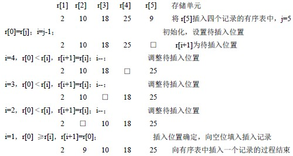
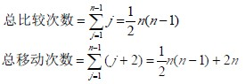
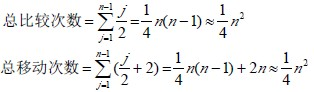

# 10.2 插入排序—直接插入排序

设有 n 个记录，存放在数组 r 中，重新安排记录在数组中的存放顺序，使得按关键码有序。即 r[1].key≤r[2].key≤……≤r[n].key

先来看看向有序表中插入一个记录的方法：

设１<ｊ≤ｎ，r[1].key≤r[2].key≤……≤r[j-1].key，将 r[j]插入，重新安排存放顺序，使得 r[1].key≤r[2].key≤……≤r[j].key，得到新的有序表，记录数增１。

【算法 10.1】

1.  r[0]=r[j]； //r[j]送 r[0]中，使 r[j]为待插入记录空位 i=j-1； //从第 i 个记录向前测试插入位置，用 r[0]为辅助单元， 可免去测试 i<1。
2.  若 r[0].key≥r[i].key，转④。//插入位置确定
3.  若 r[0].key < r[i].key 时，r[i+1]=r[i]；i=i-1；转②。//调整待插入位置
4.  r[i+1]=r[0]；结束。//存放待插入记录

【例 10.1】向有序表中插入一个记录的过程如下：

直接插入排序方法：仅有一个记录的表总是有序的，因此，对 n 个记录的表，可从第二个记录开始直到第 n 个记录，逐个向有序表中进行插入操作，从而得到 n 个记录按关键码有序的表。

【算法 10.2】

void InsertSort(S_TBL &p)

{ for(i=2；i<=p->length；i++)

if(p->elem[i].key < p->elem[i-1].key) /*小于时，需将 elem[i]插入有序表*/

{ p->elem[0].key=p->elem[i].key； /*为统一算法设置监测*/

for(j=i-1；p->elem[0].key < p->elem[j].key；j--)

p->elem[j+1].key=p->elem[j].key； /*记录后移*/

p->elem[j+1].key=p->elem[0].key； /*插入到正确位置*/

}

}

【效率分析】

空间效率：仅用了一个辅助单元。

时间效率：向有序表中逐个插入记录的操作，进行了 n-1 趟，每趟操作分为比较关键码和移动记录，而比较的次数和移动记录的次数取决于待排序列按关键码的初始排列。

最好情况下：即待排序列已按关键码有序，每趟操作只需 1 次比较 2 次移动。总比较次数=n-1 次，总移动次数=2(n-1)次。

最坏情况下：即第 j 趟操作，插入记录需要同前面的 j 个记录进行 j 次关键码比较，移动记录的次数为 j+2 次。

平均情况下：即第 j 趟操作，插入记录大约同前面的 j/2 个记录进行关键码比较，移动记录的次数为 j/2+2 次。由此，直接插入排序的时间复杂度为 O(n2)。是一个稳定的排序方法。