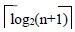

# 10.2 插入排序—折半插入排序

直接插入排序的基本操作是向有序表中插入一个记录，插入位置的确定通过对有序表中记录按关键码逐个比较得到的。平均情况下总比较次数约为 n2/4。既然是在有序表中确定插入位置，可以不断二分有序表来确定插入位置，即一次比较，通过待插入记录与有序表居中的记录按关键码比较，将有序表一分为二，下次比较在其中一个有序子表中进行，将子表又一分为二。这样继续下去，直到要比较的子表中只有一个记录时，比较一次便确定了插入位置。

二分判定有序表插入位置方法：

1.  low=1；high=j-1；r[0]=r[j]；

    // 有序表长度为 j-1，第 j 个记录为待插入记

    //设置有序表区间，待插入记录送辅助单元

2.  若 low>high，得到插入位置，转⑤
3.  low≤high，m=(low+high)/2； // 取表的中点，并将表一分为二，确定待插入区间*/
4.  若 r[0].key<r[m].key，high=m-1； //插入位置在低半区否则，low=m+1； // 插入位置在高半区转②
5.  high+1 即为待插入位置，从 j-1 到 high+1 的记录，逐个后移，r[high+1]=r[0]；放置待插入记录。

【算法 10.3】

void InsertSort(S_TBL *s)

{ /* 对顺序表 s 作折半插入排序*/

for(i=2；i<=s->length；i++)

{ s->elem[0]=s->elem[i]； /* 保存待插入元素*/

low=i；high=i-1； /* 设置初始区间*/

while(low<=high) /* 该循环语句完成确定插入位置*/

{ mid=(low+high)/2；

if(s->elem[0].key>s->elem[mid].key)

low=mid+1； /* 插入位置在高半区中*/

else high=mid-1； /* 插入位置在低半区中*/

}/* while */

for(j=i-1；j>=high+1；j--) /* high+1 为插入位置*/

s->elem[j+1]=s->elem[j]； /* 后移元素，留出插入空位*/

s->elem[high+1]=s->elem[0]； /* 将元素插入*/

}/* for */

}/* InsertSort */

【时间效率】

确定插入位置所进行的折半查找，关键码的比较次数至多为，次，移动记录的次数和直接插入排序相同，故时间复杂度仍为 O(n2)。是一个稳定的排序方法。