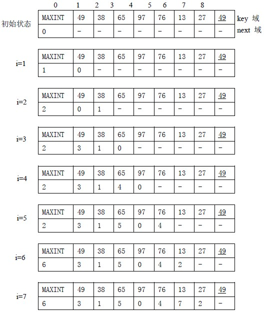
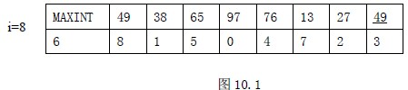
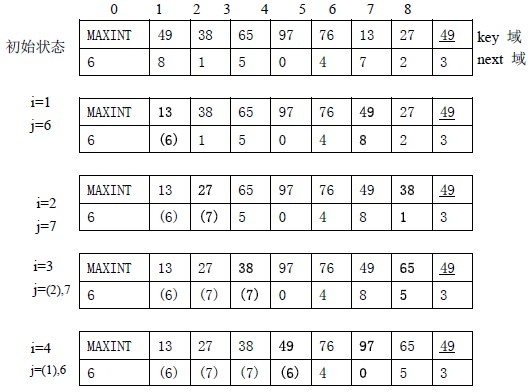
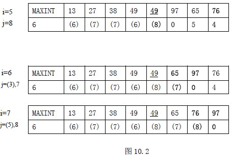

# 10.2 插入排序—表插入排序

直接插入排序、折半插入排序均要大量移动记录，时间开销大。若要不移动记录完成排序，需要改变存储结构，进行表插入排序。所谓表插入排序，就是通过链接指针，按关键码的大小，实现从小到大的链接过程，为此需增设一个指针项。操作方法与直接插入排序类似，所不同的是直接插入排序要移动记录，而表插入排序是修改链接指针。用静态链表来说明。

#define SIZE 200

typedef struct{

ElemType elem； /*元素类型*/

int next； /*指针项*/

}NodeType； /*表结点类型*/

typedef struct{

NodeType r[SIZE]； /*静态链表*/

int length； /*表长度*/

}L_TBL； /*静态链表类型*/

假设数据元素已存储在链表中，且 0 号单元作为头结点，不移动记录而只是改变链指针域，将记录按关键码建为一个有序链表。首先，设置空的循环链表，即头结点指针域置 0，并在头结点数据域中存放比所有记录关键码都大的整数。接下来，逐个结点向链表中插入即可。

【例 10.2】表插入排序示例

表插入排序得到一个有序的链表，查找则只能进行顺序查找，而不能进行随机查找，如折半查找。为此，还需要对记录进行重排。

重排记录方法：按链表顺序扫描各结点，将第 i 个结点中的数据元素调整到数组的第 i 个分量数据域。因为第 i 个结点可能是数组的第 j 个分量，数据元素调整仅需将两个数组分量中数据元素交换即可，但为了能对所有数据元素进行正常调整，指针域也需处理。

【算法 10.3】

1.  j=l->r[0].next；i=1； //指向第一个记录位置，从第一个记录开始调整
2.  若 i=l->length 时，调整结束；否则，

    a. 若 i=j，j=l->r[j].next；i++；转(2) //数据元素应在这分量中，不用调整，处理下一个结点

    b. 若 j>i，l->r[i].elem<-->l->r[j].elem； //交换数据元素

    p=l->r[j].next； // 保存下一个结点地址

    l->r[j].next=l->[i].next；l->[i].next=j； // 保持后续链表不被中断

    j=p；i++；转(2) // 指向下一个处理的结点

    c. 若 j<i，while(j<i) j=l->r[j].next；//j 分量中原记录已移走，沿 j 的指针域找寻原记录的位置转到(a)

【例 10.3】对表插入排序结果进行重排示例

【时效分析】

表插入排序的基本操作是将一个记录插入到已排好序的有序链表中，设有序表长度为 i，则需要比较至多 i+1 次，修改指针两次。因此，总比较次数与直接插入排序相同，修改指针总次数为 2n 次。所以，时间复杂度仍为 O(n2)