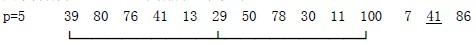
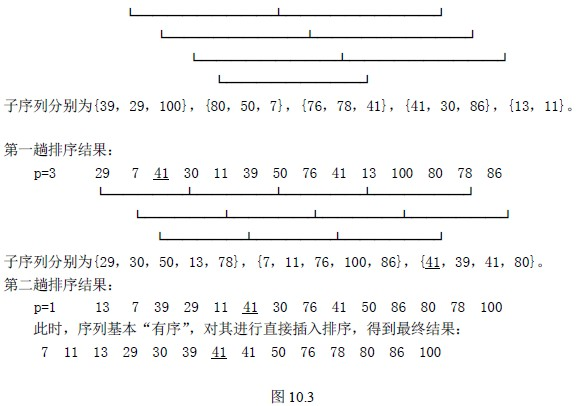

# 10.2 插入排序—希尔排序(Shell’s Sort)

希尔排序又称缩小增量排序，是 1959 年由 D.L.Shell 提出来的，较前述几种插入排序方法有较大的改进。

直接插入排序算法简单，在 n 值较小时，效率比较高，在 n 值很大时，若序列按关键码基本有序，效率依然较高，其时间效率可提高到 O(n)。希尔排序即是从这两点出发，给出插入排序的改进方法。

**希尔排序方法：**

1.  选择一个步长序列 t1，t2，…，tk，其中 ti>tj，tk=1；
2.  按步长序列个数 k，对序列进行 k 趟排序；
3.  每趟排序，根据对应的步长 ti，将待排序列分割成若干长度为 m 的子序列，分别对各子表进行直接插入排序。仅步长因子为 1 时，整个序列作为一个表来处理，表长度即为整个序列的长度。

【例 10.4】待排序列为 39，80，76，41，13，29，50，78，30，11，100，7，41，86。

步长因子分别取 5、3、1，则排序过程如下：

【算法 10.5】

void ShellInsert(S_TBL &p，int dk)

{ /*一趟增量为 dk 的插入排序，dk 为步长因子*/

for(i=dk+1；i<=p->length；i++)

if(p->elem[i].key < p->elem[i-dk].key) /*小于时，需 elem[i]将插入有序表*/

{ p->elem[0]=p->elem[i]； /*为统一算法设置监测*/

for(j=i-dk；j>0&&p->elem[0].key < p->elem[j].key；j=j-dk)

p->elem[j+dk]=p->elem[j]； /*记录后移*/

p->elem[j+dk]=p->elem[0]； /*插入到正确位置*/

}

}

void ShellSort(S_TBL *p，int dlta[]，int t)

{ /*按增量序列 dlta[0，1…，t-1]对顺序表*p 作希尔排序*/

for(k=0；k<t；t++)

ShellSort(p，dlta[k])； /*一趟增量为 dlta[k]的插入排序*/

}

【时效分析】

希尔排序时效分析很难，关键码的比较次数与记录移动次数依赖于步长因子序列的选取，特定情况下可以准确估算出关键码的比较次数和记录的移动次数。目前还没有人给出选取最好的步长因子序列的方法。步长因子序列可以有各种取法，有取奇数的，也有取质数的，但需要注意：步长因子中除 1 外没有公因子，且最后一个步长因子必须为 1。希尔排序方法是一个不稳定的排序方法。