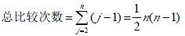
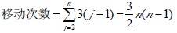

# 10.3 交换排序—冒泡排序(Bubble Sort)

交换排序主要是通过两两比较待排记录的关键码，若发生与排序要求相逆，则交换之。先来看看待排序列一趟冒泡的过程：设 1<j≤n，r[1],r[2],···,r[j]为待排序列，通过两两比较、交换，重新安排存放顺序，使得 r[j]是序列中关键码最大的记录。一趟冒

泡方法为：

1.  i=1； //设置从第一个记录开始进行两两比较
2.  若 i≥j，一趟冒泡结束。
3.  比较 r[i].key 与 r[i+1].key，若 r[i].key≤r[i+1].key，不交换，转⑤
4.  当 r[i].key>r[i+1].key 时， r[0]=r[i]；r[i]=r[i+1]；r[i+1]=r[0]；将 r[i]与 r[i+1]交换
5.  i=i+1； 调整对下两个记录进行两两比较，转②

冒泡排序方法：对 n 个记录的表，第一趟冒泡得到一个关键码最大的记录 r[n]，第二趟冒泡对 n-1 个记录的表，再得到一个关键码最大的记录 r[n-1]，如此重复，直到 n 个记录按关键码有序的表。

【算法 10.6】

1.  j=n； //从 n 记录的表开始
2.  若 j<2，排序结束
3.  i=1； //一趟冒泡，设置从第一个记录开始进行两两比较，
4.  若 i≥j，一趟冒泡结束，j=j-1；冒泡表的记录数-1，转②
5.  比较 r[i].key 与 r[i+1].key，若 r[i].key≤r[i+1].key，不交换，转⑤
6.  当 r[i].key>r[i+1].key 时， r[i]<-->r[i+1]； 将 r[i]与 r[i+1]交换
7.  i=i+1； 调整对下两个记录进行两两比较，转④

【效率分析】

空间效率：仅用了一个辅助单元。

时间效率：总共要进行 n-1 趟冒泡，对 j 个记录的表进行一趟冒泡需要 j-1 次关键码比较。

移动次数：

最好情况下：待排序列已有序，不需移动。

最坏情况下：每次比较后均要进行三次移动，