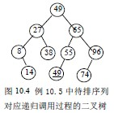

# 10.3 交换排序—快速排序

快速排序是通过比较关键码、交换记录，以某个记录为界(该记录称为支点)，将待排序列分成两部分。其中，一部分所有记录的关键码大于等于支点记录的关键码，另一部分所有记录的关键码小于支点记录的关键码。我们将待排序列按关键码以支点记录分成两部分的过程，称为一次划分。对各部分不断划分，直到整个序列按关键码有序。

一次划分方法：

设 1≤p<q≤n，r[p],r[p+1],...,r[q]为待排序列

1.  low=p；high=q； //设置两个搜索指针，low 是向后搜索指针，high 是向前搜索指针

    r[0]=r[low]； //取第一个记录为支点记录，low 位置暂设为支点空位

2.  若 low=high，支点空位确定，即为 low。

    r[low]=r[0]； //填入支点记录，一次划分结束

    否则，low<high，搜索需要交换的记录，并交换之

3.  若 low<high 且 r[high].key≥r[0].key //从 high 所指位置向前搜索，至多到 low+1 位置

    high=high-1；转③ //寻找 r[high].key<r[0].key

    r[low]=r[high]； //找到 r[high].key<r[0].key，设置 high 为新支点位置，

    //小于支点记录关键码的记录前移。

4.  若 low<high 且 r[low].key<r[0].key //从 low 所指位置向后搜索，至多到 high-1 位置

    low=low+1；转④ //寻找 r[low].key≥r[0].key

    r[high]=r[low]； //找到 r[low].key≥r[0].key，设置 low 为新支点位置，

    //大于等于支点记录关键码的记录后移。

    转② //继续寻找支点空位

【算法 10.7】

int Partition(S_TBL *tbl,int low,int high) /*一趟快排序*/

{ /*交换顺序表 tbl 中子表 tbl->[low…high]的记录，使支点记录到位，并反回其所在位置*/

/*此时，在它之前(后)的记录均不大(小)于它*/

tbl->r[0]=tbl->r[low]; /*以子表的第一个记录作为支点记录*/

pivotkey=tbl->r[low].key; /*取支点记录关键码*/

while(low<higu) /*从表的两端交替地向中间扫描*/

{ while(low<high&&tbl->r[high].key>=pivotkey) high--;

tbl->r[low]=tbl->r[high]; /*将比支点记录小的交换到低端*/

while(low<high&&tbl-g>r[high].key<=pivotkey) low++;

tbl->r[low]=tbl->r[high]; /*将比支点记录大的交换到低端*/

}

tbl->r[low]=tbl->r[0]; /*支点记录到位*/

return low; /*反回支点记录所在位置*/

}

【例 10.5】一趟快排序过程示例

【算法 10.8】

void QSort(S_TBL *tbl,int low,int high) /*递归形式的快排序*/

{ /*对顺序表 tbl 中的子序列 tbl->[low…high]作快排序*/

if(low<high)

{ pivotloc=partition(tbl,low,high); /*将表一分为二*/

QSort(tbl,low,pivotloc-1); /*对低子表递归排序*/

QSort(tbl,pivotloc+1,high); /*对高子表递归排序*/

}

}

快速排序的递归过程可用生成一棵二叉树形象地给出，图 10.4 为例 10.5 中待排序列对应递归调用过程的二叉树。

【效率分析】

空间效率：快速排序是递归的，每层递归调用时的指针和参数均要用栈来存放，递归调用层次数与上述二叉树的深度一致。因而，存储开销在理想情况下为 O(log2n)，即树的高度；在最坏情况下，即二叉树是一个单链，为 O(n)。

时间效率：在 n 个记录的待排序列中，一次划分需要约 n 次关键码比较，时效为 O(n)，若设 T(n)为对 n 个记录的待排序列进行快速排序所需时间。

理想情况下：每次划分，正好将分成两个等长的子序列，则

T(n)≤cn+2T(n/2) c 是一个常数

≤cn+2(cn/2+2T(n/4))=2cn+4T(n/4)

≤2cn+4(cn/4+T(n/8))=3cn+8T(n/8)

······

≤cnlog2n+nT(1)=O(nlog2n)

最坏情况下：即每次划分，只得到一个子序列，时效为 O(n2)。

快速排序是通常被认为在同数量级（O(nlog2n)）的排序方法中平均性能最好的。但若初始序列按关键码有序或基本有序时，快排序反而蜕化为冒泡排序。为改进之，通常以“三者取中法”来选取支点记录，即将排序区间的两个端点与中点三个记录关键码居中的调整为支点记录。快速排序是一个不稳定的排序方法。