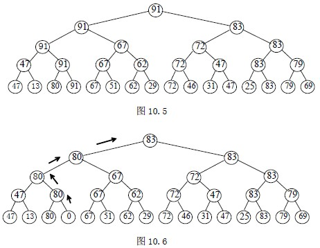

# 10.4 选择排序—树形选择排序

按照锦标赛的思想进行，将 n 个参赛的选手看成完全二叉树的叶结点，则该完全二叉树有 2n-2 或 2n-1 个结点。首先，两两进行比赛(在树中是兄弟的进行，否则轮空，直接进入下一轮)，胜出的再兄弟间再两两进行比较，直到产生第一名；接下来，将作为第一名的结点看成最差的，并从该结点开始，沿该结点到根路径上，依次进行各分枝结点子女间的比较，胜出的就是第二名。因为和他比赛的均是刚刚输给第一名的选手。如此，继续进行下去，直到所有选手的名次排定。

【例 10.6】16 个选手的比赛(n=24)

图 10.5 中，从叶结点开始的兄弟间两两比赛，胜者上升到父结点；胜者兄弟间再两两比赛，直到根结点，产生第一名 91。比较次数为 23+22+21+20=24-1=n-1。

图 10.6 中，将第一名的结点置为最差的，与其兄弟比赛，胜者上升到父结点，胜者兄弟间再比赛，直到根结点，产生第二名 83。比较次数为 4，即 log2n 次。其后各结点的名次均是这样产生的，所以，对于 n 个参赛选手来说，即对 n 个记录进行树形选择排序，总的关键码比较次数至多为(n−1)log2n+n−1，故时间复杂度为 O(nlog2n)。该方法占用空间较多，除需输出排序结果的 n 个单元外，尚需 n-1 个辅助单元。