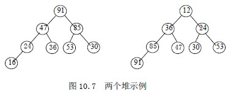
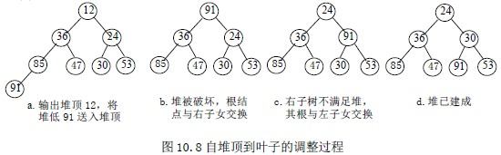
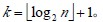

# 10.4 选择排序—堆排序(Heap Sort)

设有 n 个元素的序列 k1，k2，…，kn，当且仅当满足下述关系之一时，称之为堆。

若以一维数组存储一个堆，则堆对应一棵完全二叉树，且所有非叶结点的值均不大于(或不小于)其子女的值，根结点的值是最小(或最大)的。

设有 n 个元素，将其按关键码排序。首先将这 n 个元素按关键码建成堆，将堆顶元素输出，得到 n 个元素中关键码最小(或最大)的元素。然后，再对剩下的 n-1 个元素建成堆，输出堆顶元素，得到 n 个元素中关键码次小(或次大)的元素。如此反复，便得到一个按关键码有序的序列。称这个过程为堆排序。

因此，实现堆排序需解决两个问题：

1\. 如何将 n 个元素的序列按关键码建成堆；

2\. 输出堆顶元素后，怎样调整剩余 n-1 个元素，使其按关键码成为一个新堆。

首先，讨论输出堆顶元素后，对剩余元素重新建成堆的调整过程。

调整方法：设有 m 个元素的堆，输出堆顶元素后，剩下 m-1 个元素。将堆底元素送入堆顶，堆被破坏，其原因仅是根结点不满足堆的性质。将根结点与左、右子女中较小(或小大)的进行交换。若与左子女交换，则左子树堆被破坏，且仅左子树的根结点不满足堆的性质；若与右子女交换，则右子树堆被破坏，且仅右子树的根结点不满足堆的性质。继续对不满足堆性质的子树进行上述交换操作，直到叶子结点，堆被建成。称这个自根结点到叶子结点的调整过程为筛选。

【例 10.6】

再讨论对 n 个元素初始建堆的过程。

建堆方法：对初始序列建堆的过程，就是一个反复进行筛选的过程。n 个结点的完全二叉树，则最后一个结点是第个结点的子女。对第个结点为根的子树筛选，子树成为堆，之后向前依次对各结点为根的子树进行筛选，使之成为堆，直到根结点。

【例 10.7】

堆排序：对 n 个元素的序列进行堆排序，先将其建成堆，以根结点与第 n 个结点交换；

调整前 n-1 个结点成为堆，再以根结点与第 n-1 个结点交换；重复上述操作，直到整个序列有序。

【算法 10.10】

void HeapAdjust(S_TBL *h，int s，int m)

{/*r[s…m]中的记录关键码除 r[s]外均满足堆的定义，本函数将对第 s 个结点为根的子树筛选，使其成为大顶堆*/

rc=h->r[s]；

for(j=2*s；j<=m；j=j*2) /* 沿关键码较大的子女结点向下筛选*/

{ if(j<m&&h->r[j].key<h->r[j+1].key)

j=j+1； /* 为关键码较大的元素下标*/

if(rc.key<h->r[j].key) break； /* rc 应插入在位置 s 上*/

h->r[s]=h->r[j]； s=j； /* 使 s 结点满足堆定义*/

}

h->r[s]=rc； /* 插入*/

}

void HeapSort(S_TBL *h)

{ for(i=h->length/2；i>0；i--) /* 将 r[1..length]建成堆*/

HeapAdjust(h，i，h->length)；

for(i=h->length；i>1；i--)

{ h->r[1]<-->h->r[i]； /* 堆顶与堆低元素交换*/

HeapAdjust(h，1，i-1)； /*将 r[1..i-1]重新调整为堆*/

}

}

【效率分析】

设树高为 k，从根到叶的筛选，关键码比较次数至多 2(k-1)次，交换记录至多 k 次。所以，在建好堆后，排序过程中的筛选次数不超过下式：

2( ⎣log2(n−1)⎦ + ⎣log2(n−2)⎦ + … + log22⎦ ) < 2nlog2n 而建堆时的比较次数不超过 4n 次，因此堆排序最坏情况下，时间复杂度也为 O(nlog2n)。