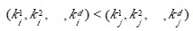
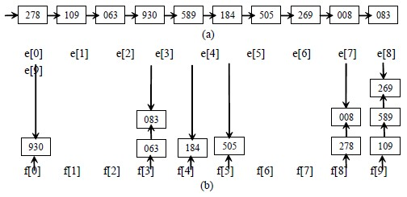
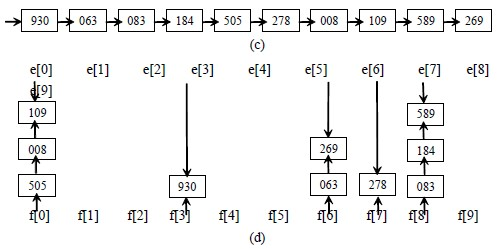
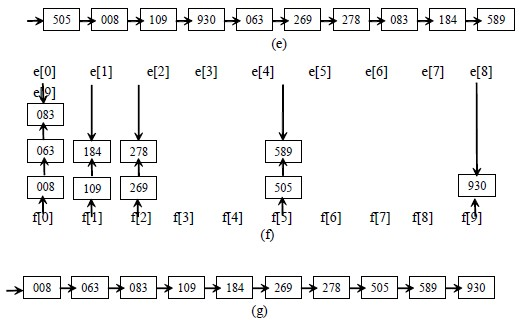

# 10.6 基数排序

基数排序是一种借助于多关键码排序的思想，是将单关键码按基数分成“多关键码”进行排序的方法。

## 10.6.1 多关键码排序

扑克牌中 52 张牌，可按花色和面值分成两个字段，其大小关系为：

花色： 梅花< 方块< 红心< 黑心

面值： 2 < 3 < 4 < 5 < 6 < 7 < 8 < 9 < 10 < J < Q < K < A

若对扑克牌按花色、面值进行升序排序，得到如下序列：

梅花 2,3,...,A，方块 2,3,...,A，红心 2,3,...,A，黑心 2,3,...,A

即两张牌，若花色不同，不论面值怎样，花色低的那张牌小于花色高的，只有在同花色情况下，大小关系才由面值的大小确定。这就是多关键码排序。

为得到排序结果，我们讨论两种排序方法。

方法 1：先对花色排序，将其分为 4 个组，即梅花组、方块组、红心组、黑心组。再对每个组分别按面值进行排序，最后，将 4 个组连接起来即可。

方法 2：先按 13 个面值给出 13 个编号组(2 号，3 号，...，A 号)，将牌按面值依次放入对应的编号组，分成 13 堆。再按花色给出 4 个编号组(梅花、方块、红心、黑心)，将 2 号组中牌取出分别放入对应花色组，再将 3 号组中牌取出分别放入对应花色组，……，这样，4 个花色组中均按面值有序，然后，将 4 个花色组依次连接起来即可。

设 n 个元素的待排序列包含 d 个关键码{k1，k2，…，kd}，则称序列对关键码{k1，k2，…，kd}有序是指：对于序列中任两个记录 r[i]和 rj 都满足下列有序关系：

其中 k1 称为最主位关键码，kd 称为最次位关键码。

多关键码排序按照从最主位关键码到最次位关键码或从最次位到最主位关键码的顺序逐次排序，分两种方法：

**最高位优先(Most Significant Digit first)法，简称 MSD 法：**先按 k1 排序分组，同一组中记录，关键码 k1 相等，再对各组按 k2 排序分成子组，之后，对后面的关键码继续这样的排序分组，直到按最次位关键码 kd 对各子组排序后。再将各组连接起来，便得到一个有序序列。扑克牌按花色、面值排序中介绍的方法一即是 MSD 法。

**最低位优先(Least Significant Digit first)法，简称 LSD 法：**先从 kd 开始排序，再对 kd-1 进行排序，依次重复，直到对 k1 排序后便得到一个有序序列。扑克牌按花色、面值排序中介绍的方法二即是 LSD 法。

## 10.6.2 链式基数排序

将关键码拆分为若干项，每项作为一个“关键码”，则对单关键码的排序可按多关键码排序方法进行。比如，关键码为 4 位的整数，可以每位对应一项，拆分成 4 项；又如，关键码由 5 个字符组成的字符串，可以每个字符作为一个关键码。由于这样拆分后，每个关键码都在相同的范围内(对数字是 0～9，字符是'a'～'z')，称这样的关键码可能出现的符号个数为“基”，记作 RADIX。上述取数字为关键码的“基”为 10；取字符为关键码的“基”为 26。基于这一特性，用 LSD 法排序较为方便。

**基数排序：**从最低位关键码起，按关键码的不同值将序列中的记录“分配”到 RADIX 个队列中，然后再“收集”之。如此重复 d 次即可。链式基数排序是用 RADIX 个链队列作为分配队列，关键码相同的记录存入同一个链队列中，收集则是将各链队列按关键码大小顺序链接起来。

【例 10.8】以静态链表存储待排记录，头结点指向第一个记录。链式基数排序过程如下图。

图(a)：初始记录的静态链表。

图(b):第一趟按个位数分配，修改结点指针域，将链表中的记录分配到相应链队列中。

图(c):第一趟收集：将各队列链接起来，形成单链表。

图(d):第二趟按十位数分配，修改结点指针域，将链表中的记录分配到相应链队列中。

图(e):第二趟收集：将各队列链接起来，形成单链表。

图(f):第三趟按百位数分配，修改结点指针域，将链表中的记录分配到相应链队列中。

图(g):第三趟收集：将各队列链接起来，形成单链表。此时,序列已有序。

【算法 10.14】

#define MAX_KEY_NUM 8 /*关键码项数最大值*/

#define RADIX 10 /*关键码基数，此时为十进制整数的基数*/

#define MAX_SPACE 1000 /*分配的最大可利用存储空间*/

typedef struct{

KeyType keys[MAX_KEY_NUM]； /*关键码字段*/

InfoType otheritems； /*其它字段*/

int next； /*指针字段*/

}NodeType； /*表结点类型*/

typedef struct{

NodeType r[MAX_SPACE]； /*静态链表，r[0]为头结点*/

int keynum； /*关键码个数*/

int length； /*当前表中记录数*/

}L_TBL； /*链表类型*/

typedef int ArrayPtr[radix]； /*数组指针，分别指向各队列*/

void Distribute(NodeType *s，int i，ArrayPtr *f，ArrayPtr *e)

{ /*静态链表 ltbl 的 r 域中记录已按(kye[0]，keys[1]，…，keys[i-1])有序)*/

/*本算法按第 i 个关键码 keys[i]建立 RADIX 个子表，使同一子表中的记录的 keys[i]相同*/

/*f[0…RADIX-1]和 e[0…RADIX-1]分别指向各子表的第一个和最后一个记录*/

for(j=0；j<RADIX；j++) f[j]=0； /* 各子表初始化为空表*/

for(p=r[0].next；p；p=r[p].next)

{ j=ord(r[p].keys[i])； /*ord 将记录中第 i 个关键码映射到[0…RADIX-1]*/

if(!f[j]) f[j]=p；

else r[e[j]].next=p；

e[j]=p； /* 将 p 所指的结点插入到第 j 个子表中*/

}

}

void Collect(NodeType *r，int i，ArrayPtr f，ArrayPtr e)

{/*本算法按 keys[i]自小到大地将 f[0…RADIX-1]所指各子表依次链接成一个链表*e[0…RADIX-1]为各子表的尾指针*/

for(j=0；!f[j]；j=succ(j))； /*找第一个非空子表，succ 为求后继函数*/

r[0].next=f[j]；t=e[j]； /*r[0].next 指向第一个非空子表中第一个结点*/

while(j<RADIX)

{ for(j=succ(j)；j<RADIX-1&&!f[j]；j=succ(j))； /*找下一个非空子表*/

if(f[j]) {r[t].next=f[j]；t=e[j]；} /*链接两个非空子表*/

}

r[t].next=0； /*t 指向最后一个非空子表中的最后一个结点*/

}

void RadixSort(L_TBL *ltbl)

{ /*对 ltbl 作基数排序，使其成为按关键码升序的静态链表，ltbl->r[0]为头结点*/

for(i=0；i<ltbl->length；i++) ltbl->r[i].next=i+1；

ltbl->r[ltbl->length].next=0； /*将 ltbl 改为静态链表*/

for(i=0；i<ltbl->keynum；i++) /*按最低位优先依次对各关键码进行分配和收集*/

{ Distribute(ltbl->r，i，f，e)； /*第 i 趟分配*/

Collect(ltbl->r，i，f，e)； /*第 i 趟收集*/

}

}

【效率分析】

**时间效率：**设待排序列为 n 个记录，d 个关键码，关键码的取值范围为 radix，则进行链式基数排序的时间复杂度为 O(d(n+radix))，其中，一趟分配时间复杂度为 O(n)，一趟收集时间复杂度为 O(radix)，共进行 d 趟分配和收集。

**空间效率：**需要 2*radix 个指向队列的辅助空间，以及用于静态链表的 n 个指针。