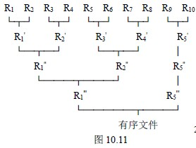
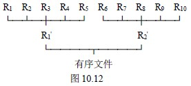
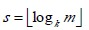

# 10.7.1 外排序—外部排序的方法

外部排序基本上由两个相互独立的阶段组成。首先，按可用内存大小，将外存上含 n 个记录的文件分成若干长度为 k 的子文件或段(segment)，依次读入内存并利用有效的内部排序方法对它们进行排序，并将排序后得到的有序子文件重新写入外存。通常称这些有序子文件为归并段或顺串；然后，对这些归并段进行逐趟归并，使归并段(有序子文件)逐渐由小到大，直至得到整个有序文件为止。

显然，第一阶段的工作已经讨论过。以下主要讨论第二阶段即归并的过程。先从一个例子来看外排序中的归并是如何进行的？

假设有一个含 10000 个记录的文件，首先通过 10 次内部排序得到 10 个初始归并段 R1～R10 ，其中每一段都含 1000 个记录。然后对它们作如图 10.11 所示的两两归并，直至得到一个有序文件为止。

从图 10.11 可见，由 10 个初始归并段到一个有序文件，共进行了四趟归并，每一趟将两个有序段归并成一个有序段的过程，若在内存中进行，则很简单，前面讨论的 2-路归并排序中的 Merge 函数便可实现此归并。但是，在外部排序中实现两两归并时，不仅要调用 Merge 函数，而且要进行外存的读/写，这是由于我们不可能将两个有序段及归并结果同时放在内存中的缘故。对外存上信息的读/写是以“物理块”为单位。假设在上例中每个物理块可以容纳 200 个记录，则每一趟归并需进行 50 次“读”和 50 次“写”，四趟归并加上内部排序时所需进行的读/写，使得在外排序中总共需进行 500 次的读/写。

一般情况下，外部排序所需总时间=内部排序(产生初始归并段)所需时间 m*tis+外存信息读写的时间 d*tio+内部归并排序所需时间 s*utmg

其中：

tis 是为得到一个初始归并段进行的内部排序所需时间的均值；

tio 是进行一次外存读/写时间的均值；

utmg 是对 u 个记录进行内部归并所需时间；

m 为经过内部排序之后得到的初始归并段的个数；

s 为归并的趟数；

d 为总的读/写次数。

由此，上例 10000 个记录利用 2-路归并进行排序所需总的时间为：10*tis+500*tio+4*10000tmg

其中 tio 取决于所用的外存设备，显然，tio 较 tmg 要大的多。因此，提高排序效率应主要着眼于减少外存信息读写的次数 d。

下面来分析 d 和“归并过程”的关系。若对上例中所得的 10 个初始归并段进行 5-平衡归并(即每一趟将 5 个或 5 个以下的有序子文件归并成一个有序子文件)，则从下图可见，仅需进行二趟归并，外部排序时总的读/写次数便减少至 2×100+100=300，比 2-路归并减少了 200 次的读/写。

可见，对同一文件而言，进行外部排序时所需读/写外存的次数和归并的趟数 s 成正比。而在一般情况下，对 m 个初始归并段进行 k-路平衡归并时，归并的趟数

可见，若增加 k 或减少 m 便能减少 s。下面分别就这两个方面讨论之。