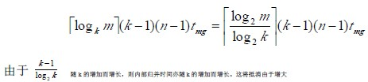
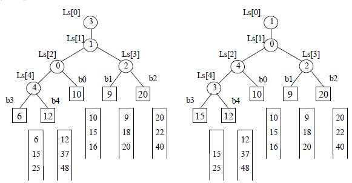
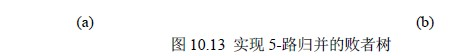

# 10.7.1 外排序—多路平衡归并的实现

从上式可见，增加 k 可以减少 s，从而减少外存读/写的次数。但是，从下面的讨论中又可发现，单纯增加 k 将导致增加内部归并的时间 utmg。那末，如何解决这个矛盾呢？

先看 2-路归并。令 u 个记录分布在两个归并段上，按 Merge 函数进行归并。每得到归并后的含 u 个记录的归并段需进行 u-1 次比较。

再看 k-路归并。令 u 个记录分布在 k 个归并段上，显然，归并后的第一个记录应是 k 个归并段中关键码最小的记录，即应从每个归并段的第一个记录的相互比较中选出最小者，这需要进行 k-1 次比较。同理，每得到归并后的有序段中的一个记录，都要进行 k-1 次比较。显然，为得到含 u 个记录的归并段需进行(u-1)(k-1)次比较。由此，对 n 个记录的文件进行外部排序时，在内部归并过程中进行的总的比较次数为 s(k-1)(n-1)。假设所得初始归并段为 m 个，则可得内部归并过程中进行比较的总的次数为

k 而减少外存信息读写时间所得效益，这是我们所不希望的。然而，若在进行 k-路归并时利用“败者树”(Tree of Loser)，则可使在 k 个记录中选出关键码最小的记录时仅需进它不再随 k 的增长而增长。

何谓“败者树”？它是树形选择排序的一种变型。相对地，我们可称图 10.5 和图 10.6 中二叉树为“胜者树”，因为每个非终端结点均表示其左、右子女结点中“胜者”。反之，若在双亲结点中记下刚进行完的这场比赛中的败者，而让胜者去参加更高一层的比赛，便可得到一棵“败者树”。

【例 10.9】

图 10.13(a)即为一棵实现 5-路归并的败者树 ls[0…4]，图中方形结点表示叶子结点(也可看成是外结点)，分别为 5 个归并段中当前参加归并的待选择记录的关键码；败者树中根结点 ls[1]的双亲结点 ls[0]为“冠军”，在此指示各归并段中的最小关键码记录为第三段中的记录；结点 ls[3]指示 b1 和 b2 两个叶子结点中的败者即是 b2，而胜者 b1 和 b3(b3 是叶子结点 b3、b4 和 b0 经过两场比赛后选出的获胜者)进行比较，结点 ls[1]则指示它们中的败者为 b1。在选得最小关键码的记录之后，只要修改叶子结点 b3 中的值，使其为同一归并段中的下一个记录的关键码，然后从该结点向上和双亲结点所指的关键码进行比较，败者留在该双亲，胜者继续向上直至树根的双亲。如图 10.13(b)所示。当第 3 个归并段中第 2 个记录参加归并时，选得最小关键码记录为第一个归并段中的记录。为了防止在归并过程中某个归并段变为空，可以在每个归并段中附加一个关键码为最大的记录。当选出的“冠军”记录的关键码为最大值时，表明此次归并已完成。由于实现 k-路归并的败者树

的初始化也容易实现，只要先令所有的非终端结点指向一个含最小关键码的叶子结点，然后从各叶子结点出发调整非终端结点为新的败者即可。

下面程序中简单描述了利用败者树进行 k-路归并的过程，为了突出如何利用败者树进行归并，避开了外存信息存取的细节，可以认为归并段已存在。

【算法 10.15】

typedef int LoserTree[k]; /*败者树是完全二叉树且不含叶子，可采用顺序存储结构*/

typedef struct{

KeyType key;

}ExNode,External[k]; /*外结点，只存放待归并记录的关键码*/

void K_Merge(LoserTree *ls,External *b) /*k-路归并处理程序*/

{ /*利用败者树 ls 将编号从 0 到 k-1 的 k 个输入归并段中的记录归并到输出归并段*/

/*b[0]到 b[k-1]为败者树上的 k 个叶子结点，分别存放 k 个输入归并段中当前记录的关键码*/

for(i=0;i<k;i++) input(b[i].key); /*分别从 k 个输入归并段读入该段当前第一个记录的*/

/*关键码到外结点*/

CreateLoserTree(ls); /*建败者树 ls，选得最小关键码为 b[0].key*/

while(b[ls[0]].key!=MAXKEY)

{ q=ls[0]; /*q 指示当前最小关键码所在归并段*/

output(q); /*将编号为 q 的归并段中当前(关键码为 b[q].key 的记录写至输出归并段)*/

input(b[q].key); /*从编号为 q 的输入归并段中读入下一个记录的关键码*/

Adjust(ls,q); /*调整败者树，选择新的最小关键码*/

}

output(ls[0]); /*将含最大关键码 MAXKEY 的记录写至输出归并段*/

}

void Adjust(LoserTree *ls,int s) /*选得最小关键码记录后，从叶到根调整败者树，选下一个最小关键码*/

{ /*沿从叶子结点 b[s]到根结点 ls[0]的路径调整败者树*/

t=(s+k)/2; /*ls[t]是 b[s]的双亲结点*/

while(t>0)

{ if(b[s].key>b[ls[t]].key) s<-->ls[t]; /*s 指示新的胜者*/

t=t/2;

}

ls[0]=s;

}

void CreateLoserTree(LoserTree *ls) /*建立败者树*/

{ /*已知 b[0]到 b[k-1]为完全二叉树 ls 的叶子结点存有 k 个关键码，沿从叶子到根的 k 条路径*/

/*将 ls 调整为败者树*/

b[k].key=MINKEY; /*设 MINKEY 为关键码可能的最小值*/

for(i=0;i<k;i++) ls[i]=k; /*设置 ls 中“败者”的初值*/

for(i=k-1;k>0;i--) Adjust(ls,i); /*依次从 b[k-1],b[k-2],…,b[0]出发调整败者*/

}

最后要提及一点，k 值的选择并非越大越好，如何选择合适的 k 是一个需要综合考虑的问题。