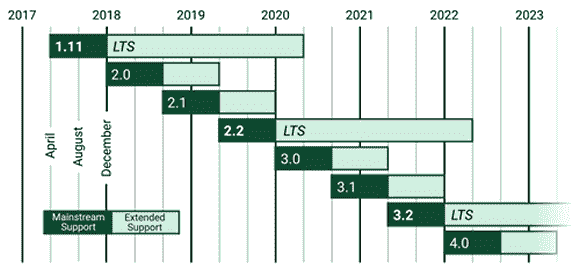

# Django 是什么？

> 原文：[`c.biancheng.net/view/7284.html`](http://c.biancheng.net/view/7284.html)

Django 是使用 Python 语言开发的一款免费而且开源的 Web 应用框架。由于 Python 语言的跨平台性，所以 Django 同样支持 Windows、Linux 和 Mac 系统。

在 Python 语言炽手可热的当下，Django 也迅速的崛起，在 Web 开发领域占有一席之地。基于 Python 开发的框架除了 Django 外，还有可以实现快速建站 Flask 和支持高并发处理的 Tornado ，而 Django 是最有代表性的一位，它们三者是当前最流行的 Python Web 框架。

在学习 Django 之前，我们先来聊聊什么是框架，这要从 Django 的诞生说起。

## 1\. Django 的由来

Django 最初是被开发用来管理劳伦斯集团旗下一些以新闻内容为主的网站。2003 年，Lawerence Journal-World 报社的 Web 开发者**艾德里安**和**威利森**开始用 Python 语言去开发应用。新闻界的快节奏使他们必须提高产品的开发速度，于是他们两个人想办法构建出了节省开发时间的框架，这个框架将能复用的组件或者模块放在一起，使开发者不必重复的工作，这是 Django 诞生的根本原因。

后来他们所在的开发小组决定将这个框架发布成一个开源软件。经过发展和时间的积累，Django 有了数以万计用户和贡献者，现在 Django 成为了 Web 开发者中最流行的框架。

总之，Python 的诞生是为了减少重复性工作，节省开发者时间，可以让开发者把有限的精力投入到关键的开发环节中。

下图是 Django 的标志。

图 1：Django 标志通过上面的介绍，可以给出 Web 框架的概念：它是一套组件，提供通用的设计模式，能够最大程度地降低开发 Web 站点开发的难度，Django 的设计目标就是使复杂的工作变得简单。

## 2\. Django 的命名

Django 命名由来官方网站只给出了一句话：

> To this day, he's considered one of the best guitarists of all time, Listen to his music. You'll like it.

Django 是以一个名叫 Django Reinhardt 吉他手的的名字来命名的。因为程序员的世界不能缺少音乐，开发者在他的音乐中得到灵感，为了感谢纪念这位吉他手，所以 Django 的名字也由此诞生！

Django 的发音也非常有趣，大写字母 D 不发音，正确的发音是“栈 go”作为程序员不要读错哦。

## 3\. Django 的版本发布

Django 遵守 BSD（即伯克利软件发行）版权，初次发布于 2005 年 7 月，并于 2008 年 9 月发行第一正式版本 1.0。

从正式版 1.0 之后，Django 的版本发布过程如下：

#### 1) 功能版

版本号定义为 A.B、A.B+1 等，大概每 8 个月发布一次，每个版本都有所改进。最新的 Django 版本是 Django 3.0 于 2020 年发布。

#### 2) 补丁版

主要用来修复 bug 或者安全问题，版本号为 A.B.C 或者 A.B.C+1。

#### 3) LTS 版本

LTS 也即长期支持版本，官方会长期提供支持和安全更新，时长至少三年，所以我们建议安装和使用 LTS 版本。

一些 Django 版本会被指定为 LTS，例如 1.11 LTS。值得大家注意的是，Django 最后一个支持 Python 2.7 的版本是 1.11 LTS，最新的 LTS 版本是 2.2 LTS。

图 2：Django 版本发布
 官方网站提供 Django 版本的下载，同时也提供了完善的在线文档，地址是 [`www.djangoproject.com`](http://www.djangoproject.com)。

## 4\. Django 框架的特点

相对于 Python 的其他 Web 框架，Django 的功能是最完整的，Django 定义了服务发布、路由映射、模板编程、数据处理的一整套功能。这也意味着 Django 模块之间紧密耦合。

Django 的主要特点如下：

*   完善的文档：经过 10 余年的发展和完善，Django 官方提供了完善的在线文档，为开发者解决问题提供支持。
*   集成 ORM 组件：Django 的 Model 层自带数据库 ORM 组件，为操作不同类型的数据库提供了统一的方式。
*   URL 映射技术：Django 使用正则表达式管理 URL 映射，因此给开发者带来了极高的灵活性。
*   后台管理系统：开发者只需通过简单的几行配置和代码就可以实现完整的后台数据管理 Web 控制台。
*   错误信息提示：在开发调试过程中如果出现运行异常，Django 可以提供非常完整的错误信息帮助开发者定位问题。

本节主要给大家介绍了 Django 的由来，以及 Django 版本的发布情况 ，在后续章节对于 Django 的特点会有详细讲解。