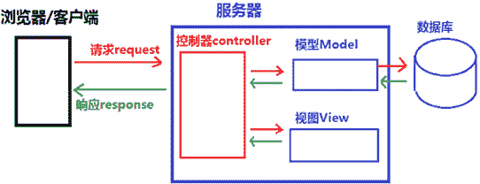
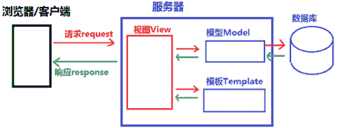

# Django MTV 和 MVC 的区别

> 原文：[`c.biancheng.net/view/7288.html`](http://c.biancheng.net/view/7288.html)

在上一节《Django 是什么》中，我们对 Django 的诞生以及 Web 框架的概念有了基本的了解，本节我们介绍 Django 的设计模式，也就是 MTV。

在 Web 开发领域还有另外一个非常著名的设计模式——MVC，它和 MTV 又有什么区别呢？这也是本节关注的重点内容。

## 1\. MVC 设计模式

我们先对 MVC 设计模式进行介绍，它是 Web 设计模式的经典之作，MTV 模式也是在它的基础上衍生而来。

MVC 是 Model-View-Controller 的缩写，其中每个单词都有其不同的含义：

*   Modle 代表数据存储层，是对数据表的定义和数据的增删改查；
*   View 代表视图层，是系统前端显示部分，它负责显示什么和如何进行显示；
*   Controller 代表控制层，负责根据从 View 层输入的指令来检索 Model 层的数据，并在该层编写代码产生结果并输出。

图 1：MVC 设计模式示意图
MVC 设计模式的请求与响应过程描述如下：

*   用户通过浏览器向服务器发起 request 请求，Controller 层接受请求后，同时向 Model 层和 View 发送指令；
*   Mole 层根据指令与数据库交互并选择相应业务数据，然后将数据发送给 Controller 层；
*   View 层接收到 Controller 的指令后，加载用户请求的页面，并将此页面发送给 Controller 层；
*   Controller 层接收到 Model 层和 View 层的数据后，将它们组织成响应格式发送给浏览器，浏览器通过解析后把页面展示出来。

MVC 的 3 层之间紧密相连，但又相互独立，每一层的修改都不会影响其它层，每一层都提供了各自独立的接口供其它层调用，MVC 的设计模式降低了代码之间的耦合性（即关联性），增加了模块的可重用性，这就是 MVC 的设计模式。

## 2\. MTV 设计模式

那么 Django 的 MTV 又是怎么回事呢？下面讲解 Django 的设计模式。

Django 借鉴了经典的 MVC 模式，它也将交互的过程分为了 3 个层次，也就是 MTV 设计模式；

*   Model：数据存储层，处理所有数据相关的业务，和数据库进行交互，并提供数据的增删改查；
*   Template：模板层（也叫表现层）具体来处理页面的显示；
*   View：业务逻辑层，处理具体的业务逻辑，它的作用是连通 Model 层和 Template 。

图 2：Django MTV 设计模式示意图
我们按照 MVC 的设计模式对 MTV 进行分析，MTV 设计模式中，用 View 层取代了 Controller 层的位置，用 Template 层取代了原来 View 层的位置。

初次接触 Django 的设计模式的人，可能会对 Template 层产生疑问，其实 Template 英文的含义就是“模板”的意思，你可以简单理解成，它是一个 HTML 页面 ，HTML 页面的渲染在视图层完成。

同样我们也对 MTV 设计模式的请求与响应过程进行描述：

*   用户通过浏览器对服务器发起 request 请求，服务器接收请求后，通过 View 的业务逻辑层进行分析，同时向 Model 层和 Template 层发送指令；
*   Mole 层与数据库进行交互，将数据返回给 View 层；
*   Template 层接收到指令后，调用相应的模板，并返回给 View 层；
*   View 层接收到模板与数据后，首先对模板进行渲染（即将相应的数据赋值给模板），然后组织成响应格式返回给浏览器，浏览器进行解析后并最终呈现给用户。

通过以上两种设计模式的比较， 我们可以得出 MTV 是 MVC 的一种细化，将原来 MVC 中的 V 层拿出来进行分离，视图的显示与如何显示交给 Template 层，而 View 层更专注于实现业务逻辑。其实在 Django 是有 Controller 层的，只不过它由框架本身来实现，所以我们不用关心它。Django 更关注于 M、T 和 V。

本节介绍了 MTV 与 MVC 设计模式，大家理解并记忆它们，对后续的 Django 学习会有很大帮助。