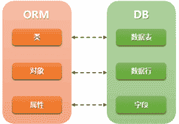

# Django ORM 模块精讲

> 原文：[`c.biancheng.net/view/7293.html`](http://c.biancheng.net/view/7293.html)

Django 框架向我们提供了丰富的模块，避免程序员在开发的过程中重复“造轮子”，提高了开发者的工作效率。接下来的几节内容，将给大家介绍 Django 的主要功能模块，第一个模块是 Django 的 ORM 模块。

## 1\. 什么是 ORM？

ORM （Object Realtional Mapping）即对象关系映射，它是一种基于关系型数据库的程序技术。ORM 允许你使用类和对象对数据库进行操作，这大大提高了对数据库的控制，避免了直接使用 SQL 语句对数据库进行操作。这种程序技术的底层主要是通过映射机制实现的，有兴趣的可以自己研究一下！

Web 开发中对数据库的操作是必不可少的，然而每种数据库的操作方式以及用法不尽相同。由于 Django 中 ORM 的存在，为我们操作不同种类的数据库提供了统一的方法，ORM 适配了多种常用的关系型数据库，例如 PostgreSQL、MySQL、Oracle、Sqlite3 等。


图 1：ORM 与 DB 映射关系图
如图 1 是 ORM 与数据库的映射关系图。ORM 把类映射成数据库中的表，把类的一个实例对象映射成数据库中的数据行，把类的属性映射成表中的字段，通过对象的操作对应到数据库表的操作，实现了对象到 SQL、SQL 到对象转换过程。

Django 把表模型定义为 Model，他需要继承自 `django.db.models`中的 Model 类，只要是与数据表相关的操作，都需要继承这个类。同时 ORM 对于数据库的的增删改查，也提供了一些简单的 API，例如 F 查询、Q 查询。

针对数据库中的字段类型，Django ORM 都有对应的 “xxxField” 来表述，见如下表格。

字段类型表

| 字段 | 说明 | 字段属性 |
| AutoFiled | 默然自增主键（Primary_key=Ture），Django 默认建立 id 字段为主键。 |   |
| CharFiled | 字符类型 | Max_length=32，字符长度需要明确 |
| IntgerFiled | 整型 int |   |
| DateFiled | 年月日时间类型 | auto_now=True，数据被更新就会更新时间 ；auto_now_add=True，数据第一次参数时产生。 |
| DateTimeFiled | 年月日小时分钟秒时间类型 | auto_now=True，数据被更新就会更新时间； auto_now_add=True，数据第一次参数时产生。 |
| DecimalFiled | 混合精度的小数类型 | max_digits=3，限定数字的最大位数(包含小数位)；decimal_places=2，限制小数的最大位数。 |
| BooleanFiled | 布尔字段，对应数据库 tinyint 类型数据长度只有 1 位。 | 值为 True 或 False |
| TextFiled | 用于大文本 |   |

上表中列举了经常用到的字段类型，后续如果涉及到其它字段类型再进行介绍。

## 2\. Django 中定义数据表

 那么在 Django 中如何使用 ORM 模块来定义一张数据表呢？在定义数据表之前，我们应该首先理解什么是模型类。

#### 1) 模型类

其实模型类本质上属于一个 Python 类，只不过在 Django 中称之为做模型类 ，它是由 django.db.models.Model 派生出的子类，在 Django 中模型类是数据交互的接口，一个模型类代表数据库中的一张数据表，模型类中每一个类属性都代表数据表中的一个字段。

通过上述介绍，我们可以这样理解：Django 中模型类就相当于 ORM 模块。

#### 2) 定义数据表

现在有一张用户信息表 UserInfo，它有两个字段 name 和 password，可以定义如下：

```

from django.db import models
class UserInfo（models.Model）:
      name = models.CharFiled(max_length=100)
      password = models.CharFiled(max_length=100)

```

通过以上代码，UserInfo 数据表就已经创建完成，我们对代码进行逐行解析：

*   第 1 行，使用 from django.db import models 导入 models 模块；
*   第 2 行，使用 class 关键字对 UserInfo 表进行类定义，并继承了 models 模块中的 Model 类；
*   第 3、4 行，数据表中的字段 name 和 password 是 UserInfo 类的属性，name 和 password 字段类型都是 CharFiled，字段长度均是 100。

## 3\. ORM 管理器对象

那么应该怎样对数据表进行操作呢？我们可以直接使用类名（即数据表名）来插入数据，下面是插入数据的一种方法：

```

UserInfo.objects.create(name='jay',password='abc123')
```

上面代码插入一条名字是“jay”，密码是“abc123”的数据。读到这里，您可能会对“ objects ”产生疑问，所以在此处讲解一个重要的概念：每个继承自 `models.Model` 的模型类，都会有一个 objects 对象被同时继承下来，这个对象就叫做“管理器对象”，数据库的增删改查可以用 objects 管理器对象来实现。

利用 ORM 插入数据有两种方式，上面已经介绍了一种，下面介绍第二种方法，也就是创建 UserInfo 的实例对象，然后调用`save()`方法保存，代码如下：

```

Obj=UserInfo（name="jay",password="abc123"）
Obj.name="john"
Obj.save()

```

上述代码中 name 属性值会被赋值为“john”，最后调用 `save()`方法保存。

ORM 的增删改查称为 CURD 操作，下面列举几个常用语句： 

```

UserInfo.objects.all()#查询表中的所有记录
UserInfo.objects.filter(name_contains='j')#查询表中 name 含有“j”的所有记录,被使用较多
UserInfo.objects.get(name="john")#有且只有一个查询结果，如果超出一个或者没有,则抛出异常
UserInfo.objects.get(name="john").delete()#删除名字为 john 的记录
UserInfo.objects.get(name="john").update(name='TOM')#更新数据表的 name 为 TOM
```

## 4\. ORM 优势与不足

ORM 模块确实有诸多的优势，比如：

*   使用该模块只需要面向对象编程，不需要面向数据库编写代码，对数据库的操作转换为对类属性和方法的操作，不用我们编写各种数据库的 SQL 语句。
*   实现数据模型与数据库的解耦，屏蔽了不同数据库操作上的差异化，不在关注不同数据库内部的操作细节，通过简单更改配置就可以实现数据库的更换而无需更改代码。

与此同时 ORM 也存在一点不足之处：
相比直接用 SQL 语句操作数据库会有性能损失，因为在映射的过程中 ORM 需要与 SQL 之间进行转换，根据对象的操作转换成 SQL 语句，根据查询结果转换成对象，所以在映射的过程存在性能损失。

但是 ORM 的不足带来的这点性能损失是微不足道的，ORM 的优势还是非常突出的。因为这种对象模型和关系型数据库之间的转换方式，给开发者带来了极大的便捷，所以其它语言开发的框架，对 ORM 也有很多应用，比如 Hibernate、IBATIS、EclipseLink 等。