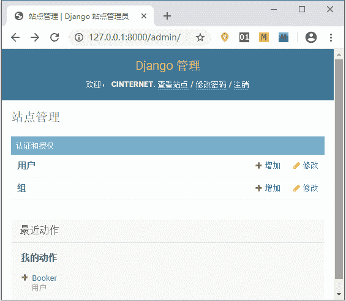
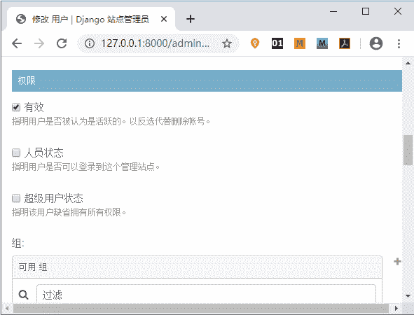
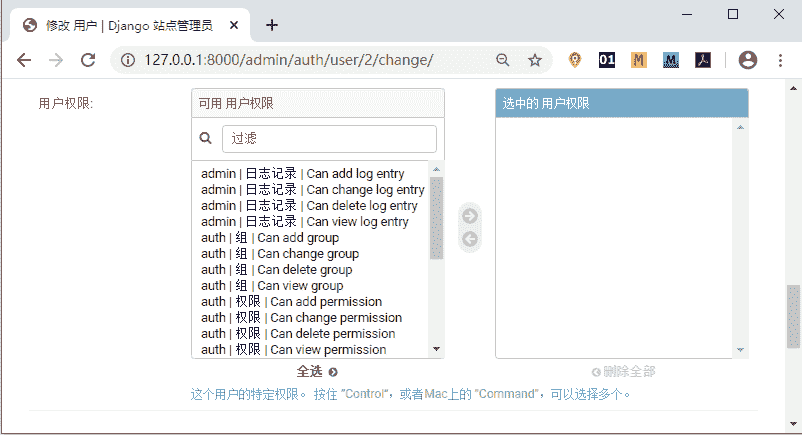
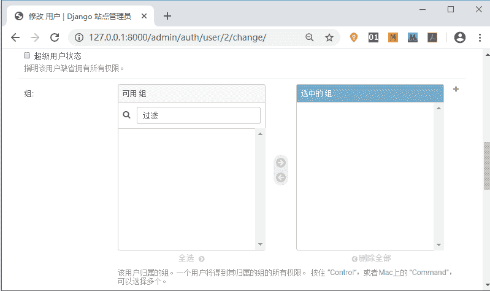
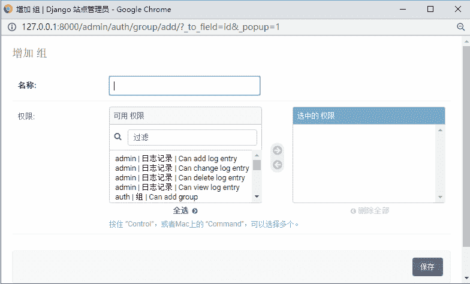
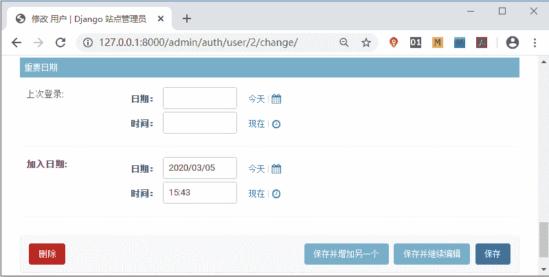

# Django Admin 后台管理系统

> 原文：[`c.biancheng.net/view/7334.html`](http://c.biancheng.net/view/7334.html)

Django 的后台管理系统是非常出色的，新建项目以后，Django 就为我们设置好了后台管理系统的各种功能，本节我们将一起认识它！

## 1\. 后台管理系统的重要性

我们先考虑一下，Django 为什么要引入后台管理系统呢？

我们知道，Web 站点上某些内容的改动是后台管理员来完成的，如果管理员直接用 Shell 或者 SQL 语句来修改，不仅麻烦，而且容易操作失误，从而导致数据不一致的结果。假如是一个不懂编程的人呢？应该怎么去操作呢？上述问题，说明了构建一个后台管理系统的重要性，通过后台管理系统为管理员提供一种便捷有效的操作方式。

后台管理系统主要是对数据表的存储做专门的管理，例如针对微博或者论坛类的站点，管理员需要删除不合规的文章，或者公司内部需要发布新的话题等，这些都是通过数据表的管理实现的。单一功能的后台系统比较容易构建，但是如果功能增多情况下，就需要对多个数据表做管理，这就增加了开发人员的重复性工作。Django 提供的后台管理系统很好的解决了这个问题，以下是后台管理系统主要功能的介绍。

如图 1 所示，是后台管理系统的登陆界面，通过超级管理员账户进行登录。


图 1：Admin 后台登陆界面
 登录后，如图 2 所示，是 Django Admin 提供的的站点管理功能。


图 2：Admin 后台登录后界面

## 2\. 了解 Django 后台管理功能

我们用下面命令来创建超级用户：

```

python manage.py createsuperuser
```

通过此命令来设置用户名、密码和邮箱。后续章节，还会用到 Admin 后台管理系统，有对此命令的说明。

Admin 后台管理系统的功能是非常强大的。在以 Django 做为开发框架的小型软件公司，开发人员配置以及时间有限，无法短期内开发一套新的后台管理系统，在这种情况下，一般采用对 Admin 后台管理系统源码稍加改动的方法，把改动后的 Admin 系统作为软件的后台管理系统。

Admin 后台管理系统提供了用户类别、用户权限以及用户组权限的划分功能，如图 3 所示，Active (有效）、Staff status（人员状态）、Superuser status（超级用户状态）是用户的三种类别。


图 3：Admin 后台用户类别设置
 如图 4 所示，Django 后台管理系统提供了用户权限划分功能。


图 4：用户权限划分
 当然也提供了用户组权限的分配功能，图 5、6 所示，分别是添加组和分配组权限。


图 5：用户组权限划分


图 6：新添加用户组权限


图 7：时间记录
 Django 原生的 Admin 管理界面，虽然没有做太多的修饰，但是开发者可以利用 Model Admin 实现个性化定制，比如字段值的过滤功能、表字段展示的排序、搜索功能等。上面展示的是中文的后台管理界面，原生的 Django 后台管理系统是英文的。所以需要简单设置才可以实现中文模式。

Django 已经非常的成熟，一些软件社区和第三方平台给 Django 做了很多有用的插件，这使得后台管理界面更加美化，比如 django-admian-bootstrap 等。