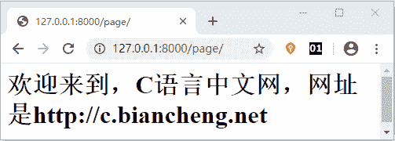

# Django 路由系统精讲

> 原文：[`c.biancheng.net/view/7375.html`](http://c.biancheng.net/view/7375.html)

在《URL 是什么》一节中，我们对 URL 有了基本的认识，在本节将对 Django 的路由系统展开详细的讲解， 让我们更加清楚的了解 URL 在 Django 中到底是如何应用的。

##  1\. Django 路由系统应用

一个用户向 Web 站点发送请求，是通过 URL 实现的，当 Web 服务器端接收到用户请求后，它又是怎么处理的呢？通过 MTV 的设计模式，我们可以得知，首先用户请求会到达相应的视图函数，那么视图函数又是怎样找到相应的访问资源的呢，在这里就用到了“路由系统”。

Django 中利用 ROOT_URLCONF 构建了 URL 与视图函数的映射关系。在 django.conf.urls 中封装了路由模块，新建的 Django 项目中提供了 urls.py（创建项目后自动生成的配置文件） 路由配置文件，urls.py 文件中定义了一个 urlpatterns 的列表，它是由 url( ) 实例对象组成的列表，Django 中 url 的定义就是在这个列表完成的。

```

from django.conf.urls import url
urlpatterns=[
url(r '^admin/',admin.site.urls),
...
]

```

后台 Admin 管理系统的路由就定义在了列表第一个位置，下面我们对路由的语法格进行简单说明：

```

url(regex,view,name=None)
```

上述 url 的参数解析如下：

*   regex，匹配请求路径，用正则表达式表示；
*   view，指定 regex 匹配路径所对应的视图函数的名称；
*   name，是给 url 地址起个别名，在模板反向解析的时候使用，这个知识点后面还有介绍。

#### 1）配置第一个 URL 实现页面访问

在 urls.py 的同级目录下，新建 views.py 文件，把它作为编写视图函数的 View 层，然后在 views.py 中编写如下代码：

```

from django.http import HttpResponse
def page_view(request):
    html='<h1>欢迎来到，C 语言中文网，网址是 http://c.biancheng.net</h>'
    return HttpResponse(html)

```

假如现在有一个名叫 “myject”的 Django 项目，首先需要在 urls.py 文件中导入 views.py， 这么做的目的是把 URL 与视图层进行绑定，然后在 urls.py 的 urlpatterns 中编写如下代码：

```

from django.conf.urls import url
from django.contrib import admin
from myject import views
urlpatterns = [
    url(r'admin/', admin.site.urls),
    url(r'^page$/',views.page_view),]

```

上述代码解析：

*   代码的前 3 行分别对 URL 模块、admin 模块、以及视图层 views 做了导包操作；
*   路径地址被定义为 page，也就是在本机浏览器地址栏输入：http://127.0.0.1:8000/page 进行访问，`views.page_view`将 page/ 路径与对应的视图函数进行了关联。

那么通过上述的代码就完成了路由的配置。在项目运行后，通过访问对应的地址就可以得到相应的页面了，如下图所示：


图 1：C 语言中文网欢迎你

#### 1）正则与正则分组使用

在 Django 的路由系统中，正则匹配得到了充分的使用，比如要匹配任意 1000 个页面，那么正则匹配路由地址可以写为：

```

url(r'^page(\d+)',views.page_view)
```

同时也可以使用正则分组的方式匹配地址：

```

r'^(\d+)/(\w{3})/(\d+)' 匹配类似于 http://127.0.0.1:8000/521/Django/1314 的地址
```

#### 2）正则捕获组使用

捕获组：

```

url(r'^person/(?P<name>\w+)/(?P<age>\d{1,2})',views.person_view)
```

在视图函数层，用函数关键字传参的方法，将 name 与 age 传递给视图函数。

```

def person_view(request,name,age):
    s = '姓名： ' + name
    s += ' 年龄: ' + age
    return HttpResponse(s)
```

一个分组表示一个参数，多个参数需要使用多个分组，并且使用 / 隔开。

## 2\. path()与 re_path()

Django 的路由系统使用方法简洁且容易理解，这大大降低了如何配置 URL 的难度。

在 Django 2.0 版本中推出了新的用法 path() 和 re_path()，进一步提升了 Django 的效率与使用的简洁性。2.0 版本以后虽然推出了新的方法，但是 1.0 版本的 URL 用法仍然可以在 2.0 版本中使用，向前做了兼容。

提示：我们可以简单的理解为：re_path() 等同于 1.0 版本的 url 正则匹配方法，而 path() 有其特定的使用方法，在后续的章节将会对其进行详细的介绍。