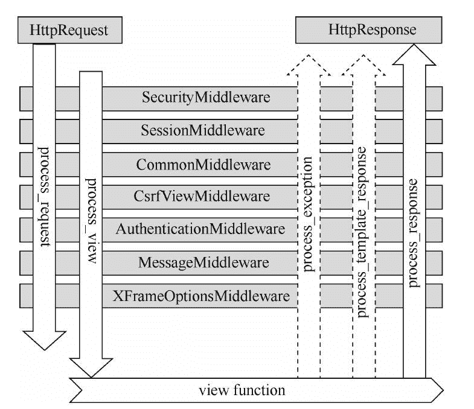

# Django 中间件

> 原文：[`c.biancheng.net/view/7379.html`](http://c.biancheng.net/view/7379.html)

中间件是一个插件系统，嵌入在 Django 的 Request 和 Response 之间执行，可以对输入和输出内容作出修改，它是处理所有请求与响应的通用框架组件。

## 1\. Django 默认自带中间件

中间件本质上是一个 Python 类，类里定义了一些函数，这些函数在视图函数执行的前后调用，它们被形象的称之为“钩子函数”。Django 不仅向我们提供了丰富的中间件，而且也可以使用 Django 的中间件接口来实现自定义中间件。下面就是创建 Django 项目后，默认生成的中间件，配置在 settings.py 文件中。

```

MIDDLEWARE = [
    'django.middleware.security.SecurityMiddleware',
    'django.contrib.sessions.middleware.SessionMiddleware',
    'django.middleware.common.CommonMiddleware',
    'django.middleware.csrf.CsrfViewMiddleware',
    'django.contrib.auth.middleware.AuthenticationMiddleware',
    'django.contrib.messages.middleware.MessageMiddleware',
    'django.middleware.clickjacking.XFrameOptionsMiddleware',
]

```

#### 1）中间的执行与响应顺序

项目创建后，所有中间件都是默认激活的状态。当然你可以通过代码注释，将某个中间件关闭，这需要您根据具体的业务需求来操作 。Django 同时规定了中间件的执行顺序与配置关系，按照如上列表，从上至下行依次执行每一个中间件，但是返回响应结果的时候，整好相反，是从下至上。

如图所示，从浏览器发出一个请求 Request，最后得到一个 HttpResponse 响应 ，这个请求传递与响应返回的过程如下图所示：
图 1：中间的执行与响应顺序
 中间件作为一个可插拔的组件对外提供服务，每个中间件都负责完成一些特定的功能。例如，Django 包含一个中间件 “AuthenticationMiddleware”，它的作用是将会话和用户请求进行关联。

中间件定义的钩子函数，是在视图函数执行的前后调用的，它们的执行过程如下所示：

#### 1）在调用视图之前

如图 1 所示，在请求阶段，Django 按照自定义的顺序自上而下地应用中间件。这个过程执行两个钩子函数 process_request() 和 process_view()，它们都是在视图函数执行前调用的。

#### 2）在调用视图之后

如图 1 所示，在响应阶段，中间件从下往上返回 HttpResponse，这个过程有三个挂钩函数可供选择：

*   process_exception() （只有当视图引发异常时调用）；
*   process_template_response() （仅适用于模板响应）；
*   process_response()。

## 2\. 中间件的作用总结

那我们可以总结一下，中间件是介于 request 与 response 之间的一道处理过程，相对比较轻量级。我们可以通过中间件来修改请求，例如，被传送到视图函数中的 HttpRequest 对象，也可以修改视图函数返回的 HttpResponse 对象。

对于请求与响应的顺序总结如下：请求发出自上而下，响应返回自下而上。

```

django.middleware.clickjacking.XFrameOptionsMiddleware
```

我们拿最后一个中间件举例说明，它的 process_request 方法最后一个执行，而它的 process_response 方法却是最先执行。