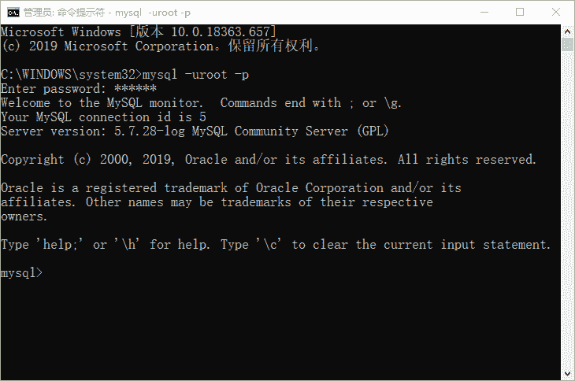
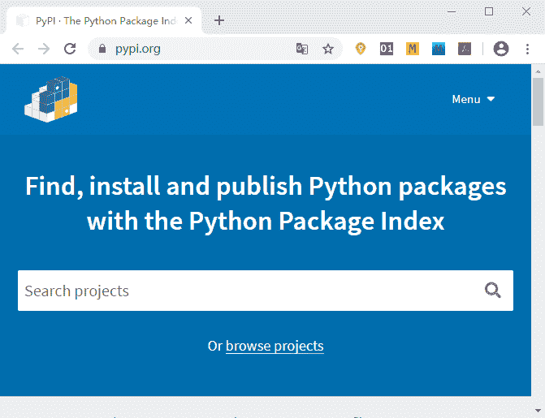
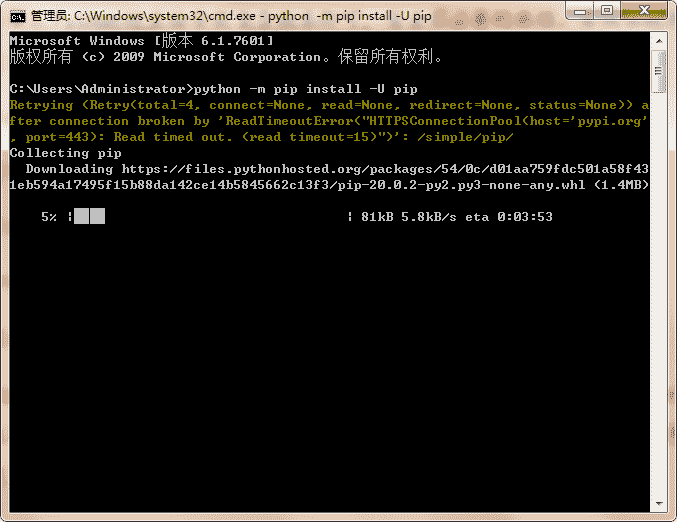

# 搭建 Django 开发环境

> 原文：[`c.biancheng.net/view/7451.html`](http://c.biancheng.net/view/7451.html)

上一章我们介绍了 Django 框架的重要组件，常言道“工欲善其事，必先利其器”，在正式创建 Django 项目之前，我们还需要做哪些准备呢？本节将对如何搭建 Django 开发环境做详细的讲解。

搭建开发环境不仅是个繁琐的过程，而且很容易出错，搭建 Django 开发环境主要分为以下 5 个步骤，我们将依次展开介绍： 

*   安装 Python 解释器
*   安装 MySQL 数据库
*   安装 Python 包管理器 pip
*   安装 Pycharm IDE
*   安装 Django

## 1\. 安装 Python 解释器

Django 是一款完全基于 Python 的 Web 开发框架，所以安装 Python 解释器是毋庸置疑的。本教程是以 Django 2.2.10 版本来展开学习的，它支持 Python3.5、3.6 以及 3.7，如果你使用的是 Linux 或 Mac 操作系统，你的电脑中已经安装了 Python。因为这两种操作系统的部分功能是使用 Python 语言实现的，所以在它们出厂的时候就对 Python 进行内置安装，可以使用如下命令检查 Python 版本：

C:\Users\Administrator>python --version
Python 3.7.4

Python 版本的选择只要符合 Django 的要求即可，Python 的安装在这里就不加赘述了，可以参见本网站《Python 编程环境搭建》，它提供了 Linux、MacOS、Windows 三个平台安装 Python 的方式！

## 2\. 安装 MySQL 数据库

为了达到数据存储的目的，我们需要对数据库进行安装，Django 对关系型数据库有非常好的支持，虽然它自带一个轻量级的 SQLite 数据库，但为了切合 Django 的实际应用场景，我们选择 MySQL 这样的企业级应用数据库。MySQL 安装可以参见本网站《MySQL 安装教程，包含所有平台（图解）》，根据自己电脑的操作系统类型选择相应的安装方式。笔者建议安装 MySQL5.5 或以上版本，本教程以 Mysql5.7 与 Django 配合使用。

如果想通过 Windows CMD 界面操作 MySQL 数据库，那么需要以管理员身份运行 CMD 命令提示符，如图所示：

图 1: CMD 操作 MySQL 数据库

## 3\. 安装 Python 包管理器

世界各地开发者基于 Python 编写的各种软件也是以一种标准的包形式进行分享的，称为“第三方包”。官方专门建立了“Python 包索引”（即 PyPI： [`pypi.python.org/`](https://pypi.python.org/)） 用来统一发布第三方包，相当于是 Python 软件的免费应用市场。Python 标准库和“第三方包”共同组成了 Python 开源软件市场。Python 之所以强大，不仅是因为它支持 Web 开发，而且支持当下比较热门的数据分析以及人工智能这些前沿技术，这些技术的实现也得益于 Python 的“第三方包”。

图 2：第三方包官网
 就像手机上的软件应用市场一样，帮我们管理着种类繁多的软件。Python 同样也需要一个工具去下载维护这些“第三方包”，这就用到了 pip 包管理器，它是一种自动安装、升级、配置和删除包的软件，无需自己动手下载、安装和维护软件，除此之外包管理器还帮助我们解决以下几个问题：

*   包对环境的的依赖问题；
*   包之间存在冲突的问题；
*   包的系统路径指定和维护问题。

这些繁琐的工作都交给 pip 包管理器去处理。

Python3.4 及以上本版本，均对 pip 做了内置安装，所以在安装 Python 时直接安装 3.7 版本即可，省去不必要的麻烦。可以使用如下命令将 pip 升级至最新版：

python -m pip install -U pip

如图 3 所示：

图 3：pip 更新界面图
 pip 最常用的命令有以下几个：

*   查看版本：pip --version
*   安装：pip install 包名
*   升级：pip install -U 包名
*   卸载：pip uninstall 包名
*   列出已经安装的包：pip list

提示：在这里简单介绍一下 pip3，如果你的系统安装了 Python 2.7 和 Python 3.x 两个版本的时候，那么 pip 对应的是 Python 2.7，pip3 对应的是 Python 3.x。

## 4\. 安装 Pycharm IDE

PyCharm 是一种 Python IDE，它是一个可跨平台的开发工具，被认为是最好用的 Python IDE 之一，它带有一整套在使用 Python 语言开发时提高效率的工具，比如调试、语法高亮、Project 管理、代码跳转、智能提示、自动完成等。此外，该 IDE 对 Django 框架下的专业 Web 开发提供了良好的支持。Pycharm 安装可以参见本网站《PyCharm 下载和安装教程（包含配置 Python 解释器）》。

本节主要介绍了如何搭建 Django 开发环境的前 4 个步骤，在下一节，我们将针对 Django 的安装与配置做专门的讲解。