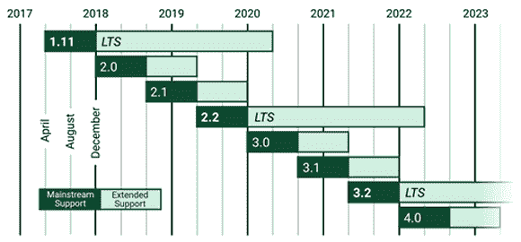
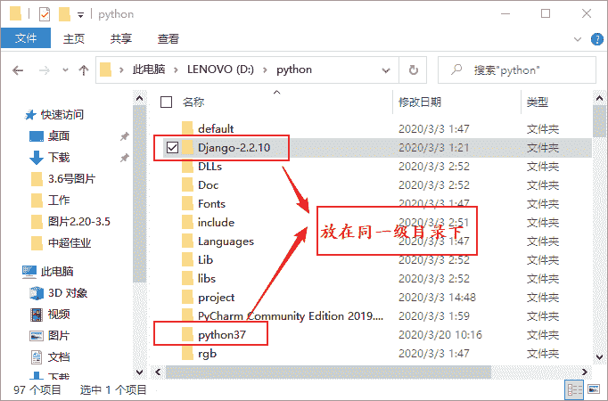
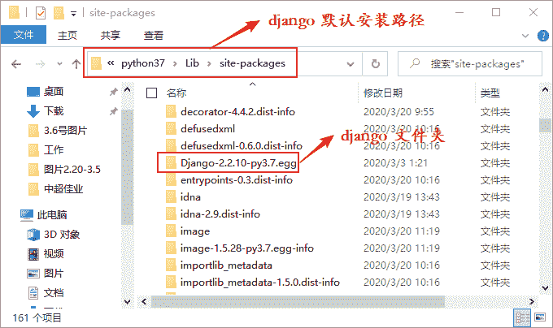
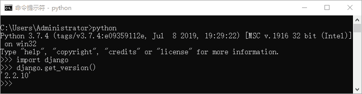

# Django 安装与配置教程（图解）

> 原文：[`c.biancheng.net/view/7455.html`](http://c.biancheng.net/view/7455.html)

本节主要对 Django 在各个平台上的安装方式与配置进行讲解。

前文章节提到过，不同 Django 版本对 Python 版本的要求也是不一样的 ，Django 对 Python 版本的支持，如表格所示：

Django 版本与 Python 版本对应表

| Django 版本 | Python 版本 |
| 1.8 | 2.7, 3.2, 3.3, 3.4, 3.5 |
| 1.9, 1.10 | 2.7, 3.4, 3.5 |
| 1.11x | 2.7, 3.4, 3.5, 3.6 |
| 2.0 | 3.4, 3.5, 3.6, 3.7 |
| 2.1, 2.2 | 3.5, 3.6, 3.7 |
| 3.0 | 3.6, 3.7, 3.8 |

本教程的教学版本是 Django 2.2.10 版，Django 的官方网站不仅可以下载不同的 Django 版本（官方网址：[`www.djangoproject.com/download/`](http://www.djangoproject.com/download/)），而且也提供了 Django 完善的使用文档。2019 年 4 月份，官网发布了最新的 LTS 版本 Django 2.2.10 ，我们选择最新的 LTS 版本来展开学习。下图是官网设定的 Django 不同版本的发布时间。


图 1：Django 不同版本发布时间

## 1\. Windows 系统安装 Django

#### 1) 离线安装

首先应该确定您的电脑已经安装了 Python 3.7 版本，然后通过 Django 官方网站下载 Django 2.2.10 压缩包。我们将下载完成的压缩包解压，并将解压后的文件和 python37 放在同一个目下。在 CMD 命令行工具中使用 `cd` 命令进入 Django-2.2.10 文件夹，然后执行 `python setup.py install` 命令，这样就开始安装 Django 了，Django 将默认被安装到 python37/Lib/site-packages 文件夹下。


图 2：Windows 离线安装方式

图 3：Windows 离线安装方式

#### 2) 在线安装

在 CMD 命令行中执行如下命令进行在线安装，安装时可以指定版本号：

python -m pip install django==2.2.10

但是由于网络的不稳定性有时会导致下载失败，所以不推荐在线安装的方式，建议采用离线安装的方式。

#### 3) 配置 Django 环境变量

配置环境变量是 Windows 系统下重要的一步，首先右击计算机->属性->高级->环境变量->编辑系统变量 path，然后在 path 里添加如下变量值：

D:\Python37\Lib\site-packages\Django-2.2.10-py3.7.egg\django\bin;D:\Python37\Scripts

注意使用分号隔开。如图 4 所示，笔者的 Django 是安装在 D 盘中的，而大家进行配置的时候一定要根据 Django 的安装位置来编辑环境变量。当把环境变量配置完成后就可以使用命令来新建 Django 项目了。

提示：注意此处的环境变量一定要配置正确，否则影响后续创建 Django 项目。


图 4：配置 Django 环境变量

#### 4) 检查是否安装成功

通过 CMD 命令行中进入 Python 交互解释器，用以下方式检查 Django 是否安装成功，若能成功返回 Django 版本号，则说明安装成功：

图 5：查看 Django 版本

## 2\. Linux 和 Mac 系统安装 Django

#### 1) 使用终端在线安装

使用如下命令将默认安装 Django 的最新版本：

$sudo pip3 install django

还可以指定版本号来进行安装，命令如下：

$sudo pip3 install django==2.2.10

#### 2) 下载安装包离线安装

在官方网站下载 Django 2.2.10 安装包，通过下面的命令解压并安装：

```

$ tar -zxvf Django-2.2.10.tar.gz  
$ cd Django-2.2.10
$ sudo python3 setup.py install
```

安装完成后，进入 Python 交互解释器来检查 Django 是否安装成功，如下所示：

```

>>>import django
>>>django.get_version()
2.2.10

```

本章通过两节知识的介绍，完成了 Django 基本开发环境的搭建工作。下一章，我们将学习如何创建一个简单的可以运行的 Web 站点。