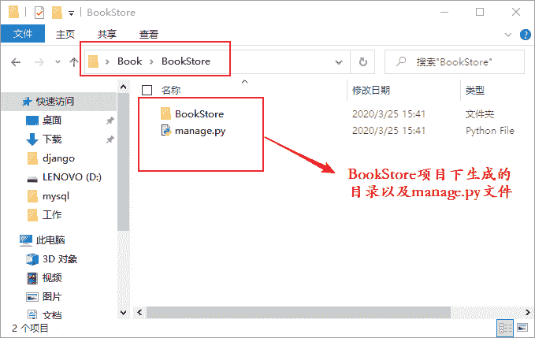
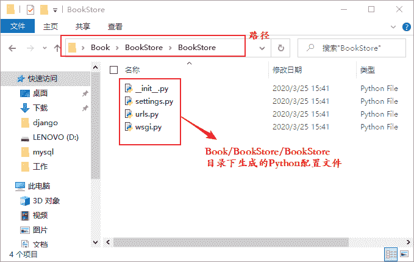

# Django 创建第一个项目

> 原文：[`c.biancheng.net/view/7458.html`](http://c.biancheng.net/view/7458.html)

在上一章中，我们完成了开发环境的搭建工作。 本章我们将学习如何创建 Django 项目以及 Django 项目的初始化，我们将创建一个名为 BookStore 的 Django 项目，用此项目来讲解 Django 框架的部分知识，通过这个项目我们将一起打开 Django 世界的大门。

## 1\. 第一个项目 BookStore

#### 1) BookStore 项目创建

我们创建一个名为 Book 的文件夹，用它来承载 BookStore 项目。在 CMD 命令行使用`cd`命令进入新建的 Book 文件夹，然后使用如下命令创建 BookStore 项目：

django-admin startproject BookStore

startproject 是 django-admin 的子命令，它是专门用来创建 Django 项目的。

我们可以通过`tree`命令来查看 Book 文件夹的目录树结构，下面是命令执行的过程：

```

C:\Users\Administrator>cd Desktop\Book
C:\Users\Administrator\Desktop\Book>django-admin startproject BookStore
C:\Users\Administrator\Desktop\Book>cd ..
C:\Users\Administrator\Desktop>tree /f Book
C:\USERS\ADMINISTRATOR\DESKTOP\BOOK
└─BookStore
    ├─manage.py
    │
    └─BookStore
          ├─settings.py
          ├─urls.py
          ├─wsgi.py
          ├─__init__.py
```

`tree` 命令让我们清晰地认识了 Django 项目的目录结构。我们发现在 Book 文件夹下存在一个名为 BooKStore 的子目录，这个子目录就是我们使用命令创建的项目，而在该目录下仍然存在一个同名的 BookStore 的二级子目录和一个 manage.py 文件，如图 1 所示：


图 1：BookStore 一级子目录
 BookStore 二级子目录专门用来承载 Django 项目的配置文件，如图 2 所示：


图 2：BookStore 二级子目录

## 2\. Django 项目配置文件

二级子目录 BookStore 下的文件称为 Django 项目的配置文件， 它们在创建项目的时候自动生成。下面我们对上述涉及到的文件进行详细的说明：

#### 1) manage.py 文件

一级子目录中的 manage.py 文件是管理 Django 项目的重要命令行工具，它主要用于启动项目、创建应用和完成数据库的迁移等。

#### 2) __init__.py 文件

二级子目录中的 __init__.py 文件用于标识当前所在的目录是一个 Python 包，如果在此文件中，通过 import 导入其他方法或者包会被 Django 自动识别。

#### 3) settings.py 文件

settings.py 文件是 Django 项目的重要配置文件。项目启动时，settings.py 配置文件会被自动调用，而它定义的一些全局为 Django 运行提供参数，在此配置文件中也可以自定义一些变量，用于全局作用域的数据传递。

#### 4) urls.py 文件

url.py 文件用于记录 Django 项目的 URL 映射关系，它属于项目的基础路由配置文件，路由系统就是在这个文件中完成相应配置的，项目中的动态路径必须先经过该文件匹配，才能实现 Web 站点上资源的访问功能。

#### 5) wsgi.py 文件

wsgi.py 是 WSGI（Web Server Gateway Interface）服务器程序的入口文件，主要用于启动应用程序。它遵守 WSGI 协议并负责网络通讯部分的实现，只有在项目部署的时候才会用到它。

本节主要介绍了，如何使用 Django-admin 命令来创建 Django 项目以及相关配置文件的简单介绍，下一节我们将学习如何启动 Django 项目。