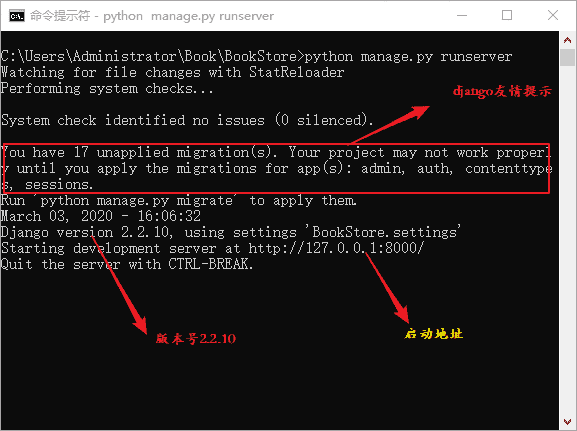
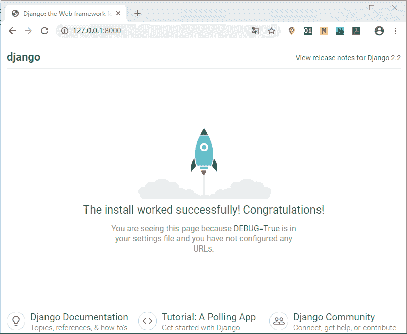
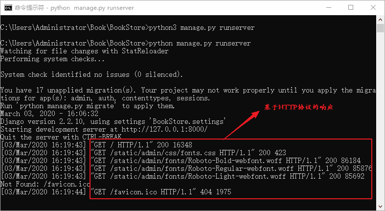
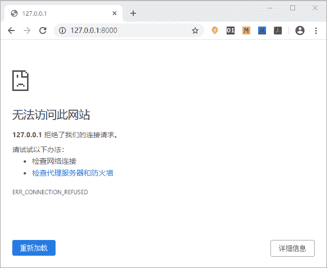

# 如何启动 Django 项目详解

> 原文：[`c.biancheng.net/view/7467.html`](http://c.biancheng.net/view/7467.html)

我们使用 django-admin 命令成功创建项目后，我们要如何启动这个项目呢？本节的学习目标是能够通过本地回送地址 127.0.0.1 成功访问 BookStore 项目。

## 1\. 启动项目并实现访问

在 CMD 命令行工具中，执行 `cd` 命令进入 Book/BookStore 目录下，通过《Django 创建第一个项目》一节，我们知道在 BookStore 子目录下有一个 manage.py 文件，而这个文件的主要作用之一就是用来启动项目的，所以必须和 manage.py 文件处于同一个路径下才可以执行启动命令，启动项目的命令如下所示：

python manage.py runserver

runserver 方法是调试 Django 时经常用到的运行方式，它使用 Django 自带的 WSGI Server 运行，主要在测试和开发中使用。执行完命令后，如下图所示表示启动成功。

图 1：Django 项目启动命令

提示：若是 Linux 或者 Mac 系统执行 python3 manage.py runserver

成功启动后，在该目录下会生成 Django 自带的数据库文件 db.sqlite3，这是 Django 默认自带的轻量级数据库。对于红色方框标住的部分，它是 Django 给的警告信息，后面会做详细的讲解。通过图 1 可以得到很多信息点，首先 Django 告诉我们如何访问项目，通过 http://127.0.0.1:8000 访问创建好的项目，8000 是 Django 的默认端口号。最后如若想退出运行状态，可以通过 CTRL+C 来终止。

在浏览器地址栏输入 http://127.0.0.1:8000 进行访问，如下图所示：


图 2：Django 项目访问界面

提示：注意项目成功运行后，不要关闭运行命令的 CMD 窗口，否则将访问失败。

当你在地址栏回车的一瞬间，若出现了如图 2 所示的界面后，那么恭喜你，表示项目的骨架已经搭建完成了。其实你会发现我们只是用了一个启动命令，就实现一个站点的访问功能，这就是 Django 框架的优势所在，Django 框架依靠创建项目时生成的配置文件，从而构建了自身功能的完整性。

访问成功后，我们可以看到 CMD 命令行也存在变化，如图所示：


图 3：CMD 命令行的 HTTP 响应
 当我们在浏览器地址栏输入网址并确认访问后，就表示对项目服务端发送请求，服务端接收到请求后，会返回相应的页面。结合 HTTP 协议的相关知识，GET 方法表示从服务器获取资源，200 响应码表示请求成功。项目启动后，服务端开始运行，如果关闭启动项目的 CMD 命令行窗口，就表示服务端关闭，此时在浏览器地址栏输入本地会送地址并进行访问，会得到如图 4 所示的结果：


图 4：无法加载网页页面
 所以用来启动项目的 CMD 命令行窗口一般都处于运行状态，这样在项目开发过程中就可以实时进行测试或者调试代码。

#### 1) 启动项目命令介绍

我们使用如下命名启动了项目：

python manage.py runserver

Django 的默认启动端口是 8000，当然也可以选定其他端口来启用。比如，你想在你的计算机上启动多个 Django 项目，那么就需要多个端口启动不同的项目，否则就会出现端口重用的问题，那么如何通过指定端口号启动项目呢？我们可以使用如下命令格式：

python manage.py runserver  6000

上面的命令表示的是以 6000 端口启动项目。

如果是在局域网内，那么如何让局域网内的其他电脑访问你的 Django 项目呢？我们可以使用如下命令来启动项目：

python3 manage.py runserver 0.0.0.0:6000 

#### 2) manage.py 文件子命令

我们可以执行`manage.py help`命令查看 manage.py 文件的相关子命令:

```

C:\Users\Administrator\Book\BookStore>manage.py help

Type 'manage.py help ' for help on a specific subcommand.

Available subcommands:

[auth]
    changepassword
    createsuperuser

[contenttypes]
    remove_stale_contenttypes

[django]
    check
    compilemessages
    createcachetable
    dbshell
    diffsettings
    dumpdata
    flush
    inspectdb
    loaddata
    makemessages
    makemigrations
    migrate
    sendtestemail
    shell
    showmigrations
    sqlflush
    sqlmigrate
    sqlsequencereset
    squashmigrations
    startapp
    startproject
    test
    testserver

[sessions]
    clearsessions

[staticfiles]
    collectstatic
    findstatic
    runserver
```

后面章节如果用到相关的命令，我们再对其进行讲解。

通过本节讲解，我们实现了如何用本地回送地址访问 Django 项目目的。下一节，我们将对 Django 项目的重要配置文件 settings.py 做详细的介绍。