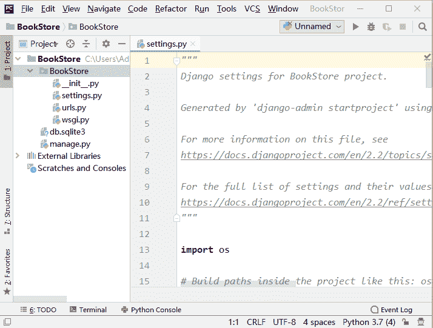

# settings.py 配置文件详解

> 原文：[`c.biancheng.net/view/7475.html`](http://c.biancheng.net/view/7475.html)

在《Django 创建第一个项目》一节中，我们简单介绍了 settings.py 配置文件，它是 Django 框架的重要配置文件，它定义的一些全局变量用来给 Django 框架传递参数，我们还可以根据自己的实际需求来修改这个文件从而实现某些特定的要求。下面我们对这个配置文件进行详细介绍，了解这个配置文件，是迈进 Django 世界的重要一步。

首先使用 Pycharm IDE 打开 BookStore 项目，注意此时的根目录是一级子目录 BookStore，而不是  Book 目录，如图所示：


图 1：通过 Pycharm 打开项目

## 1\. settings.py 文件介绍

下面对 settings.py 配置文件涉及到的知识点进行依次讲解：

#### 1) BASE_DIR

它用于绑定当前项目 BookStore 所在的绝对路径，项目中的所有的文件都需要依赖此路径，绑定路径的方法如下：

```

BASE_DIR=os.path.dirname(os.path.dirname(os.path.abspath(__file__)))

```

`__file__` 是 Python 的语法，显示当前文件的位置，`os.path.abspath(__file__)` 方法返回当前文件的绝对路径。

#### 2) SECRET_KEY

这个变量的本质是一个加密的盐，它一般配合加密算法 Hash、MD5 一起使用。例如用户密码的加密或者建立会话时用到的 sessionid 都需要用到 SECRET_KEY 。在实际的开发工作中，一般将它保存在系统的环境变量中以确保加密盐的安全。

#### 3) DEBUG

用于配置 Django 项目的启用模式，有两种取值方式：

*   DEBUG = True 用于在开发环境中使用，属于调试模式，在项目的运行过程中会暴露一些错误信息以方便调试。
*   DEBUG = False 用于线上环境，表示不启用调试模式。

#### 4) ALLOWED_HOSTS

用于配置能够访问当前站点的域名（IP 地址），当 DEBUG = False 时，必须填写，有以下三种使用方法：

*   []，空列表,表示只有 1217.0.0.1，localhost 能访问本项目；
*   ['*']，表示任何网络地址都能访问到当前项目；
*   ['192.168.1.3', '192.168.3.3'] 表示只有当前两个主机能访问当前项目。

提示：如果是在局域网，让其它主机也能访问此站点，应使用 ALLOWED_HOSTS=['*'] 的方式。

#### 5) INSTALLED_APPS

这个参数是指当前项目中用来安装的应用（APP）的列表，Django 把默认自带的应用放在这个列表里，比如 Admin 后台应用、Auth 用户管理系统等，前面我们也对这两个模块做了相应的介绍，在 Django 中把它们称之为“应用”。

我们可以根据自己的项目需求对其进行增加或删除，比如公司要单独开发一个后台管理系统，就可以把第一项 admin 注释掉。开发时自己编写的应用都必须在这个变量表中进行注册才能生效。所以这个列表需要经常的改动。

INSTALLED_APPS = [
    'django.contrib.admin',
    'django.contrib.auth',
    'django.contrib.contenttypes',
    'django.contrib.sessions',
    'django.contrib.messages',
    'django.contrib.staticfiles',
]

#### 6) MIDDLEWARE

它用于注册中间件，我们在《Django 中间》中进行了介绍，Django 默认加载了一些中间件。例如，用于处理会话的 SessionMiddleware 等，同样我们可以对这些中间件进行添加或者注释。

#### 7) ROOT_URLCONF

```

ROOT_URLCONF = 'BookStore.urls'
```

它指定了当前项目的根 URL，是 Django 路由系统的入口。

#### 8) TEMPLATES

它用于指定模板的配置信息，列表中每一元素都是一个字典。如下所示是 Django 默认自带模板引擎：

```

{'BACKEND':'django.template.backends.django.DjangoTemplates'
```

#### 9) WSGI_APPLICATION

```

WSGI_APPLICATION = 'BookStore.wsgi.application'

```

项目部署时，Django 的内置服务器将使用的 WSGI 应用程序对象的完整 Python 路径。

#### 10) DATABASES

```

DATABASES = { 'default': { 'ENGINE': 'django.db.backends.sqlite3', 'NAME': os.path.join(BASE_DIR, 'db.sqlite3'), } } 
```

它用于指定数据库配置信息，这里默认配置的是 Django 自带的 sqllite3 数据库。Django 支持多种数据库，在这个字典变量中更改数据库配置。在后续章节我们将对 Mysql 数据库配置进行讲解。

#### 11) AUTH_PASSWORD_VALIDATORS

这是一个支持插拔的密码验证器，且可以一次性配置多个，Django 通过这些内置组件来避免用户设置的密码等级不足的问题。

```

AUTH_PASSWORD_VALIDATORS = [
    {
        'NAME': 'django.contrib.auth.password_validation.UserAttributeSimilarityValidator',
    },
    {
        'NAME': 'django.contrib.auth.password_validation.MinimumLengthValidator',
    },
    {
        'NAME': 'django.contrib.auth.password_validation.CommonPasswordValidator',
    },
    {
        'NAME': 'django.contrib.auth.password_validation.NumericPasswordValidator',
    },
]
```

#### 12) LANGUAGE_CODE 和 TIME_ZONE

分别代表语言配置项和当前服务端时区的配置项，我们常用的配置如下所示：

*   LANGUAGE_CODE 取值是英文：'en-us'或者中文：'zh-Hans'；
*   TIME_ZONE 取值是世界时区 'UTC' 或中国时区 'Asia/Shanghai'。

#### 13)  USE_118N 和 USE_L10N

项目开发完成后，可以选择向不同国家的用户提供服务，那么就需要支持国际化和本地化。USE_118N 和 USE_L10N 这两个变量值表示是否需要开启国际化和本地化功能。默认开启的状态。

提示：USE_I18N = True 与 USE_L10N = True 其的 I18N 指的是国际化英文缩写，L10N 指的是本地化英文缩写。

#### 14) USE_TZ=True

它指对时区的处理方式，当设置为 True 的时候，存储到数据库的时间是世界时间  'UTC'。

#### 15) STATIC_URL= '/static/'

它指的是静态资源的存放位置，静态资源包括 CSS、JS、Images。比如我们要在项目中添加一些图片，通常这些静态图片被存放在新建的 static 目录下，这样就实现了通过 STATIC_URL= '/static/' 路径对静态资源的访问。

以上就是对于 settings.py 配置文件的详细介绍。