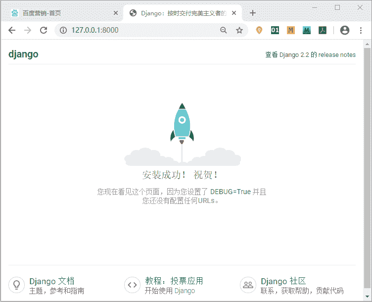
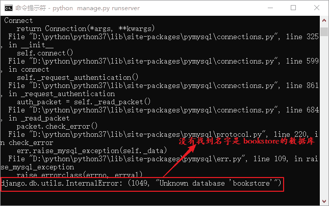
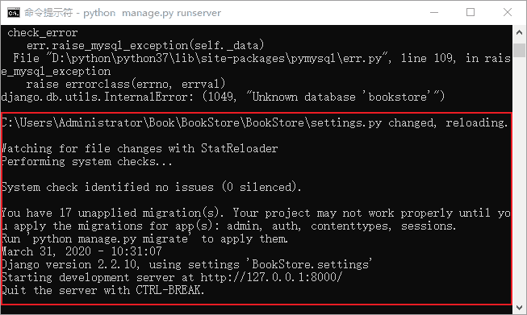

# 如何配置 settings.py 文件

> 原文：[`c.biancheng.net/view/7484.html`](http://c.biancheng.net/view/7484.html)

《settings.py 配置文件详解》一文中，将 settings.py 配置文件的每一项给大家做了介绍。在开发的过程中，为了使 settings.py 适用项目，都要对这个默认配置文件进行相应的修改，那么我们应该如何修改呢，有哪几个重要的步骤呢？下面总结了配置文件的一些通用修改项，让我们一起来看看。

#### 1) 修改语言与时区配置

在项目中设置语言、时区是必不可少的，打开 settings.py 文件，在文件的末尾部分找到相应的变量进行配置，如下所示：

LANGUAGE_CODE='zh-Hans'  #设置为中文模式
TIME_ZONE='Asia/Shanghai'   #设置为中国时间

然后访问 127.0.0:8000 来验证，发现已经变成了中文模式，如图 1 所示：


图 1：Django 2.0 中文版界面

#### 2) 设置时区不敏感

当 USE_TZ 设置为 False 时，表示对时区不敏感，并且让数据库时间符合本地时区。

#### 3) 配置项目所需数据库

在 Django 项目中配置数据库是必不可少的，我们使用 MySQL 作为项目的数据库，下面是 Django 默认配置的 sqlite3 数据库：

```

DATABASES = {
    'default': {
        'ENGINE': 'django.db.backends.sqlite3',
        'NAME': os.path.join(BASE_DIR, 'db.sqlite3'),
    }
}
```

在配置 MySQL 数据库之前，先进入 MySQL 命令行界面为项目建库，使用如下命令：

CREATE DATABASE bookstoredb；

然后在 settings.py 文件中配置 MySQL 数据库，如下所示：

```

DATABASES = {
    'default': {
        'ENGINE': 'django.db.backends.mysql',
        'NAME': 'bookstoredb',
        'USER': 'root',
        'PASSWORD': '123456',
        'HOST': '127.0.0.1',
        'PORT': '3306',
    }
}
```

提示： 配置时需要注意，MySQL 数据库的 USER 和 PASSWORD 请根据自己的设置来配置。不要 Copy 上述代码。

下面我们对上述 DATABASES 中的字典元素进行介绍：

*   ENGINE：指定使用的数据库引擎，可以通过 Django.db.backends 来查看哪些数据库可以与 Django 配合使用；
*   NAME：指定项目所用的数据库名字；
*   USER：是 MySQL 用户名，是在安装 MySQL 时设定的，或者是为项目单独创建的用一个户；
*   PASSWORD：指的是数据库的密码；
*   HOST：数据库服务器地址，这里是本地环境开发，所以使用本地回送地址 127.0.0.1；
*   PORT：MySQL 数据库的端口号，默认端口是 3306。

#### 4）学会阅读报错信息

Django 允许我们在项目运行过程中直接修改配置文件，但如果配置文件出错，那么错误信息将会输出到该项目对应的 CMD 命令行。

我们举一个简单的例子，比如 settings.py 文件中的数据库名字与实际创建的数据库名字不符，在这种情况下命令行就会报错提示，然后我们直接看显示在最后一行的错误信息，如图 2 所示：


图 2：报错信息提示
settings.py 文件中的数据库名字是 bookstore，而实际 MySQL 创建的数据库名字 bookstoredb，所以 Django 告诉我们，它没有找到名字是“bookstore”的数据库。当我们进行更正后，发现运行项目的命令行又回到正常的运行状态。如图 3 所示：


图 3：恢复正常运行的界面

提示：通过举例可以得出，运行项目的命令行与项目保持实时同步的状态，我们对项目的操作，会直接反馈到命令行中，这在项目的开发和测试过程中尤其重要！可以帮助开发者发现错误并找到错误原因。

以上就是对 settings.py 的文件的基本修改，当然 settings.py 还可以进行很多的配置，比如模板配置或者静态文件路径的配置，但是这些配置需要根据项目实际要求而定，在后续章节会对其进行介绍。