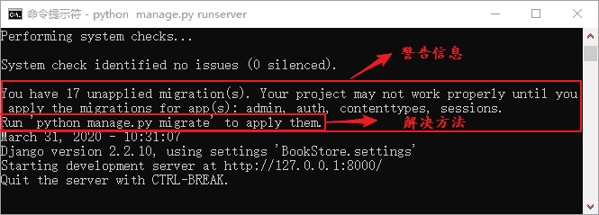
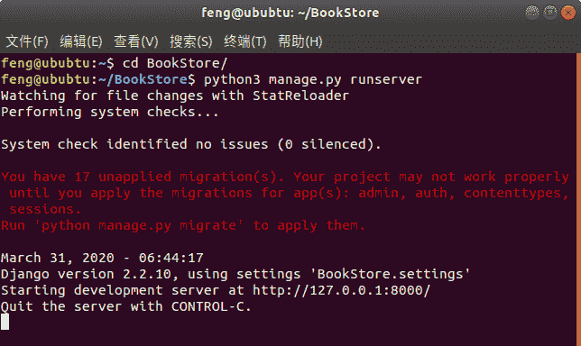
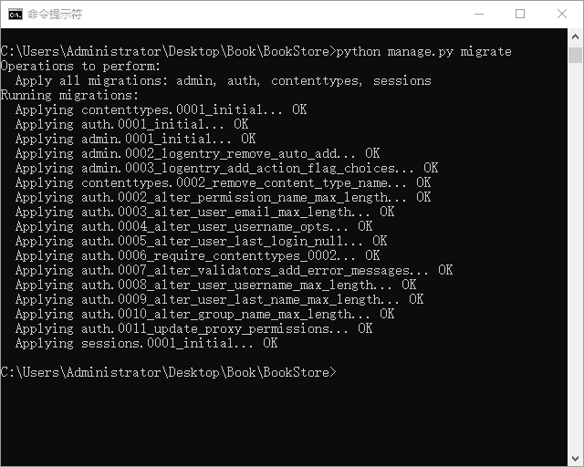
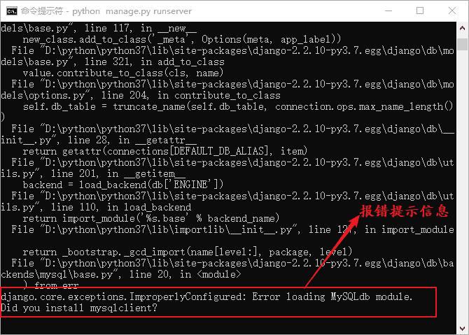

# Django 初始化项目环境精讲

> 原文：[`c.biancheng.net/view/7487.html`](http://c.biancheng.net/view/7487.html)

上一节中，我们完成了对 settings.py 文件的基本配置，本节我们还需要对新建的项目进一步的操作，从而完成项目的初始化工作。

在《settings.py 配置文件详解》一文中，我们介绍了 INSTALLED_APPS 这个安装了 Django 自带应用的列表，诸如 admin 后台管理系统、auth 用户系统应用以及 session 会话建立等应用，它们都被安装在了这个列表中。

## 1\. 完成数据库迁移

作为应用（下面我们统称 app）通常都会需要使用数据表来完成状态或数据的保存，Django 自带的 app 也不例外。如果不同步这些应用的数据表到数据库中，而是直接启动项目，在 CMD 命令行就会打印警告信息，并且告知如何解决这个警告信息方法。如图 1 所示：


图 1：Django 警告信息以及解决方法
 在图 1 中，用红色方框标注的的就是 Django 的警告信息，告诉我们安装在 INSTALLED_APPS 列表中应用如 admin、auth、session 等需要进行数据库迁移。而且它还告诉我们如何进行迁移，就是使用如下命令来进行数据表的迁移：

python manage.py migrate

提示：“迁移”就是把 Django 默认自带应用的数据表迁移到我们自己的创建的数据库里，有点像搬家的意思，migrate 这个单词的含义就是“迁移”。

如果你是在 Linux 或者 Mac 操做系统，利用终端启动项目后，提示会更加明显，如下图 2 所示：

图 2：Linux 终端运行项目因为 Linux 系统同时安装了 python 2.7 版本和 python 3.x 的版本，所以使用如下命令进行数据库的迁移。

python3 manage.py migrate 

migrate 是 manage.py 的子命令，它主要用来将应用的数据表同步到数据库中。执行后，它会检查 INSTALLED_APPS 里配置的应用列表，依次为每个应用创建所需要的数据表。

我们可以根据自己的需要来决定使用哪个应用，如果项目本身用不到，可以将其在列表注释掉。那么 migrate 就不会执行它了。在执行此命令之前，你的数据库应该处于开启状态而且你的 settings.py 文件已经按照《如何配置 settings.py 文件》一节做了相应的配置。执行命令后，在 CMD 命令行得到如图 3 所示输出：


图 3：完成数据库迁移

## 2\. PyMySQL 模块的使用

如果你的终端看到如图 4 所示的报错信息，也不必紧张，这个错误信息是由于 MySQLdb 不支持 Python 3 导致的，所以 Django 连接 MySQL 就不能在使用 MySQLdb 了，我们需要用一个驱动模块来实现 MySQL 数据库 与 Django 的连接 ，这时候就用到了一个 Python 的模块，也就是 PyMySQL 模块。


图 4：数据库连接报错
PyMySQL 模块是 Python 的一个第三方模块， Python 3 与 MySQL 数据库的连接就是由它实现的。然后我们进行以下操作：找到 init.py 配置文件，在文件中加上如下代码：

```

import pymysql 
    pymysql.install_as_MySQLdb()
```

这就表示用 PyMySql 代替 MySQLdb 来实现 Django 与 MySQL 数据库的交互。按照上述的方式配置完成后，再执行迁移命令，就可以顺利完成项目的初始化工作了。

## 3\. migrate 与 makemigrations 命令详解

通过图 3 所示，我们能够得出执行完 migrate 命令后，在数据库 bookstoredb 中就生成了 admin、auth、session 等应用所需要的数据表，我们可以进入 MySQL 命令界面，使用如下命令查看创建了哪些表。

SHOW TABLES;

输出结果如下所示，这就是在项目数据库中生成的表：

```

mysql> show tables;
+----------------------------+
| Tables_in_bookstoredb      |
+----------------------------+
| auth_group                 |
| auth_group_permissions     |
| auth_permission            |
| auth_user                  |
| auth_user_groups           |
| auth_user_user_permissions |
| django_admin_log           |
| django_content_type        |
| django_migrations          |
| django_session             |
+----------------------------+
10 rows in set (0.01 sec)
```

这里使用一个命令就完成了数据库的迁移工作，但是有两点问题值得我们思考，migrate 是怎么知道要创建哪些表的，而且如果这些表修改了，它又怎样去维护这些表与数据库中已经迁移的表保持一致呢？下面我们来解答这个疑惑。

Django 对于数据库的迁移工作通过两个命令来实现，一个就是我们上面介绍的 migrate 命令，另个命令如下所示：

python manage.py makemigrations

makemigrations 命令会检测应用目录下是否存在 migrations 目录，如果没有则进行创建。首先，会根据应用的表结构定义生成一个 0001_inital.py 文件，里面定义了数据表的结构。

#### 1) makegrations 生成数据库迁移文件

当数据表更改后，我们首先执行 makemigrations 命令，然后 Django 会重新生成一个新的数据库迁移文件用来记录表结构之间的差异，命名规则是对上一个迁移文件的序列号加 1，如 0002_xxx、0003_xxx。

#### 2) migrate 执行数据库迁移命令

之后，再次执行 migrate 命令让新的迁移文件生效并同步回数据库，从而完成表结构定义的修改。对于 Django 内置的应用，数据库迁移文件已经生成好了，所以直接使用 migrate 命令即可。

#### 3) 完成数据库迁移总结

每一次数据表更改后，都需要执行下面的两个命令，它们的执行顺序如下所示：

python manage.py makemigrations
python manag.py migrate

为了保证已经完成的迁移工作不会重复的执行，Django 会把每一次数据库迁移记录到 django_migrations 表中，每一次执行 migrate 命令前都会比较迁移文件是否已经记录在表中了，只有没出现过的才会执行。若想查看当前项目的第一次 migrate 生成的迁移记录，可以在 MySQL 命令行界面使用如下命令查看 ：

select * from django_migrations;

输出结果如下所示：

```

mysql> select * from django_migrations;
+----+--------------+------------------------------------------+----------------------------+
| id | app          | name                                     | applied                    |
+----+--------------+------------------------------------------+----------------------------+
|  1 | contenttypes | 0001_initial                             | 2020-03-31 17:53:24.328380 |
|  2 | auth         | 0001_initial                             | 2020-03-31 17:53:24.772333 |
|  3 | admin        | 0001_initial                             | 2020-03-31 17:53:25.304430 |
|  4 | admin        | 0002_logentry_remove_auto_add            | 2020-03-31 17:53:25.389557 |
|  5 | admin        | 0003_logentry_add_action_flag_choices    | 2020-03-31 17:53:25.400529 |
|  6 | contenttypes | 0002_remove_content_type_name            | 2020-03-31 17:53:25.483671 |
|  7 | auth         | 0002_alter_permission_name_max_length    | 2020-03-31 17:53:25.499663 |
|  8 | auth         | 0003_alter_user_email_max_length         | 2020-03-31 17:53:25.523571 |
|  9 | auth         | 0004_alter_user_username_opts            | 2020-03-31 17:53:25.540536 |
| 10 | auth         | 0005_alter_user_last_login_null          | 2020-03-31 17:53:25.584193 |
| 11 | auth         | 0006_require_contenttypes_0002           | 2020-03-31 17:53:25.589585 |
| 12 | auth         | 0007_alter_validators_add_error_messages | 2020-03-31 17:53:25.599557 |
| 13 | auth         | 0008_alter_user_username_max_length      | 2020-03-31 17:53:25.617511 |
| 14 | auth         | 0009_alter_user_last_name_max_length     | 2020-03-31 17:53:25.635472 |
| 15 | auth         | 0010_alter_group_name_max_length         | 2020-03-31 17:53:25.653411 |
| 16 | auth         | 0011_update_proxy_permissions            | 2020-03-31 17:53:25.664380 |
| 17 | sessions     | 0001_initial                             | 2020-03-31 17:53:25.688552 |
+----+--------------+------------------------------------------+----------------------------+
17 rows in set (0.00 sec)
```

至此，BookStore 项目的骨架、数据库配置和迁移都已经完成了，后面需要做的就是完成应用的创建和编写，能够提供一些功能给用户使用。本节详细讲解了项目初始化过程中会遇到的一些问题，并对他们做了深度的剖析，包括 Django 与 MySQL 数据库的连接以及数据库迁命令的解析，希望这些知识对大家学习 Django 有所帮助。