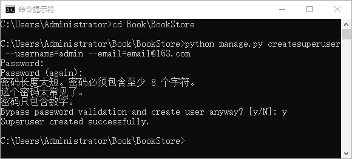
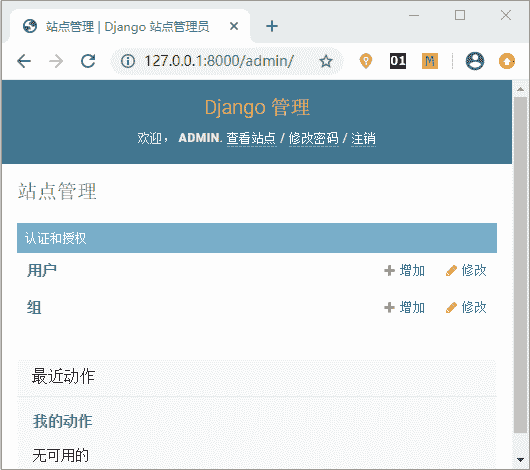
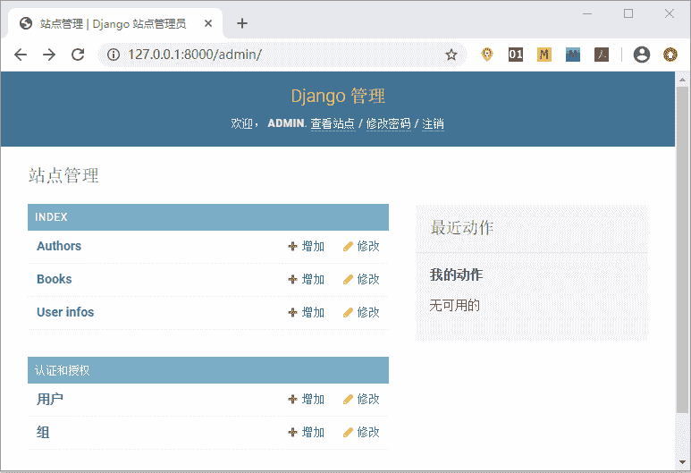
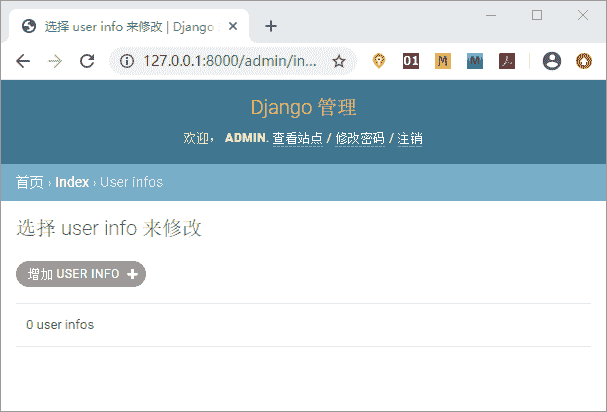
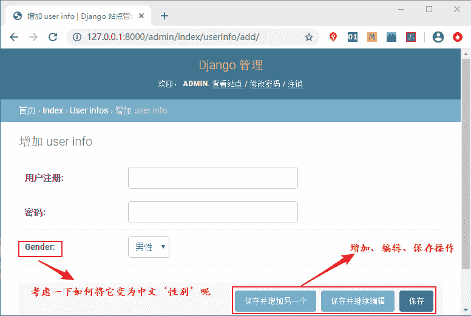

# Django Admin 数据表可视化

> 原文：[`c.biancheng.net/view/7523.html`](http://c.biancheng.net/view/7523.html)

在《Django Admin 后台管理系统》介绍过 Django 的后台管理系统是为了方便站点管理人员对数据表进行操作。Django 的 ORM 模块提供了丰富的 API 用于实现对 Model 的增删改查，但是对于 Web 站点的管理运营人员来说，学习它们的成本较高，且误操作的可能性较大。当然开发人员自己也可以去构建管理界面，但是当系统越来越复杂，Model 越来越多的时候， 就会增加很多重复性的工作。

综上所述，Django 完全考虑到了这些问题，它可以让开发人员几乎不用写代码就能拥有一个功能强大的 Model 管理后台。下面我们一起来学习 Django 提供的这个强大功能。

## 1\. 创建超级用户

我们是使用在《Django Admin 后台管理系统》中提到过的命令创建超级管理员账户，命令如下所示：

python manage.py createsuperuser --username=admin --email=admin@163.com

这里将用户名设置为 admin，邮箱设置为 admin@163.com，也可以根据自己的需要去修改。如果在 createsuperuser 后面不加任何内容，Django 会提示用户输入用户名和邮箱。当前命令执行后，需要重复输入两次密码，密码可以根据自己的需要设置，但是密码不能过于简单，如下图所示，表示创建成功：


图 1：创建超级用户 admin

提示：超级用户拥有所有权限，方便技术人员或非技术人员以可视化的形式对应用数据记录实现增删改查的操作。

在 CMD 命令行工具启动 BookStore 项目，然后在浏览器地址栏输入 127.0.0.1:8000/admin 访问，输入刚刚创建的超级用户名以及密码进行登录。如下所示登录成功：


图 2：Admin 后台超级用户登录

## 2\. 将 Model 注册到管理后台

#### 1)在 admin.py 文件中声明

那么如何把自定义的数据表 Model 注册到管理后台呢？也就是说要把 Model 显示在 Admin 后台管理系统界面，需要做哪些操作呢？当我们使用 startapp 命令创建 index 应用的时候会自动创建 admin.py 文件，想要把自定义的 Model 注册到管理后台，就需要在 admin.py 文件中进行声明，添加如下代码：

```

from django.contrib import admin #Django 自动在 admin.py 文件中导入
from index.models import Book, Author,UserInfo #这个需要我们自己导入相应的模型类（数据表）
admin.site.register([Book,Author,UserInfo])

```

通过上述代码，我们就完成了将 Model 注册到后台管理系统的操作，其实实现的过程也非常的简单，首先通过 django.contrib 的标准库引入 admin 应用，然后把 index 应用下我们自定义的三张数据表引入，最后我们调用 admin.site.register() 方法实现模型类的注册。多个模型类一起注册我们使用列表的形式来统一注册，如果是单一的模型类注册，我们可以使用以下方式即可：

```

admin.site.register(Book)

```

至此我们就完成了数据表在 Admin 后台管理系统的可视化操作，我们再次使用`ctrl+F5`刷新后台管理系统的显示页面，可以得到如下结果：


图 3：admin 后台数据表可视化

提示：在图 3 中，每张数据表的名字都加上了 s ，这是 Django 自动设定的，我们可以通过相应的修改将其去掉，在后续章节我们将介绍。

虽然看似页面简单并且没有太多的附加功能，但是对于简单的增删改操作而言已经足够使用了。我们打开其中的 UserInfos 数据表来查看，如下所示：


图 4：admin 后台数据表可视化
 点击增加 USERI INFO 按钮会得到如下页面，在此页面我们可以进行数据的添加、编辑、保存操作：


图 5：admin 后台数据表可视化
 上图中提到的问题，其实只需要我们在自定义的模型类中添加上一个字段选项 verbose_name 就可以修改了，小伙伴们可以自己修改一下。

## 3.  django_admin_log 数据表

Admin 应用在数据库迁移的过程中只创建了 django_admin_log 一张表 ，用于记录通过管理后台完成的对 Model 的增删改操作，如下所示，是数据库迁移过程中生成的所有数据表：

```

mysql> show tables;
+----------------------------+
| Tables_in_bookstoredb      |
+----------------------------+
| auth_group                 |
| auth_group_permissions     |
| auth_permission            |
| auth_user                  |
| auth_user_groups           |
| auth_user_user_permissions |
| django_admin_log           |
| django_content_type        |
| django_migrations          |
| django_session             |
| index_author               |
| index_book                 |
| index_userinfo             |
+----------------------------+
13 rows in set (0.00 sec)
```

我们可以使用`desc`命令查看 django_admin_log 表结构， 如下所示：

```

mysql> desc django_admin_log;
+-----------------+----------------------+------+-----+---------+----------------+
| Field           | Type                 | Null | Key | Default | Extra          |
+-----------------+----------------------+------+-----+---------+----------------+
| id              | int(11)              | NO   | PRI | NULL    | auto_increment |
| action_time     | datetime(6)          | NO   |     | NULL    |                |
| object_id       | longtext             | YES  |     | NULL    |                |
| object_repr     | varchar(200)         | NO   |     | NULL    |                |
| action_flag     | smallint(5) unsigned | NO   |     | NULL    |                |
| change_message  | longtext             | NO   |     | NULL    |                |
| content_type_id | int(11)              | YES  | MUL | NULL    |                |
| user_id         | int(11)              | NO   | MUL | NULL    |                |
+-----------------+----------------------+------+-----+---------+----------------+
8 rows in set (0.01 sec)
```

这些字段含义只做简单了解即可，如下所示：

*   id 是自增的主键字；
*   action_time：datetime 类型，保存操作发生的日期和时间；
*   object_id：longtext 类型，保存修改对象的主键；
*   object_repr：varchar 类型，保存修改后的对象执行 repr 函数的值，repr 是 Python 的内置函数，用于将对象转换为字符串；
*   action_flag：无符号 smallint 类型，用于记录操作类型 ADDITION（值为 1，表示添加）、CHANGE（值为 2，表示更新）、DELETION（值为 3，表示删除）；
*   change_message：longtext 类型，用于保存修改对象的详细描述；
*   content_type_id：int 类型，外键关联 ContentType 对象；

*   user_id：int 类型，外键关键 User 对象（默认值），记录执行操作的用户。

本节我们在 Admin 后台管理系统实现了数据表的可视化，通过这个功能我们就可以对数据表进行管理，极大的方便了 Web 站点的管理人员。