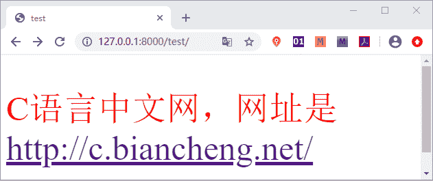

# Django 模板加载与响应

> 原文：[`c.biancheng.net/view/7525.html`](http://c.biancheng.net/view/7525.html)

在前文章节《Django 模板系统》中，我们对 Django 的模板系统有了初步的认识，在本章我们将重点讲解 Django 的模板语言。

Djano 的模板系统将 Python 代码与 HTML 代码解耦，动态地生成 HTML 页面。Django 项目可以配置一个或多个模板引擎，但是通常使用 Django 的模板系统时，应该首先考虑其内置的后端 DTL（Django Template Language，Django 模板语言。

## 1\. 什么是模板

在 Django 中，模板是可以根据字典数据动态变化的，并且能够根据视图中传递的字典数据动态生成相应的 HTML 网页。Django 中使用 Template 来表示模板，Template 对象定义在 django/template/base.py 文件中，它的构造函数如下所示：

```

def __init__(self,template_string,origin=None,name=None,engine=None)
```

它只有一个必填的参数：字符串表示的模板代码。

#### 1) 模板的配置

首先按照 `BookStore/templates`路径创建模板文件夹 templates，在 settings.py 配置文件中有一个 TEMPLATES 变量，如下所示：

```

TEMPLATES = [
    {
        'BACKEND': 'django.template.backends.django.DjangoTemplates',
        'DIRS': [],  #指定模板文件的存放路径
        'APP_DIRS': True, #搜索 APP 里面的所有 templates 目录
        'OPTIONS': {
            'context_processors': [  #context_processors 用于配置模板上下文处理器
                'django.template.context_processors.debug',
                'django.template.context_processors.request',
                'django.contrib.auth.context_processors.auth',
                'django.contrib.messages.context_processors.messages',
            ],
        },
    },
]
```

其中每一项释义如下所示：

*   BACKEND : Django 默认设置，指定了要是用的模板引擎的 Python 路径；
*   DIRS : 一个目录列表，指定模板文件的存放路径，可以是一个或者多个。模板引擎将按照列表中定义的顺序查找模板文件；
*   APP_DIRS : 一个布尔值，默认为 Ture。表示会在安装应用中的 templates 目录中搜索所有模板文件；
*   OPTIONS : 指定额外的选项，不同的模板引擎有着不同的可选参数，例如 context_processors 用于配置模板上下文处理器，在使 RequestContext 时将看到它们的作用。

#### 2) 修改 settings 配置文件

修改 settings.py 文件，设置 TEMPLATES 的 DIRS 值来指定模板的搜索目录为“templates”如下所示：

```

'DIRS': [os.path.join(BASE_DIR, 'templates')]
```

## 2\. 模板的加载与响应方式

那么我们如何加载模板并响应给浏览器呢？在前文《Django 模板系统》一文，我们已经介绍了一种 render 的方法，其实这里可以使用的方式主要有两种，在本节我们将更加全面的讲解它们。

方式一：通过 loader 获取模板,通过 HttpResponse 进行响应

```

from django.template import loader
# 1.通过 loader 加载模板
t = loader.get_template("模板文件名")
# 2.将 t 转换成 HTML 字符串
html = t.render(字典数据)
# 3.用响应对象将转换的字符串内容返回给浏览器
return HttpResponse(html)
```

方式二：使用 render 方法直接加载并响应模板

```

from django.shortcuts import render
return render(request,'模板文件名', 字典数据)

```

下面我们对上述两种方式分别来说明：

```

#方式一
from django.template import loader # 导入 loader 方法
from django.shortcuts import render #导入 render 方法
def test_html(request): 
    t=loader.get_template('test.html') 
    html=t.render({'name':'c 语言中文网'})#以字典形式传递数据并生成 html
    return HttpResponse(html) #以 HttpResponse 方式响应 html
#方式二
from django.shortcuts import render #导入 reder 方法 
def test_html(request): 
    return render(request,'test.html',{'name':'c 语言中文网'})#根据字典数据生成动态模板 

```

然后在 templates 目录下创建 test.html 文件并在其中添加如下代码：

```

<p style="font-size:50px;color:red">{{name}}，网址是<a href="http://c.biancheng.net/">http://c.biancheng.net/</a></p>

```

提示：{{name}} 属于 django 模板语言的语法，代表一个变量，在后续章节我们会讲解。

最后在 BookStore/urls.py 文件的 urlpatterns 列表中为视图函数 test_html() 配置路由映射关系,如下所示：

```

urlpatterns = [ path('admin/', admin.site.urls), path('test/',views.test_html), ]

```

从上述过程我们不难体会 Django 视图函数的实现流程。首先定义了视图函数 test_html()，然后在 templates 文件夹中新建了 test.html 文件，使用它作为模板文件；最后我们配置了视图函数的路由映射关系，以上步骤完成后，我们可以通过访问 127.0.0.1/test 得到如下展示页面：


图 1：页面展示效果

## 3\. render 方法详解

renbder 方法的作用是结合一个给定的模板和一个给定的字典，并返回一个渲染后的 HttpResponse 对象。通俗的讲就是把字典格式的内容, 加载进 templates 目录中定义的 HTML 文件, 最终通过浏览器渲染呈现.

rebder() 方法的完整参数格式如下所示：

```

render(request, template_name, context=None, content_type=None, status=None, using=None)
```

以下每个参数的含义如下所示：

*   request: 是一个固定参数，用于生成响应的请求对象；
*   template_name: templates 中定义的文件, 要注意路径名. 比如 'templates\appname\index.html', 参数就要写‘appname\index.html’；
*   context: 要传入文件中用于渲染呈现的数据, 默认是字典格式；
*   content_type: 生成的文档要使用的媒体格式类型。默认为 DEFAULT_CONTENT_TYPE 设置的值；
*   status: http 的响应代码,默认是 200；
*   using: 用于加载模板使用的模板引擎的名称。

常见的 content_type 媒体格式，如下所示：

text/html ： HTML 格式
text/plain ：纯文本格式
text/xml ： XML 格式

image/gif ：gif 图片格式
image/jpeg ：jpg 图片格式
image/png：png 图片格式

application/xhtml+xml ：XHTML 格式
application/xml： XML 数据格式
application/atom+xml ：Atom XML 聚合格式
application/json： JSON 数据格式
application/pdf：pdf 格式
application/msword ：Word 文档格式
application/octet-stream ： 二进制流数据（如常见的文件下载）
application/x-www-form-urlencoded ：form 表单数据被编码为 key/value 格式发送到服务器（表单默认的提交数据的格式）。

multipart/form-data ： 需要在表单中进行文件上传时，就需要使用该格式

本节是我们使用 Templates 模板的的开始，下一节我们将详细介绍 Django 模板语言的语法，对它展开进一步的学习。