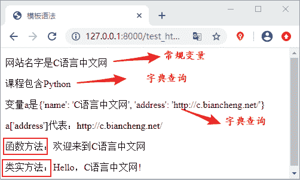

# Django 模板变量精讲

> 原文：[`c.biancheng.net/view/7547.html`](http://c.biancheng.net/view/7547.html)

在上一节《Django 模板加载与响应》中我们详细讲述了 模板与视图函数如何进行配合使用，同时我们介绍了加载与响应模板的两种方式，本节我们将着重讲解 Django 模板语言的语法。

我们知道，模板是文本文件，比如我们常见的有 HTML、CSV、TXT 等。Django 模板语言的语法主要分为以下四个部分：

*   变量
*   标签
*   过滤器
*   注释

下面章节我们会对这四部分进行细致的讲解。

## 1\. 模板变量

上一节内容中我们提到了模板变量，并且已经使用了它，如 {{name}}。Django 模板引擎通过 `context_processors`这个上下文处理器来完成字典提供的值（vaule）与模板变量之间的替换，也就是用字典的 vaule“C 语言中文网”来替换模板文件 test.html 中的变量 {{name}}，这就好比字典中 key 到 vaule 的映射。而我们无需关心内部细节是如何让实现的，这些由 Django 框架自己完成。

提示：当在模板中遇到变量的时候，会根据视图函数来确定这个变量的值，然后将结果输出。

#### 1) 变量的命名规范

Django 对于模板变量的命名规范没有太多的要求，可以使用任何字母、数字和下划线的组合来命名，且必须以字母或下划线开头，但是变量名称中不能有空格或者标点符号。

#### 2）模板的变量语法

如何理解模板的变量语法呢？其实它有四种不同的使用场景，分别如下所示：

*   索引 index 查询，如 {{变量名.index}}，其中 index 为 int 类型即索引下标；
*   字典查询方法，{{变量名.key}} 其中 key 代表字典的键，如 a['b']；
*   属性或方法查询，如 {{对象.方法}} ，把圆点前的内容理解成一个对象，把圆点后的内容理解为对象里面的属性或者方法；
*   函数调用，如 {{函数名}}。

注意：在模板中访问对象方法的时候，方法调用不需要加括号，而且只能够调用不带参数的方法；如果不希望自定义的方法被模板调用可以使用 alters_data=Ture 属性，放在方法的结束位置即可。下方代码注释掉地方做了展示，小伙伴们可以自行测试效果。

下面我们对上面变量的语法进行依次的说明，首先在 views.py 中添加如下代码：

```

def test_html(request):
    a={} #创建空字典，模板必须以字典的形式进行传参
    a['name']='C 语言中文网' 
    a['course']=["Python","C","C++","Java"]
    a['b']={'name':'C 语言中文网','address':'http://c.biancheng.net/'}
    a['test_hello']=test_hello
    a['class_obj']=Website()
    return render(request,'test_html.html',a)
def test_hello():
    return '欢迎来到 C 语言中文网'
class Website:
    def Web_name(self):
        return 'Hello，C 语言中文网!'
    #Web_name.alters_data=True #不让 Website()方法被模板调用
```

其次在 templates 目录下创建名为 test_html 的 html 文件，然后添加以下代码：

```

<p> 网站名字是{{ name }}</p> //字典查询
<p> 课程包含{{ course.1 }}</p> //索引查询
<p> 变量 a 是{{ b }}  <p>
<p> a['address']是{{b.address}}  </p>//字典查询
<p> 函数 fuction：{{ test_hello }}</p> //函数方法调用
<p> 类实例化对象：{{class_obj.Web_name}} </p> //类方法调用

```

然后在 urls.py 文件中添加路由配置，如下所示：

path('test_html/',views.test_html)

最后运行效果如图 1 所示：


图 1：模板语法实例展示

#### 3) 模板传参语法格式

在视图函数中必须将变量封装到字典中才允许传递到模板上，语法格式如下：

```

#方式 1
def xxx_view(request)
    dic = {
        "变量 1":"值 1",
        "变量 2":"值 2",
    }
    return render(request, 'xxx.html', dic)
#方式 2
def xxx_view(request)
        变量 1=值 1
        变量 2=值 2
    return render(request, 'xxx.html', locals())

```

提示：locals() 返回当前函数作用域内全部局部变量形成的字典。即将变量与值对应形成字典，并把这个字典作为 locals() 的返回值来使用。

在下一节中，我们会对模板语言的另一个知识点模板标签展开讲解。