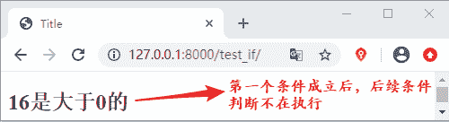
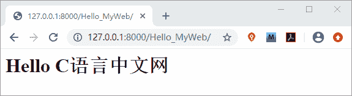
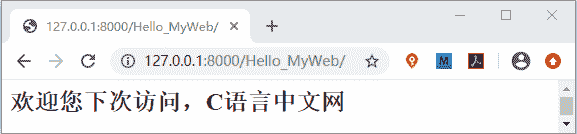

# Django if 标签详解

> 原文：[`c.biancheng.net/view/7561.html`](http://c.biancheng.net/view/7561.html)

本节继续讲解 Django 的模板语言，Django 内置了许多标签用于简化模板的开发过程，同时 Django 也支持自定义标签，这极大的方便了 Web 开发者，下面我们依次进行介绍。

## 1\. 模板标签

Django 的模板系统对标签的解释是在渲染的过程中提供相应的逻辑，比如 Python 语言中 if...else 语句、with 语句、以及 for 循环等，这些在 Django 的模板系统中都有对应的标签，不过稍微复杂些，它们的使用方式如下所示：



不过有些标签需要开始标签和结束标签，也有的标签不需要，下面我们对这两种类型的常见标签进行讲解。

#### 1) 判断逻辑的 if 标签

我们知道 if 在 Python 语言中是判断条年是否成立的，在模板标签中它们作用是类似的，如果条件成立则显示块中的内容。模板标签规定了 if 需要与 endif 成对出现 ，使用的方式如下所示：


 ......

......

......

......


上面的 if 示例中就是使用了开始标签和结束标签，它们分别写在了开始位置和结束位置。

注意：模板标签内部的两边空格不要省略。

那 if 标签具体又是如何使用的呢，下面我们通过一个简单的例子来看一下：

```

#在 views.py 中添加如下代码
def test_if(request):
    dic={'x':2**4}
    return render(request,'test_if.html',dic)
```

在 templates 目录中创建 test_if.html 文件 ，并在 body 中添加以下代码

```


<h2>{{ x }}是大于 0 的</h2>

<h3>{{ x }}是等于 0 的</h3>

<h4>{{ x }}是小于 0 的</h4>

```

最后在 urls.py 文件中配置路由如下所示：

path('test_if/',views.test_if)

最终结果可想而知，通过访问 127.0.0.1:8000/test_if 会得到如下显示：



图 1：模板标签 if 运行效果图

从上面例子还可以看出，在 if 标签中可以使用算术操作符，如 >、<、==、<= 等符号，同时也可以使用逻辑运算符 and、or 来连接多个条件，以及使用 not 对当前条件取反。

提示：elif 和 else 这两个标签是可选的，elif 标签可以不止一个，但是 else 标签只有一个，同时也可以都不出现在 if 标签中，只使用 if 与 endif。

如果当判断的条件太多时，为了避免过多的连接操作符的出现，同样可以考虑使用嵌套的 if 标签，格式如下所示：

```


       
       ......
      

       ......
      
       ......
      


```

在这里我们介绍另外一种方式来简单的演示如何使用嵌套 if 标签，在 views.py 文件中添加如下代码：

```

from django.template import Template,Context#调用 template、以及上下文处理器方法
def Hello_MyWeb(request):
      #调用 template()方法生成模板
      t=Template("""
                        
                              
                                     <h1>Hello C 语言中文网</h1>
                              
                                      <h2>欢迎您下次访问，C 语言中文网</h2>
                              
                        
                                      """)
      c= Context({'web':{'name':'C 语言中文网'}, 'printable' : True }) #Context 必须是字典类型的对象，用来给模板传递数据
      html=t.render(c)
      return HttpResponse(html)
```

然后我们在 urls.py 文件中为 hello_MyWeb() 函数配置路由映射关系，如下所示：

path('Hello_MyWeb/',views.Hello_MyWeb)

最终我们会得到如下所示的输出：


图 1：if 标签嵌套使用
当我们将 printable 的值改为 False 的时候，则会得到如下输出：


图 2：if 标签嵌套使用
 本节给大家详细的讲解了 Django 模板标签中的 if 标签的使用方法。在学习的过程一定要懂得融会贯通 ，因为 Django 是基于 Python 的 Web 框架，它纵然有自己的特点，但是万变不离其宗，所以学会结合 Python 语言去学习会有利我们快速理解与掌握相关的知识。