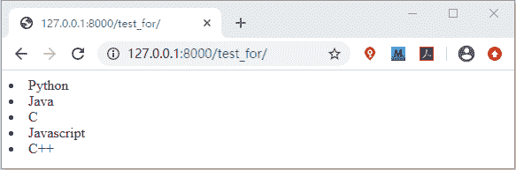
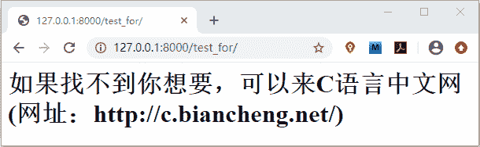
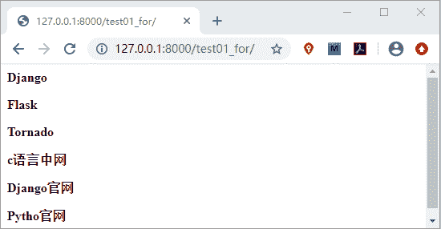
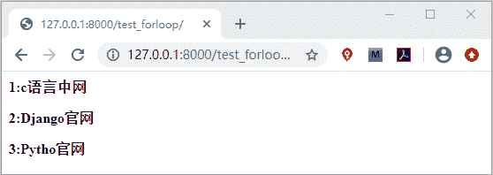

# Django for 标签详解

> 原文：[`c.biancheng.net/view/7562.html`](http://c.biancheng.net/view/7562.html)

通过上一节的《Django if 标签详解》的讲解，我相信大家对于模板标签已经不再陌生，在本节我们再给大家隆重介绍一位最熟悉的陌生人，那就是 for 标签，学习它的时候，我们也要结合 Python 语言中的 for 循环，这样很便于大家理解与使用它。

## 1\. for 标签的使用

for 标签用于对可迭代对象进行遍历，包括列表、元组等，它与 Python 中的 for 语法是类似的。for 标签 使用时也需要和 endfor 标签配合使用，当然它也有不同之处，那就是它多了一个可选的 empty 标签，比如用它来显示当列表不存在或者列表中元素为空的时候要显示的内容，它的使用格式如下：


    ... 循环语句

    ... 可迭代对象无数据时填充的语句


我们通过一个具体的实例来看一下它的用法，在 views.py 中添加如下代码：

```

from django.template import Template,Context
def test_for(request):
      #调用 template()方法生成模板
      t1=Template("""
                    
                        <li>{{ item }}</li>
                    
                        <h1>如果找不到你想要，可以来 C 语言中文网(网址：http://c.biancheng.net/)</h1>
                    
                              """)
      #调用 Context()方法
      c1= Context({'list':['Python','Java','C','Javascript','C++']})
      html=t1.render(c1)
      return HttpResponse(html)

```

并配置路由映射关系，如下所示：

path('test_for/',views.test_for)

访问 127.0.0.1:8000/test_for 得到如下页面：


图 1：for 标签的使用
 当我们将列表改为空的时候，或者不是一个可迭代对象的时候，会得到如下页面：


图 2：for 标签的使用

提示：与 Python 中的 for 循环不同的是，for 标签只能一次性地遍历完列表中的元素，不能中断（break），也不能跳过（continue）。

## 2\. for 标签嵌套使用

for 标签同样可以嵌套使用，示例代码如下所示：

```

def test01_for(request):
    #使用嵌套 for 标签依次遍历列表取值
     website=Template("""
     
     <div>
        
        <p><b>{{ coursename }}</b></p>
        
     </div>
     
     """)
     webname=Context({'list01':[['Django','Flask','Tornado'],['c 语言中网','Django 官网','Pytho 官网']]})
     html=website.render(webname)
     return HttpResponse(html)
```

然后为其配置路由映射关系，最后访问 127.0.0.1/test01_for 获得相应页面如下所示：


图 3：for 循环嵌套使用

## 3\. forloop 变量详解

在 for 标签还提供了内置变量 `forloop` ，我们可以访问这个变量的属性从而获取 for 循环迭代过程中的一些信息，比如 forloop.first，它的返回值是一个布尔值，当 for 循环迭代第一个元素的时候返回 True， 若有其余元素则返回的是 False。forloop 的属性主要有以下几个：

forloop 变量属性

| 变量 | 描述 |
| forloop.counter | 用来计数，查看当前迭代第几个元素（从 1 开始索引） |
| forloop.counter0 | 用来计数，查看当前迭代第几个元素（从 0 开始索引） |
| forloop.revcounter | 表示当前循环中剩余的未被迭代的元素数量（从 1 开始索引） |
| forloop.revcounter0 | 表示当前循环中剩余的未被迭代的元素数量（从 0 开始索引） |
| forloop.first | 如果当前迭代的是第一个元素，则为 True |
| forloop.last  | 如果当前迭代的是最后一个元素，则为 True |
| forloop.parentloop | 在嵌套循环中，用来引用外层循环的 forloop |

实例说明如下所示：

```

def test_forloop(request):
     a=Template("""
     
     <div>
        <p><b>{{ forloop.counter }}:{{ item }}</b></p>
     </div>
     
     """)
     b=Context({'lists':['c 语言中网','Django 官网','Pytho 官网']})
     html=a.render(b)
     return HttpResponse(html) #数字与元素以 1:'c 语言中文网' 的形式出现
```

最终效果如图所示：


图 4：forloop 属性使用方法

提示：forloop 变量只能在 for 与 endfor 之间使用，它的 first 和 last 属性，可以通过 if 标签对当前迭代元素做逻辑判断，而像 counter 属性，常用于调试程序。