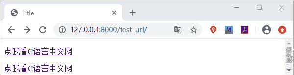
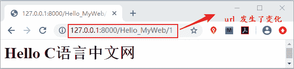

# Django url 标签详解

> 原文：[`c.biancheng.net/view/7582.html`](http://c.biancheng.net/view/7582.html)

在 Django 的模板语言中除了我们前面章节介绍过的 if 标签和 for 标签之外，还有许多我们时常用到标签，比如 url 标签。

## 1\. url 标签基本使用

Django 的模板语言为我们提供了 url 标签，url 标签可以避免在模板中使用硬编码的方式插入要访问的 url 地址。

所谓硬编码就是将数据直接嵌入到程序或其他可执行对象的源代码中，比如我们修改了视图的访问地址，如果模板中采用的是硬编码的话，那么也需要对模板中的访问地址 url 进行修改，让它们保持数据的一致，但是这样对于采用 MTV 设计模式的 Django 框架来说是极其不方便的。url 标签就很好的避免了这一点，它的使用语法格式如下：



我们解析一下它的的含义，其中 app_name 代表我们创建的应用的名字此处是 index；url_name 是 url 自定义的别名，可以在配置路由地址时通过 path 的 name 属进行设置。而后面的 args1、args2 参数是用于定义动态的 url 即带有查询的字符串的 url。下面我们通过已经讲过的实例代码对 url 标签进行讲解。

首先我们在 urls.py 文件中 为 url 设置别名，如下所示：

path('Hello_MyWeb/',views.Hello_MyWeb,name='hello')

然后我们在 templates 目录下创建一个名为 test_url 的 html 文件，添加一下代码：

```

<p><a href="" >点我看 C 语言中文网</a></p>
```

最后我们在 views.py 文件中创建一个 test_url 函数，如下所示：

```

def test_url(request):
    return render(request,'test.url')
```

在浏览器地址栏访问 127.0.0.1:8000/test_url/ ，通过点击可以跳转到 Hello_MyWeb 页面。如果你想跳转到其他的页面，只需要将给相应路由配置 name 属性即可，而我们无需做其他的改动。name 参数有非常重要作用，url 的反向解析也是通过它与`reverse()`函数配合使用实现的。这个知识点后续还会讲到。

提示：url 标签主要用来实现页面之间的跳转，在分布式路由中使用  即应用名:url 别名，在本例中是 index:hello。

## 2\. 给定参数的动态 url

如果是带参数的 url 我们要怎么处理它呢？其实通过简单一段代码我们就能够明白，下面我们对前述代码进行改写。首更改 path 路由函数映射关系，如下所示：

path('Hello_MyWeb/<int:id>',views.Hello_MyWeb,name='hello')

改动 Hello_MyWeb 视图函数，为其添加 id 参数，如下所示：

def Hello_MyWeb(request,id):

再把模板中的标签改写成如下格式：

```

<p><a href="" >点我看 C 语言中文网</a></p>
```

通过访问 127.0.0.1/test_url 地址，可以得到如下显示结果：


图 1：url 标签使用
 我们点击上述链接会跳转到 Hello_MyWeb 视图的页面，如下所示：


图 2：url 标签使用
 本节讲解了模板语言 url 标签的用法，url 标签有很多的使用场景，比如前端首页导航栏中的各个功能模块的超链接，点击后就会进入详情页，这些在模板中就是使用了 url 标签。url 标签还经常被使用到 url 的反向解析中。