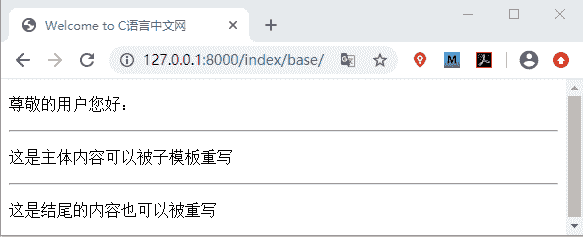
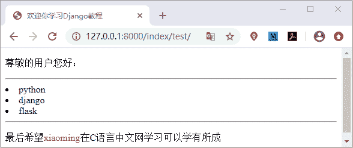
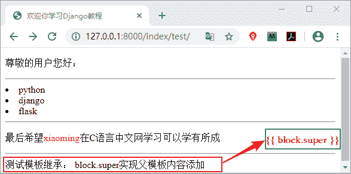

# Django 模板继承精讲

> 原文：[`c.biancheng.net/view/7601.html`](http://c.biancheng.net/view/7601.html)

在本节我们讲述模板语言中最后一个知识点，也是最重要的，那就是模板继承。模板继承和 Python 语言中类的继承含义是一样的，在 Django 中模板只是一个文本文件，如 HTML，XML，CSV 等文件格式。那模板继承到底是是什么呢？如何在 Django 中使用它呢？让我们一起一探究竟。

## 1\. 模板继承的概念

模板继承是 Django 模板语言中最强大的部分。模板继承使你可以构建基本的“骨架”模板，将通用的功能或者属性写在基础模板中，也叫基类模板或者父模板。子模板可以继承父类模板，子模板继承后将自动拥有父类中的属性和方，我们还可以在子模板中对父模板进行重写，即重写父模板中方法或者属性，从而实现子模板的定制。模板继承大大提高了代码的可重用性，减轻开发人员的工作量。

## 2\. 模板继承的应用

那么模板继承如何使用呢？它的使用场景有哪些呢？最典型的应用是 Web 站点的头部信息和尾部信息，比如 Web 站点的底部广告，每个网页都需要放底部广告，还有 Web 站点的头部导航栏，这些都可以使用模板继承来实现。

在模板继承中最常用了标签就是  与  标签，其中 {% block% } 标签与  标签成对出现，而  放在子模板的第一行且必须是模板中的第一个标签，标志着此模板继承自父模板，它们使用方法如下所示：

```

#定义父模板可被重写内容

...可以被子模板覆盖的内容

#继承父模板

#子模板重写父模板

...子模板覆盖后呈现的新内容

```

需要注意的是子模板不需要重写父模板中的所有 block 标签定义的内容，未重写时，子模板原封不动的使用父模板中的内容。下面我们通过一个简单的例子来看一下具体的实现过程。

首先在 index/templates/index 目录下定义父模板 base.html，代码如下所示：

```

<!DOCTYPE html>
<html lang="en">
<head>
    <meta charset="UTF-8">
    <title>Welcome to C 语言中文网 </title>
</head>
<body>
<!--区域 1 默认区域不可以被子模板修改-->
<p>尊敬的用户您好：</p>
<hr>
<!--区域 2 可以被子模板重写-->

<p>这是主体内容可以被子模板重写</p>

<hr>
<!--区域 3 可以被子模板重写-->

<p>这是结尾的内容也可以被重写</p>

</body>
</html>
```

然后在父模板同级路径下定义子模板文件 test.html，代码如下所示：

```


<!--重写 title-->
 欢迎你学习 Django 教程 
<!--区域 1 保持父模板默认状态-->
<!--对父模板的区域 2 进行重写-->


<li>{{ item }}</li>


<p>最后希望<span style="color:red">{{ name }}</span>在 C 语言中文网学习可以学有所成</p>

```

在 index/views.py 文件编写视图函数，如下所示：

```

#定义父模板视图函数
def base_html(request):
    return render(request,'index/base.html')
#定义子模板视图函数
def index_html(request):
    name='xiaoming'
    course=['python','django','flask']
    return render(request,'index/test.html',locals())
```

我们在主路由使用 include 函数为 index 应用建立对应的分发式路由列表，操作步骤如下所示，首先在主路由列表关联 index 应用

```

from django.urls import path,include
from BookStore import views
urlpatterns = [path('index/',include('index.urls'))]
```

然后在 index 应用目录下新建 urls.py 文件，建立主路由对应的分发式路由，代码如下所示：

```

from django.urls import path
from index import views
urlpatterns=[
#127.0.0.1:8000/index/test 访问子模板
path('test/',views.index_html),
#127.0.0.1:8000/index/base 访问父模板
path('base/',views.base_html)]
```

在浏览器地址栏输入父模板 url 地址进行访问，得到的结果如下所示：


图 1：模板继承父模板
 我们在父模板中标记了哪些区域可以被子模板重写覆盖，现在我们访问子模板地址，看看它又是如何的呢？展示结果如下所示：


图 2：模板继承子模板
 我们可以看出，子模板对父模板中  包含的内容进行了重写覆盖，这就是模板继承应用。如果在多个模板中出现了大量复杂的代码，那么就应该考虑使用模板继承来减少重复性代码。

## 3\. 父模板内容扩展(block.super)

所谓父模板内容扩展，即对父模板中的 block 包含内容进行添加，而并非替换。Django 为实现这一功能需求提供了 {{ block.super }} 变量，可以获取到父模板中渲染后的结果并对父模板内容进行添加，我们通过举例说明实现方法，在 base.html 中添加如下代码：

```


测试模板继承：

```

最后在 test.html 文件中插入如下代码：

```


{{block.super}}"block.super"实现父模板内容添加

```

视图层函数保持不变。访问 127.0.0.1:8000/index/test，结果如下：


图 3：block.super 变量使用

## 4\. 总结归纳

本节介绍了模板继承的使用，以及它的优势，Django 官网建议，在父模板中应尽量多的使用  标签，这样可以给我们更多的选择空间。本节知识点总结如下：

*   block 标签需要成对出现，使用 {{ endblock }} 作为结束标签；
*   定义 block 标签名字，子模板中具有同样名称的 block 块完成对父模板的替换；
*   子模板不需要定义父模板中的所有 block，未定义时，子模板将原样使用父模板中的内容；
*   子模板需要使用  标签继承父模板，且必须是模板中的第一个标签，并放在文件的第一行；
*   子模板不覆盖父模板而是对父模板内容进行添加，此时使用 {{ block.super }} 变量来获取父模板 block 块的内容。