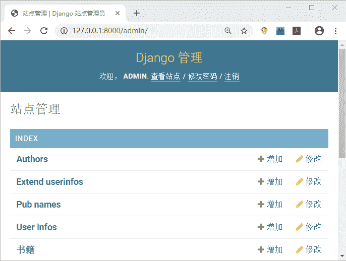
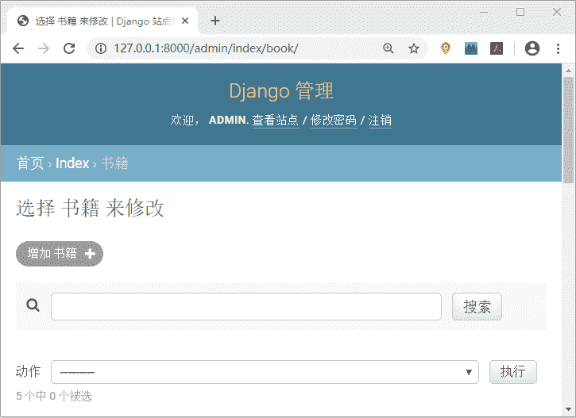
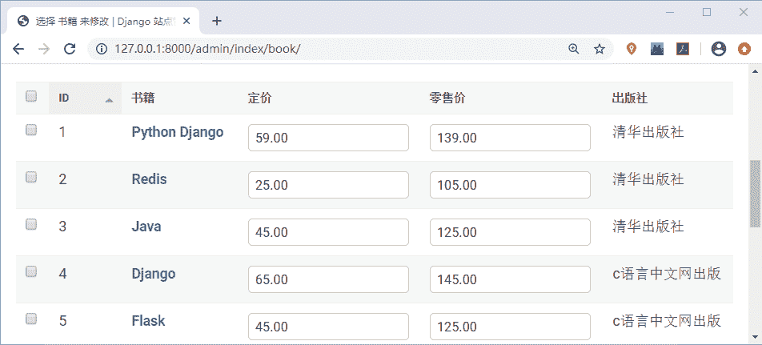
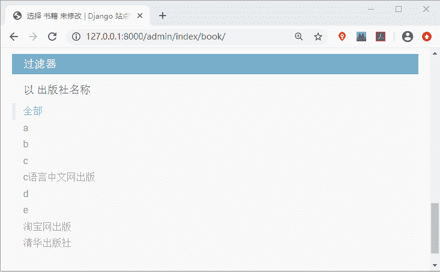

# Django Admin 优化后台展示

> 原文：[`c.biancheng.net/view/7753.html`](http://c.biancheng.net/view/7753.html)

在《Django Admin 数据表可视化》一节，我们实现了 Model 注册并显示在了后台管理系统中，Django 原生的后台系统，在没有经过配置之前是非常“简陋”的，而且不易于管理员阅读以及使用。

为了更加方便管理员操作后台管理系统，Django 提供了 魔术方法 __str__ 让后台管理系统变得易于阅读，同时 Django 也提供了`ModelAdmin `类能够自定义后台管理系统，可以让展现形式更加美观。在本节，我们将对此知识点进行讲解，最后得到一个视觉效果美观的后台管理系统就达到了目的。

## 1\. ModelAdmin 自定义管理后台

ModelAdmin 功能强大，包含了许多内置属性，能够为后台管理系统界面添加便于操作的新功能。后台管理器类须继承自 django.contrib.admin 里的 ModelAdmin 类。它的使用方法主要分为两个步骤：

#### 1) 定义后台模型管理器类

```

#在应用 index/admin.py 里定义模型管理器类
class XXXX_Manager(admin.ModelAdmin):
...
```

#### 2) 注册 admin 管理器与模型类关联

```

# 注册 MyModel 模型类与管理器类 MyModel_Manager 关联
```

```

from django.contrib import admin
from index.models import MyModel
admin.site.register(MyModel, MyModel_Manager)#使用 register 注册关联关系
#或者使用装饰器进行注册
@admin.register(MyModel)#在定义的模型管理器类中使用装饰器
class MyModelAdmin(admin.ModelAdmin)
...

```

这里需要大家注意，Django 规定每一个 Model 只可以注册一次，所以再注册同一个 Model 时，需要将之前注册的语句注释（或者删除），否则会抛出如下异常：

django.admin.sites.AlreadyRegistered 异常

上面介绍了两种方式可以实现 admin 管理器与模型类进行关联，两种方式实现的功能是一样的，但是相比较而言使用装饰器的方法会更加简单一些。

## 2\. ModelAdmin 的常用属性

因为第二步骤在《Django Admin 数据表可视化》一节已经进行了注册，只需要再稍加改动即可，所以我们主要对第一部分进行详细讲解，那么我们如何自定义后台模型管理器类呢？Django 在 ModelAdmin 类中定义了一些属性，我们可以通过配置这些属性，来优化管理后台的界面展示。下面就让我们来认识一些常用的属性吧！

#### 1) list_display 字段展示

在默认的情况下，Model 在 admin 列表修改页（Admin ChangeList）只会显示一列，内容是实例对象的 __str__ 的返回值，如果想要多现实一些列的数据，就可以通过 list_display 属性来实现。它除了可以配置 Model 的字段名之外，还可以接收函数，且这个函数将一个 Model 实例对象作为参数，这个函数也需定义在 ModeAdmin 中。语法格式如下：

list_display=[]

在使用 list_display 时需要特别注意它的两个特性：

*   对于 Foreignkey 类型的字段，显示的是 obj.__str__() 返回的值。
*   不支持 ManyToManyField 类型的字段，如果需要展示，可以用自定义方法实现。

#### 2）search_fileds 添加搜索框

在一些场景下给某些字段添加搜索框是很有意义的，Django 考虑到这一点提供了 search_fileds 属性，在 Admin 中表现为一个搜索框，查询的字段可以是 CharField 或 TextField 类型的，也可以是对 ForeignKey 或 ManyToManyField 字段类型的引用查询，使用双下画线引用字段名。使用示例如下：

```

@admin.register(Book)
class BookAdmin(admin.ModelAdmin):
    search_fields = ['title','pub__pubname']
```

对于搜索框中的输入词，Django 会将其分割成多个关键字，并返回所有包含这些关键字的实例对象。

提示：需要注意的是，每个关键字都必须是 search_fields 选项中的至少一个。

#### 3) list_filter 添加过滤器

配置 list_filter 属性，可以在 Admin 后台的列表修改页的右侧添加过滤器，且各个过滤条件是 and 的关系。

list_filter 是列表或者元组类型，通常使用它会传递两类元素：一个是 Model 的字段名，另一个是继承自以下的类（并不常用）：

django.contrib.admin.SimpleListFilter

对于 Model 的字段名，字段类型必须属于 BooleanField、CharField、DateField、DateTimeField、IntegerField、ForeignKey 或 ManyToManyField 中的一种。同样也可以使用双下画线实现跨表关联。示例如下所示：

list_filter= ['title','pub__pubname']

#### 4) raw_id_fileds 优化数据库检索

raw_id_fields 是一个元组或者列表，其中包含的每一个字段必须是 ForeignKey 或 ManyToManyField 类型。Django 对于其中的每一个字段会以输入框的形式展现，用于输入关联 Model 实例的主键，对于 ManyToManyField 类型，则需要用逗号分隔主键。

除了与默认前端展现样式上的不同之外，Django 不会再去检索所有的关联 Model 实例，而是把这个操作留给了用户，让用户决定是否需要查询。

#### 5) list_display_links 链接至列表页面

使用 list_display_links 可以控制 list_display 中的字段是否应该链接到对象的“更改”页面。默认情况下，更改列表页面会只将第一列链接到每个项目的更改页面。它的使用格式和 list_display 相同，是是列表或者元组类型。

同时它也可以指定一个或多个字段。只要这些字段在中 list_display 中存在 ，那么 Django 就不会在意链接了多少个字段。

注意：要使用 list_display_links 这个属性 ，必须先要定义 list_display。

#### 6) list_editable 设置字段名称

允许模型的字段在列表页面上被编辑，也就是说，它包含的字段将在 list_editable 更改页面上显示为表单窗口小部件，从而允许用户一次编辑和保存多行。

使用 list_editable 时，你应该注意以下规则： 

*   list_editable 列表中的每个字段也必须位于 list_display 中。否则你将无法编辑；
*   同一字段不能同时在 list_editable 和 list_display_links 中显示，因为同一字段只能属于它们两者中的一个。

ModelAdmin 中提供了很多有用的属性，基于我们本项目介绍这些就足够用了，大家也可以查阅官方文档《[ModelAdmin 属性选项](http://docs.djangoproject.com/en/2.2/ref/contrib/admin/)》进一步学习，该文档中提供了所有属性选项的介绍。

## 3\. 项目实例效果展示

访问 127.0.0.1:8000/admin 得到相应页面，如下所示：


图 1：admin 主页面优化展示


图 2：admin 后台优化页面展示


图 3：admin 后台优化页面展示


图 4：admin 后台优化页面展示在 index/admin.py 中的代码如下所示：

```

from django.contrib import admin
from index.models import Book,Author,UserInfo,PubName,ExtendUserinfo
@admin.register(Book) #使用 admin.register(Model)来注册
class BookAdmin(admin.ModelAdmin):
    list_display = ['id','title','price','retail_price','pub_name']
    def pub_name(self,obj):  #显示约束字段 pubname
        return u'%s'%obj.pub.pubname  #u 会对字符串中的\n 等进行转义
    pub_name.admin_order_field = 'pub'  # 字段排序
    pub_name.short_description = '出版社'  # 属性 name 重命名
    list_display_links = ['title']
    list_filter = ['pub__pubname']#ForeignKey 字段
    list_editable=['price','retail_price']
    search_fields = ['title','pub__pubname']
    raw_id_fields = ['pub']
#注册 Model 到 admin 管理后台
admin.site.register([Author,UserInfo,PubName,ExtendUserinfo])
```

大家看到优化后的 Admin 管理界面更加适合阅读，而且更易于后台管理人员进行操作，比如通过增加书籍按钮实现书籍的添加等等，小伙伴们可以根据本节讲解的知识，将其余的 Model 也进行优化展示，不妨自己动手试一试。如果你想更全面的了解后本节知识点，建议参阅官方文档《[ModelAdmin 属性选项](http://docs.djangoproject.com/en/2.2/ref/contrib/admin/)》。