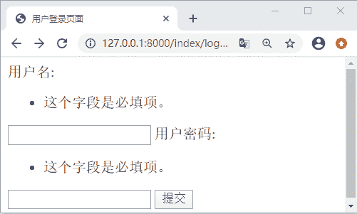

# Django 表单系统初体验

> 原文：[`c.biancheng.net/view/7765.html`](http://c.biancheng.net/view/7765.html)

每个 Web 站点上都需要有用户注册、登陆以及退出这些基本功能，有的站会稍微复杂点，比如让用户输入验证码来鉴别是否是机器人，当然这是后话。既然所有的 Web 站点都需要实现这项基本功能，就可见这个功能的重要性。在本章中我们将主要讲述如何实现一个 Web 站点的注册、登出、退出、以及用户登录时的校验，最终我们还可以使用 Bootstrap4 前端框架对登录界面进行优化调整，下面就让我们开始学习之旅吧。

在 Django 中实现用户的登出这项功能，主要有两种方式，一个是利用 HTML 中的 form 表单通过 Post 传参到服务器，另一个就是本节我们要讲到的 Django 的表单系统，对于第一种方式后续也会介绍到，本节我们主要讲解第二种。在后续的学习中我们将用到 Get 和 Post 这两种向服务端发起请求的方法，如果对于 Http 协议或者 Http 请求方法生疏了，大家要及时的学习，在这里推荐给大家一篇文章，希望可以对你有所帮助《[Http 请求总结](http://zhuanlan.zhihu.com/p/94076120)》。

## 1\. 初识 Django Form 表单

#### 1) HTML 表单提交简单流程

在正式介绍 Django 的表单系统之前，我们先了解以下一个普通 HTML 表单的处理流程，也就是上述的第一种方式。一个 HTML 表单必须指定以下两项，一个是用户数据发送的目的 URL，另一个是发送数据所使用的 HTTP 方法，在 Form 表单中有两种请求方法也就是 GET 和 POST，它们分别表示向从服务器资源和向服务器提交信息，登录表单的实现就是通过 POST 方法，为了让大家详细的了解推荐《[HttpRequest 的 POST 和 GET 的区别](https://zhidao.baidu.com/question/1048272938344437739.html)》这篇文章。

处理表单的过程往往会相对复杂，但是不同的表单的处理过程却非常的相似。不同类型的数据项在表单中渲染成 HTML 向用户展示，用户可以在表单中编辑并提交数据到后端服务器，通过后端的逻辑代码对用户提交的数据进行验证，并进行后续的处理，若存在数据有误的情况，则对用户进行提示并告知信息存在错误。这就是通过表单向后端服务器提交数据的简单流程。

#### 2) HttpRequest 对象常用属性与方法

为了方便后续理解本节中的代码，在这里我们对 Httprequest 对象的常用属性与方法进行简单的介绍。在 Django 中 视图函数的第一个参数 request 就是 HttpRequest 的对象，在前面章节，我们也进行了介绍。它的常用属性有如下几种，在这里我们以表格的形式呈现给大家。如下所示：

HttpRequest 对象常用属性

| 属性名称 | 属性简单描述 |
| path | 表示提交请求页面的 URL 的字符串，不包括域名。 |
| method | 表示提交请求时使用的 HTTP 方法。这是最常用的属性，比如： 
if request.method == 'GET':
...处理 GET 请求数据并响应
elif request.method == 'POST':
....处理 POST 请求数据并响应 |
| GET | QueryDict 查询字典的对象，包含 get 请求方式的所有数据 |
| POST | QueryDict 查询字典的对象，包含 post 请求方式的所有数据 |
| COOKIES | Python 字典，包含所有的 cookie，键和值都为字符串，浏览器端实现会话保持。 |
| SESSION | 是一个可读写的类字典对象，表示当前 session。服务端实现会话保持。 |
| FILES | 类似于字典的对象，包含所有的上传文件信息 FILES 的键来自于<input type="file" name="" /> 中的 name 。 FILES 的值是一个标准的 Python 字典。 注意： FILES 只有在请求的方法是 POST ，并且提交的 <form> 包含 enctype="multipart/form-data" 时才包含数据。否则， FILES 只是一个空的类字典对象。 |
| META | 一个标准的 Python 字典，包含所有有效的 HTTP 头信息。有效的头信息与客户端和服务器有关。示例：request.META['REMOTE_ADDR']  获取请求方的客户端 IP 地址 |

它的常用方法有如下几个，分别为：

*   请求的完整路径：request.get_full_path() 
*   请求的主机的 IP：request.get_host() 
*   检查请求是否安全，安全则返回 True：is_secure()

#### 3) Django 表单系统功能

使用 Django 提供的表单系统可以将上述第一种方式的流程大大简化，这也符合 Django 框架的艺术性即使用简单代码优雅。下面就让我们看一下 Django 表单系统为开发者提供了哪些主要的功能呢？它主要有 4 大核心功能，如下所示：

*   自动生成 HTML 表单元素。
*   对用户提交的数据进行校验
*   对校验存在错误的数据进行回显，告知错误。
*   将表单数据转换为对应的 Python 数据类型。

下面我们通过简单的实例生成一个最简单的 form 表单，从而进一步的认识 Django 表单系统。

## 2\. 表单系统简单应用

Django 的表单系统和 Django 的 Model 模型类非常相似，虽然他们负责不同的功能，但是学习的过程中，我们也要学会总结，这样有利于我们快速的理解与记忆。所有的表单对象继承自 Form 类，Form 的定义如下所示：

class Form(BaseForm,metaclass=DeclarativeFieldsMetaclass)

Form 中指定了基类 BaseForm 和元类 DeclarativeFieldsMetaclass。BaseForm 中定义了生成 HTML 与字段值的校验方法，而 DeclarativeFieldsMetaclass 则定义了创建 Form 对象的过程。要应用 Django 表单首先就要创建 Form 对象，并定义表单的字段分别是 user_name 与 user_password，代码如下所示：

```

#第一步 index/views.py 创建 Form 对象。
from django import forms
class LoginForm(forms.Form): #继承自 Form 类，
    user_name=forms.CharField(label="用户名",min_length=6,max_length=12)#新建表单字段
    user_password=forms.CharField(label="用户密码",min_length=8)

#第二步围绕 form 对象完成表单。
def login(request):#定义登录处理函数 login()
    if request.method == "POST": #request 是 HttpRequest 的对象，利用它的的 method 属性，判断请求方法。
        form = LoginForm(request.POST)#实例化对象，post 提交数据是 QuerySet 类型的字典，GET 方法与其一样。
        if form.is_valid(): #提供验证判断是否有效，成立则返回是 Ture
            return HttpResponse("登录成功")
    else:
        form=LoginForm()
    return render(request, "index/login.html",locals())
```

并在 templates/index 目录下新建 login.html 文件，代码如下所示：

```

<!DOCTYPE html>
<html lang="en">
<head>
    <meta charset="UTF-8">
    <title>用户登录页面</title>
</head>
<body>
<form action="/login/" method="post">
<!--    防止 CSRF 攻击-->
     
    {{ form}}
<input type="submit" value="提交">
</form>
</body>
</html>

```

配置完路由后，在浏览器地址栏进行访问,结果如下所示：


图 1：Django 表单系统的简单应用
 Django 的表单系统将复杂的工作变得简单，它自身提供了很多的方法，让开发者不必自己再去写一些 API，直接调用相应的接口即可，比如提供验证的 `is_valid()`，诸如此类接口还有很多，在后续章节我们会详细介绍。

`request.POST`的返回值是一个 QueryDict 的类字典对象，我们通过可以通过 get 方法进行取值。判断 form 表单的请求方法使用 request.method，这是 form 表单中固定的使用方式。CharField 是表单的字段类型，当然还有其他的字段类型，后续也会进行相应的介绍。

从第一步可以看出，表单系统的应用和 Model 模型类的用法非常相似，大家要学会比较性的学习。