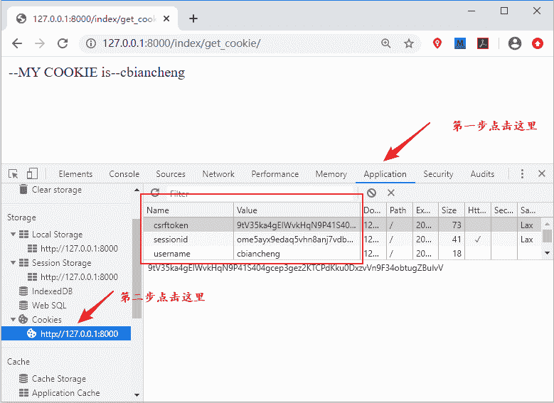

# Django 中 Cookie 和 Session 介绍（一）

> 原文：[`c.biancheng.net/view/7828.html`](http://c.biancheng.net/view/7828.html)

在 Django 中可以通过 HTML Form 表单实现登录注册功能，但是在这之前，我们有必要简单介绍一下 Cookie 和 Session。比如在某些场景下，在排除用户手动删除浏览器 Cookie 以及 Cookie 未过期的情况下，用户如果在某网站登录过一次，下次访问这个网站，用户不需要输入用户名和密码就可以进入网站，这就是通过 Cookie 和 Session 实现的。本节先对 Cookie 进行介绍。

## 1\. Django 中 Cookie 简述

#### 1) Django 中 COOKIE 的使用方法

大家在学习 HTTP 超文本传输协议的时候，就已经知道 HTTP 是一种无状态的传输协议，对于事务处理没有记忆能力。对于客户端浏览器发出的请求，Web 服务器无法区分是不是源自于同一个浏览器。所以，这时就需要额外的数据用于维持会话。

我们通常用来它来记录浏览器端的信息和当前连接的确认信息。Cookie 保存在客户端浏览器存储空间中并以键值对的形式进行存储，也就是说 Cookie 也是一个类字典对象。

在 Django 服务器端来设置浏览器的 Cookie 必须通过 HttpResponse 对象来完成，那么如何通过 HttpResponse 实现 Cookie 添加、修改或者删除呢？这里提供了一些方法，如下所示：

HttpResponse.set_cookie(key="", value='', max_age=None, expires=None) #设置或者添加 Cookie

上面的参数分别表示：key、value 分别表示 COOKIES 的键与值；max_age 代表 COOKIES 的存活时间，以秒为单位；expires 表示具体过期时间，当不指定 max_age 和 expires 时，关闭浏览器时此数据失效。当然还有一些其他的参数，比如说 domain 用来绑定域名从而实现跨域。那么又如何删除一个 COOKIE 呢？方法如下所示：

HttpResponse.delete_cookie(key) 

实例演示，代码如下所示：

```

from django.http import HttpResponse
#设置添加 cookie
def set_cookie_view(request):
    resp=HttpResponse()
    resp.set_cookie('username','cbiancheng',3600)
    return resp
#得到 cookie 的值使用 get 方法
def get_cookie_view(request):
    value = request.COOKIES.get('username')
    return HttpResponse('--MY COOKIE is--%s'%value)
```

然后配置相应的路由，如下所示：

```

urlpatterns=[    
path('set_cookie/',views.set_cookie_view),
path('get_cookie/',views.get_cookie_view),]
```

最后访问相应的路由，地址栏输入 1270.0.0.1:8000/index/set_cookie，使用谷歌调试工具，点击 Network 找到响应头，Cookie 都是需要进行加密处理的，在这里为了方便给大家演示，没有进行加密操作。如下所示：

```

Response Headers
Content-Length: 0
Content-Type: text/html; charset=utf-8
Date: Thu, 04 Jun 2020 08:36:37 GMT
Server: WSGIServer/0.2 CPython/3.7.4
Set-Cookie: username=cbiancheng; expires=Thu, 04 Jun 2020 09:36:37 GMT; Max-Age=3600; Path=/
X-Frame-Options: SAMEORIGIN
```

访问 1270.0.0.1:8000/index/get_cookie，直接可以得到 Cookie 的值，大家也可以自己尝试一下，结果如下图所示：


图 1：Chrome 调试工具展示 Cookie
 从上述过程中，我们知道了如何在 Django 中添加 Cookie 或者对其进行取值，但是你可能会发现这个过程其实是不安全的，很容易造成 Cookie 的泄露或者被截取的风险，而且不同浏览器的版本对存储 Cookie 的数量也有限制，且 Cookie 自身也有长度限制最大不可超过 4kb，否则会被自动截断。

一般情况下为了降低 Cookie 带来的安全性问题，可以采用和 Session 一起使用的策略。那么 Session 在 Django 中又如何应用呢？在下一节我们会对 Session 展开讲解。