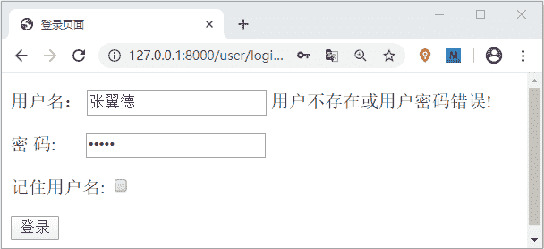

# Django HTML 表单实现用户登录退出（含源码）

> 原文：[`c.biancheng.net/view/7831.html`](http://c.biancheng.net/view/7831.html)

在上一节中，我们实现了用户注册功能，在本节将继续介绍，如何使用 Django 实现用户的登录以及退出功能，希望大家通过这两节内容的学习，学会总结思路，把这个开发功能的过程反复练习，这样才能够更好的理解 Django 框架，而且在以后 Web 开发的道路上也会对自己大有裨益。

## 1\. HTML 表单实现用户的登录

通过前一节的学习，通过 HTML 表单并不难实现用户的登录功能，那么大家先思考一下，用户登录的逻辑打开是怎么样的呢？分析这个逻辑，大家也可以去体验一下其他网站的登录功能，从用户的注册到登录最后用户退出，这整个的流程都需要大家细细的品味，并发现其中的规律，并且学以致用。当自己不熟练的时候，学会去借鉴其他人的经验，往往是一个不错的选择。下面就让我们一起来实现一下用户的注册功吧。

#### 1) HTML 表单编写前端页面

在 user\templates\user 目录下新建 login.html 文件。并在其中编写如下代码：

```

<!DOCTYPE html>
<html lang="en">
<head>
    <meta charset="UTF-8">
    <title>登录页</title>
    <style>
               #pwd input{
           margin-left:23px
        }
    </style>
</head>
<body>
<form action="/user/login/" method="post">
<!--传统的 html 登录表单-->
    <p>
        用户名： <input type="text" name="username" value="{{ username }}">
        <span> {{ error }}</span>
    </p>
    <p id=pwd> 
        密码: <input type="text" name="password" value="{{ password }}">
    </p>
    <p>
        记住用户名: <input type="checkbox" name="isSaved">
    </p>
    <p>
        <input type="submit" value="登录">
    </p>
</form>
</body>
</html>
```

上述代码理解起来非常的通俗易懂，但是不难发现我们在其中新增了一个记住用户名的小功能，大家想想这个功能又是如何实现的呢？没错它就是通过 Cookies 实现的。在前面的章节《[Django 中 Cookie 和 Session 介绍（一）](http://view/7828.html?1591770155)》中，我们给大家详细的讲述了 Cookies 与 Session，在本节我们将用到它们，如果忘记的小伙伴请抓紧时复习哦。

#### 2) 编写视图层逻辑代码

在 user\views.py 中编写视图层用户登录逻辑代码，如下所示：

```

#用户的登录逻辑处理
def login_view(request):
    #处理 GET 请求
    if request.method == 'GET':
        #1, 首先检查 session，判断用户是否第一次登录，如果不是，则直接重定向到首页
        if 'username' in request.session:  #request.session 类字典对象
            return HttpResponseRedirect('/index/allbook')
        #2, 然后检查 cookie，是否保存了用户登录信息
        if 'username' in request.COOKIES:
            #若存在则赋值回 session，并重定向到首页
            request.session['username'] = request.COOKIES['username']
            return HttpResponseRedirect('/index/allbook')
        #不存在则重定向登录页，让用户登录
        return render(request, 'user/login.html')
    # 处理 POST 请求
    elif request.method == 'POST':
        username = request.POST.get('username')
        password = request.POST.get('password')
        m = hashlib.md5()
        m.update(password.encode())
        password_m = m.hexdigest()
        #判断输入是否其中一项为空或者格式不正确
        if not username or not password:
            error = '你输入的用户名或者密码错误 !'
            return render(request, 'user/login.html', locals())
        #若输入没有问题则进入数据比对阶段，看看已经注册的用户中是否存在该用户
        users = User.objects.filter(username=username, password=password_m)
        # 由于使用了 filter, 所以返回值 user 是一个数组，但是也要考虑其为空的状态，即没有查到该用户
        if not users:
            error = '用户不存在或用户密码输入错误!!'
            return render(request, 'user/login.html', locals())
        # 返回值是个数组，并且用户名具备唯一索引，当前用户是该数组中第一个元素
        users = users[0]
        request.session['username'] = username
        response = HttpResponseRedirect('/index/allbook')
        #检查 post 提交的所有键中是否存在 isSaved 键
        if 'isSaved' in request.POST.keys():
            #若存在则说明用户选择了记住用户名功能，执行以下语句设置 cookie 的过期时间
            response.set_cookie('username', username, 60*60*24*7)
        return response
```

完成视图层代码后，记得要配置路由映射关系，如下所示：

```

from django.urls import path
from user import views
urlpatterns=[
    path('reg/',views.reg_view),
    path('login/',views.login_view)
]
```

#### 3）登录页面展示效果

输入数据库中已存在的用户名，但是将密码输入错误，则会有如下的显示：


图 1：用户登录界面输入正确的密码则会跳转到 index\allbook 页面，如果登录成功后，下次在访问 127.0.0.1/user/login/ 的时候，将将直接跳转到 index\allbook 页面，这就是 session 与 cookie 的作用，那么可想而知如果要实现用户的退出功能就需要将它们两个删除。

## 2\. 实现用户的退出功能

用户的退出功能相对来说要简单的多，通过下面代码就可以实现：

```

def logout_view(request):
    #实现退出功能
    #删除 session
    if 'username' in request.session:
        del request.session['username']
    resp = HttpResponseRedirect('/user/index')
    #删除 cookie
    if 'username' in request.COOKIES:
        resp.delete_cookie('username')
    return resp
#编写视图函数映射关系
urlpatterns = [
    #http://127.0.0.1:8000/user/logout
    path('logout/', views.logout_view)
]
```

大家可以自行编写一个简单的网站首页，我们知道退出功能的 button 都会显示在首页边角位置，所以只需要将退出功能的 url 关联到 <a> 标签的 href 属性即可实现点击退出的功能了。

我们使用了两节的内容给大家讲述了 Django 如何实现最基本的注册登录以及退出功能，这两节代码较多，也设计到一些逻辑的理解，所以大家要勤加练习，多多复习，才能够熟练掌握。在下一节中，我们将简单介绍 Django 中的静态资源，比如文件的上传下载以及 CSV 文件的生成导出等。